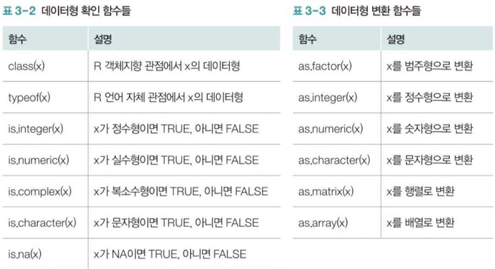
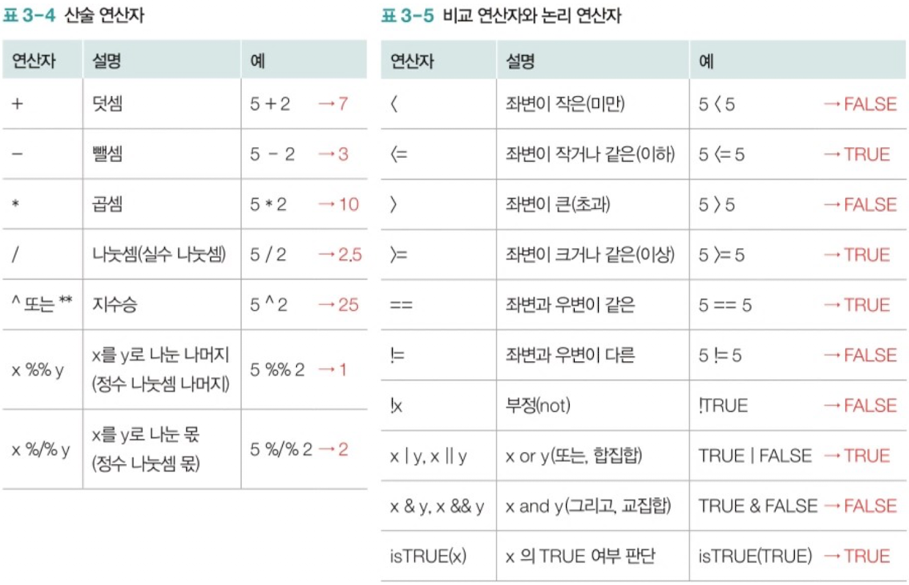

### **데이터형**

R에서 주로 사용하는 기본 데이터형은 다음과 같다. 


R에서는 변수 선언 시 해당 변수의 데이터형을 지정하지 않고, 변수에 어떤 값을 저장하는 지에 따라 데이터형이 결정된다.

```r
x = 5
y = 2

str = "Hello, World"

blood.type = factor(c('A','B','O','AB'))

xinf = Inf
```

관련된 함수는 다음과 같다. 



### **연산자**



