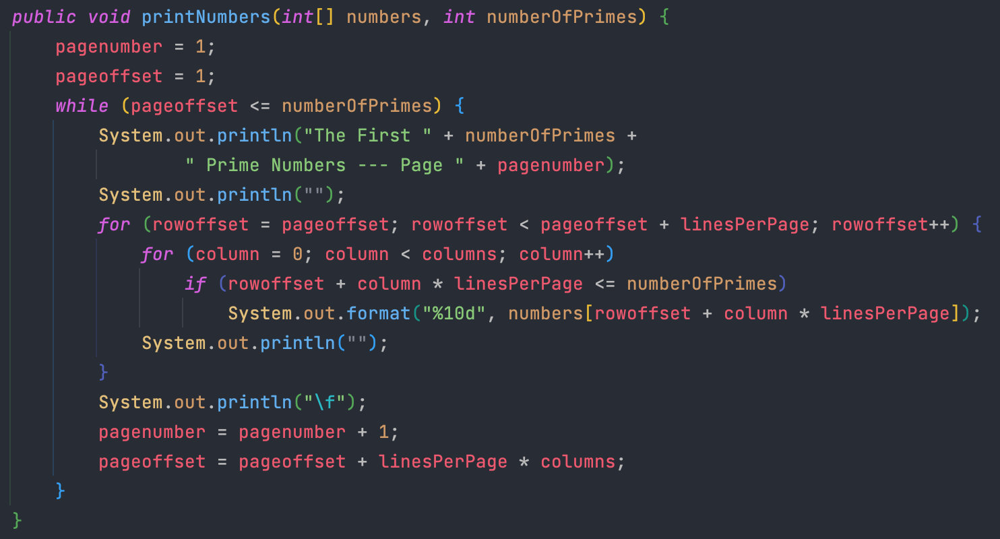
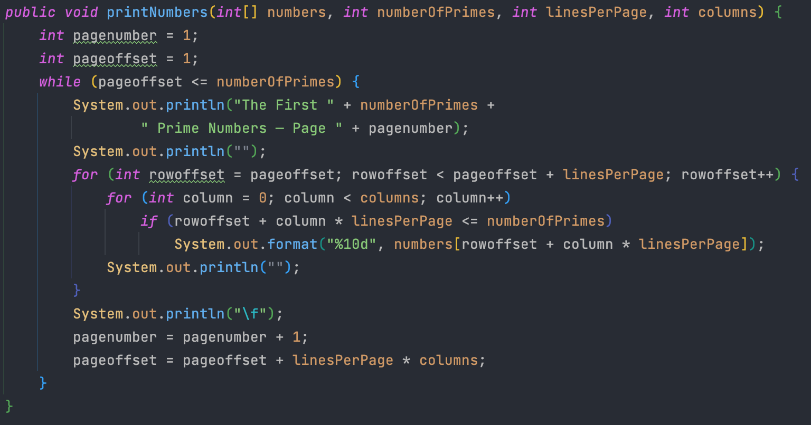

## 들어가면서

- 해당 포스트는 [최범균님의 클린 코더스 강의](https://www.youtube.com/watch?v=60lLSe1phks)를 정리한 내용입니다. 
- 강의 자료는 [깃 허브](https://github.com/msbaek/clean-coders-2013)에서 보실 수 있습니다.


## 클린 코더스 강의 3. Function

### **1. 원칙**
- 한 가지 일만 해야 한다.
- 메소드의 크기는 과장 보태서 4줄짜리여야 한다.
    - 따라서 indentation, while, nested if 등은 없어야
- 잘 지어진 서술적인 이름을 갖는 많은/작은 메소드들로 유지해야 한다.

### **2. The First Rule of Functions**
- 더 이상 작아질 수 없을만큼 작아야 한다.
- 큰 메소드를 보면 클래스로 추출할 생각을 해야 한다. Extract Method Object
- 클래스는 일련의 변수들이 동작하는 기능의 집합이다. 
- extreact method 할 때는 서로 다른 점을 변수로 추출하고 그 변수들은 새로운 method의 파라미터로 전달한다. 

### **3. extreact method 예제 - FitnessExample**

```java
public class FitnessExample {
    public String testableHtml(PageData pageData, boolean includeSuiteSetup) throws Exception {
        WikiPage wikiPage = pageData.getWikiPage();
        StringBuffer buffer = new StringBuffer();

        if (pageData.hasAttribute("Test")) {
            if (includeSuiteSetup) {
                WikiPage suiteSetup = PageCrawlerImpl.getInheritedPage(SuiteResponder.SUITE_SETUP_NAME, wikiPage);
                if (suiteSetup != null) {
                    WikiPagePath pagePath = wikiPage.getPageCrawler().getFullPath(suiteSetup);
                    String pagePathName = PathParser.render(pagePath);
                    buffer.append("!include -setup .").append(pagePathName).append("\n");
                }
            }
            WikiPage setup = PageCrawlerImpl.getInheritedPage("SetUp", wikiPage);
            if (setup != null) {
                WikiPagePath setupPath = wikiPage.getPageCrawler().getFullPath(setup);
                String setupPathName = PathParser.render(setupPath);
                buffer.append("!include -setup .").append(setupPathName).append("\n");
            }
        }

        buffer.append(pageData.getContent());
        if (pageData.hasAttribute("Test")) {
            WikiPage teardown = PageCrawlerImpl.getInheritedPage("TearDown", wikiPage);
            if (teardown != null) {
                WikiPagePath tearDownPath = wikiPage.getPageCrawler().getFullPath(teardown);
                String tearDownPathName = PathParser.render(tearDownPath);
                buffer.append("!include -teardown .").append(tearDownPathName).append("\n");
            }
            if (includeSuiteSetup) {
                WikiPage suiteTeardown = PageCrawlerImpl.getInheritedPage(SuiteResponder.SUITE_TEARDOWN_NAME, wikiPage);
                if (suiteTeardown != null) {
                    WikiPagePath pagePath = wikiPage.getPageCrawler().getFullPath(suiteTeardown);
                    String pagePathName = PathParser.render(pagePath);
                    buffer.append("!include -teardown .").append(pagePathName).append("\n");
                }
            }
        }

        pageData.setContent(buffer.toString());
        return pageData.getHtml();
    }
}
```

extact method to object
```java
public class FitnessExample {
    public String testableHtml(PageData pageData, boolean includeSuiteSetup) throws Exception{
        return new TestableHtmlBuilder(pageData, includeSuiteSetup).invoke();
    }
    
    private class TestableHtmlBuilder {
        private PageData pageData;
        private boolean includeSuiteSetup;

        public TestableHtmlBuilder(PageData pageData, boolean includeSuiteSetup) {
            this.pageData = pageData;
            this.includeSuiteSetup = includeSuiteSetup;
        }

        public String invoke() throws Exception {
            WikiPage wikiPage = pageData.getWikiPage();
            StringBuffer buffer = new StringBuffer();
                        ...
```

메소드의 여러 곳에서 사용되는 `wikiPage`와 `buffer`를 멤버 변수로 올리고 생성자를 통해서 초기화시킨다.

이를 통해 나중에 내부에서 다른 메소드를 추출할 때마다 매번 파라미터로 받지 않을 수 있게된다.
```java
private class TestableHtmlBuilder {
    private PageData pageData;
    private boolean includeSuiteSetup;
    private WikiPage wikiPage;
    private StringBuffer buffer;

    public TestableHtmlBuilder(PageData pageData, boolean includeSuiteSetup) {
        this.pageData = pageData;
        this.includeSuiteSetup = includeSuiteSetup;
        wikiPage = pageData.getWikiPage();
        buffer = new StringBuffer();
    }

    public String invoke() throws Exception {
        if (pageData.hasAttribute("Test")) {
            ...
```

자주 반복되는 아래 코드 세 줄을 메소드로 뽑기 위해서 먼저 메소드마다 다른 `buffer.append()` 내부 string을 변수로 추출한다. 
```java
WikiPagePath pagePath = wikiPage.getPageCrawler().getFullPath(suiteSetup);
String pagePathName = PathParser.render(pagePath);
buffer.append("!include -setup .").append(pagePathName).append("\n");
```

```java
String setup = "setup";
WikiPagePath pagePath = wikiPage.getPageCrawler().getFullPath(suiteSetup);
String pagePathName = PathParser.render(pagePath);
buffer.append("!include -" + setup + " .").append(pagePathName).append("\n");
```

`includePage()` 메소드로 추출
```java
public String invoke() throws Exception {
    if (pageData.hasAttribute("Test")) {
        if (includeSuiteSetup) {
            WikiPage suiteSetup = PageCrawlerImpl.getInheritedPage(SuiteResponder.SUITE_SETUP_NAME, wikiPage);
            if (suiteSetup != null) {
                String setup1 = "setup";
                includePage(suiteSetup, setup1);
            }
        }
        WikiPage setup = PageCrawlerImpl.getInheritedPage("SetUp", wikiPage);
        if (setup != null) {
            String setup1 = "setup";
            includePage(setup, setup1);
        }
    }

    buffer.append(pageData.getContent());
    if (pageData.hasAttribute("Test")) {
        WikiPage teardown = PageCrawlerImpl.getInheritedPage("TearDown", wikiPage);
        if (teardown != null) {
            String teardown1 = "teardown";
            includePage(teardown, teardown1);
        }
        if (includeSuiteSetup) {
            WikiPage suiteTeardown = PageCrawlerImpl.getInheritedPage(SuiteResponder.SUITE_TEARDOWN_NAME, wikiPage);
            if (suiteTeardown != null) {
                String teardown1 = "teardown";
                includePage(suiteTeardown, teardown1);
            }
        }
    }
    ...
private void includePage(WikiPage suiteSetup, String setup1) {
    WikiPagePath pagePath = wikiPage.getPageCrawler().getFullPath(suiteSetup);
    String pagePathName = PathParser.render(pagePath);
    buffer.append("!include -" + setup1 + " .").append(pagePathName).append("\n");
}
```

이제 아래 부분들을 공통화시켜서 메소드로 뽑아야 한다.
```java
WikiPage suiteSetup = PageCrawlerImpl.getInheritedPage(SuiteResponder.SUITE_SETUP_NAME, wikiPage);
if (suiteSetup != null) {
    String setup1 = "setup";
    includePage(suiteSetup, setup1);
}
```

위에서와 마찬가지로 각 코드마다 다른 `getInheritedPage()`의 파라미터값을 변수로 뽑는다.

그 후 메소드로 뽑기 위해 앞에서 변수로 뽑았던 `setup1`, `teardown1`등을 위로 올려준다.
```java
if (pageData.hasAttribute("Test")) {
    if (includeSuiteSetup) {
        Object suiteSetupName = SuiteResponder.SUITE_SETUP_NAME;
        String setup1 = "setup";
        WikiPage suiteSetup = PageCrawlerImpl.getInheritedPage(suiteSetupName, wikiPage);
        if (suiteSetup != null) {
            includePage(suiteSetup, setup1);
        }
    }
    String setUp = "SetUp";
    String setup1 = "setup";
    WikiPage setup = PageCrawlerImpl.getInheritedPage(setUp, wikiPage);
    if (setup != null) {
        includePage(setup, setup1);
    }
}
```

그 후 includeInherited() 메소드로 추출한다.
```java
if (pageData.hasAttribute("Test")) {
    if (includeSuiteSetup) {
        Object suiteSetupName = SuiteResponder.SUITE_SETUP_NAME;
        String setup1 = "setup";
        includeInherited(suiteSetupName, setup1);
    }
    String setUp = "SetUp";
    String setup1 = "setup";
    includeInherited(setUp, setup1);
}

buffer.append(pageData.getContent());
if (pageData.hasAttribute("Test")) {
    String tearDown = "TearDown";
    String teardown1 = "teardown";
    includeInherited(tearDown, teardown1);
    if (includeSuiteSetup) {
        Object suiteTeardownName = SuiteResponder.SUITE_TEARDOWN_NAME;
        String teardown2 = "teardown";
        includeInherited(suiteTeardownName, teardown2);
    }
}
```

앞서 서로 다른 부분을 메소드로 뽑기 위해서 변수로 선언했지만 이제 필요없기때문에 변수를 파라미터로 인라인시킨다.

이 과정속에서 if문 내에 실행할 문장이 하나가 된다면 괄호를 지워주도록 하자.
```java
if (pageData.hasAttribute("Test")) {
    if (includeSuiteSetup)
        includeInherited(SuiteResponder.SUITE_SETUP_NAME, "setup");
    includeInherited("SetUp", "setup");
}

buffer.append(pageData.getContent());
if (pageData.hasAttribute("Test")) {
    includeInherited("TearDown", "teardown");
    if (includeSuiteSetup) 
        includeInherited(SuiteResponder.SUITE_TEARDOWN_NAME, "teardown");
}
```

여기서 가독성을 더 높이기 위해 setup을 위한 메소드와 teardown을 위한 메소드를 추출한다.
```java
public String invoke() throws Exception {
    if (pageData.hasAttribute("Test"))
        includeSetups();
    buffer.append(pageData.getContent());
    if (pageData.hasAttribute("Test"))
        includeTeardowns();
    pageData.setContent(buffer.toString());
    return pageData.getHtml();
}
```

중복된 if문을 제거하고 하나의 if문 내부로 밀어넣자.
```java
public String invoke() throws Exception {
    if (pageData.hasAttribute("Test")) {
        includeSetups();
        buffer.append(pageData.getContent());
        includeTeardowns();
    }
    pageData.setContent(buffer.toString());
    return pageData.getHtml();
}
```

if문 내부의 조건도 가독성을 높이기 위해 메소드로 추출한다.
```java
public String invoke() throws Exception {
    if (isTestPage()) {
        includeSetups();
        buffer.append(pageData.getContent());
        includeTeardowns();
    }
    pageData.setContent(buffer.toString());
    return pageData.getHtml();
}
```
메소드를 읽어보면 

만약 테스트 페이지이면 setup을 include하고 버퍼에 페이지의 content를 넣고 teardown을 include한 뒤,

버퍼에 있는 데이터를 페이지 데이터에 입력한 뒤, 페이지 데이터를 html로 변경한다는 것을 알 수 있다. 

이렇게 리팩토링 후 `invoke()`를 읽기 훨씬 수월해졌다.


<br>

이제 추출한 클래스명과 `invoke()`의 이름을 의미있게 변경하는 등 나머지 리펙토링 작업을 수행한 최종 코드는 아래와 같다.
```java
public class FitnessExample {
    public String testableHtml(PageData pageData, boolean includeSuiteSetup) throws Exception {
        return new SetUpTearDownSurrounder(pageData, includeSuiteSetup).surround();
    }

    private class SetUpTearDownSurrounder {
        private PageData pageData;
        private boolean includeSuiteSetup;
        private WikiPage wikiPage;
        private String content;

        public SetUpTearDownSurrounder(PageData pageData, boolean includeSuiteSetup) {
            this.pageData = pageData;
            this.includeSuiteSetup = includeSuiteSetup;
            wikiPage = pageData.getWikiPage();
            content = new String();
        }

        public String surround() throws Exception {
            if (ifTestPage())
                surroundPageWithSetUpsAndTearDowns();
            return pageData.getHtml();
        }

        private void surroundPageWithSetUpsAndTearDowns() throws Exception {
            content = includeSetups();
            content += pageData.getContent();
            content += includeTearDowns();
            pageData.setContent(content);
        }

        private boolean ifTestPage() throws Exception {
            return pageData.hasAttribute("Test");
        }

        private String includeTearDowns() throws Exception {
            String tearDowns = includeInherited("TearDown", "teardown");
            if (includeSuiteSetup)
                tearDowns += includeInherited(SuiteResponder.SUITE_TEARDOWN_NAME, "teardown");
            return tearDowns;
        }

        private String includeSetups() throws Exception {
            String setUps = "";
            if (includeSuiteSetup)
                setUps += includeInherited(SuiteResponder.SUITE_SETUP_NAME, "setup");
            setUps += includeInherited("SetUp", "setup");
            return setUps;
        }

        private String includeInherited(String pageName, String mode) throws Exception {
            WikiPage suiteSetup = PageCrawlerImpl.getInheritedPage(pageName, wikiPage);
            if (suiteSetup != null)
                return includePage(suiteSetup, mode);
            return "";
        }

        private String includePage(WikiPage suiteSetup, String mode) throws Exception {
            WikiPagePath pagePath = wikiPage.getPageCrawler().getFullPath(suiteSetup);
            String pagePathName = PathParser.render(pagePath);
            return String.format("!include -%s .%s\n", mode, pagePathName);
        }
    }
}
```
이 예제로 리펙토링을 반복해서 연습할 것. 

### **4. 개선**
- 읽기 쉬워지고
- 이해하기 쉬워지고
- 메소드가 자신의 의도를 잘 전달

### **5. 개선의 원인**
- Small
    - 메소드의 첫 번째 규칙. 메소드는 작아질 수 있는 한 최대한 작아야 함
- 블록이 적어야 함
    - if, else, while 문장 등의 내부 블록은 한 줄이어야 함
    - 따라서 괄호가 없고 메소드 호출일 것
- Indenting이 적어야 함
    - 메소드는 중첩 구조를 갖을 만큼 크면 안됨
    - 들여쓰기는 한 두단계 정도만

### **6. functions should do one thing**
리펙토링 전의 메소드는 하나 이상의 일을 하고 있던 것에 비해 리펙토링 후의 메소드는 하나의 단순한 일만 실행한다. 

그런데 메소드를 살펴보면 여러 메소드를 실행하는 등 한 가지 일만 수행하는 것 같지는 않아보인다. 메소드가 한 가지 일만 실행한다는 것은 무엇을 의미할까? 

메소드가 수행하는 모든 일의 추상화 수준이 같고, 메소드의 각 스텝들이 메소드 이름이 갖는 추상화 수준보다 한 단계 낮은 것으로만 이루어졌다면 메소드는 한 가지 일만 한다고 할 수 있다. 따라서 원래 코드는 추상화 수준이 다른 많은 단계들을 포함하므로 한 가지 이상의 일을 한다는 것이 명확하다. 

하지만 메소드가 한 가지 일만 하도록 최종적으로 줄이는 것은 매우 어렵다. 이를 어떤 기능을 to 부정사 구문으로 표현하여 해당 기능을 수행하기 위해서는 어떤 과정이 필요한지 생각해본다면 같은 추상화 수준의 계층을 그려볼 수 있을 것이다. 

메소드가 하나 이상의 추상화 레벨을 다루면 이 메소드는 한 가지 이상의 일을 하는 것이다. 
- StringBuffer, parser, pageCrawler는 low level detail of implementation
- 반면 testablePage, inheritedPage 등은 비즈니스 개념으로 high level of abstraction
- 하나의 메소드가 2가지 개념들을 모두 다루는 것을 원치 않는다.
- 서로 다른 추상화 레벨을 서로 다른 메소드로 분리한다.
- 메소드가 한 가지 일만 하기 위해서는 추상화 레벨의 경계를 넘지 말아야 한다.


### **7. Where do classes do to hide?**
큰 메소드는 실제로 클래스가 숨어있는 곳이다. 

큰 메소드는 들여쓰기가 존재하고 변수들을 사용해서 통신하는 기능들의 집합이다. 그렇다면 이 메소드는 항상 하나 이상의 클래스로 분리할 수 있을 것이다.


### **8. PrimeNumber 예제**

```java
public class PrintPrimes {
    public static void main(String[] args) {
        final int numberOfPrimes = 1000;
        final int linesPerPage = 50;
        final int columns = 4;
        final int ordmax = 30;
        int primes[] = new int[numberOfPrimes + 1];
        int pagenumber;
        int pageoffset;
        int rowoffset;
        int column;
        int candidate;
        int primeIndex;
        boolean possiblyPrime;
        int ord;
        int square;
        int n;
        int multiples[] = new int[ordmax + 1];
        candidate = 1;
        primeIndex = 1;
        primes[1] = 2;
        ord = 2;
        square = 9;
        while (primeIndex < numberOfPrimes) {
            do {
                candidate = candidate + 2;
                if (candidate == square) {
                    ord = ord + 1;
                    square = primes[ord] * primes[ord];
                    multiples[ord - 1] = candidate;
                }
                n = 2;
                possiblyPrime = true;
                while (n < ord && possiblyPrime) {
                    while (multiples[n] < candidate)
                        multiples[n] = multiples[n] + primes[n] + primes[n];
                    if (multiples[n] == candidate)
                        possiblyPrime = false;
                    n = n + 1;
                }
            } while (!possiblyPrime);
            primeIndex = primeIndex + 1;
            primes[primeIndex] = candidate;
        }
        {
            pagenumber = 1;
            pageoffset = 1;
            while (pageoffset <= numberOfPrimes) {
                System.out.println("The First " + numberOfPrimes +
                        " Prime Numbers --- Page " + pagenumber);
                System.out.println("");
                for (rowoffset = pageoffset; rowoffset < pageoffset + linesPerPage; rowoffset++) {
                    for (column = 0; column < columns; column++)
                        if (rowoffset + column * linesPerPage <= numberOfPrimes)
                            System.out.format("%10d", primes[rowoffset + column * linesPerPage]);
                    System.out.println("");
                }
                System.out.println("\f");
                pagenumber = pagenumber + 1;
                pageoffset = pageoffset + linesPerPage * columns;
            }
        }
    }
}
```

먼저 main()을 Replace Method With Method Object를 통해 `PrimePrinterHelper`라는 이름의 클래스로 뽑아낸다.
```java
public class PrintPrimes {
    public static void main(String[] args) {
        PrimePrinterHelper.invoke();
    }

    private static class PrimePrinterHelper {
        private static void invoke() {
            ...
```

이때 `invoke()`가 static method로 생성되기때문에 `static`을 제거해주자
```java
public class PrintPrimes {
    public static void main(String[] args) {
        new PrimePrinterHelper().invoke();
    }

    private static class PrimePrinterHelper {
        private void invoke() {
            ...
```

그 후 변수들을 모두 멤버 변수로 끌어올린다.

이 변수들 중에서는 멤버 변수로 올리지 않아도 되는 것들도 있으나, 그러한 것들은 리펙토링 과정에서 쉽게 찾을 수 있으니 일단 다 올리는 것이 편하다. 
```java
private static class PrimePrinterHelper {
    private final int numberOfPrimes = 1000;
    private final int linesPerPage = 50;
    private final int columns = 4;
    private final int ordmax = 30;
    private int primes[] = new int[numberOfPrimes + 1];
    private int pagenumber;
    private int pageoffset;
    private int rowoffset;
    private int column;
    private int candidate;
    private int primeIndex;
    private boolean possiblyPrime;
    private int ord;
    private int square;
    private int n;
    private int multiples[] = new int[ordmax + 1];
    
    private void invoke() {
        ...
```

그 후 결과 출력과 관련된 부분을 `printNumbers()`로 추출
```java
} while (!possiblyPrime);
        primeIndex = primeIndex + 1;
        primes[primeIndex] = candidate;
    }
    printNumbers();
}

private void printNumbers() {
    pagenumber = 1;
    pageoffset = 1;
    while (pageoffset <= numberOfPrimes) {
```

이후에 클래스가 나뉘었을 때도 `primes`와 `numberOfPrimes`를 사용하기 위해서 이 두 변수를 파라미터로 전달받도록 한다.

이후 `printNumbers()`의 파라미터 `primes`의 변수명을 `numbers`로 변경한다. `printNumbers()` 입장에서 출력할 변수가 prime number인지 아닌지는 관심사가 아니기 때문에 `numbers`로 변경하는 것이 더 이해하기 쉽다.

```java
private void printNumbers(int[] numbers, int numberOfPrimes) {
    pagenumber = 1;
    pageoffset = 1;
    while (pageoffset <= numberOfPrimes) {
        System.out.println("The First " + this.numberOfPrimes +
                " Prime Numbers --- Page " + pagenumber);
        System.out.println("");
        for (rowoffset = pageoffset; rowoffset < pageoffset + linesPerPage; rowoffset++) {
            for (column = 0; column < columns; column++)
                if (rowoffset + column * linesPerPage <= this.numberOfPrimes)
                    System.out.format("%10d", numbers[rowoffset + column * linesPerPage]);
```

이후 static class로 선언되어 있던 `PrimePrinterHelper` 클래스를 `PrintPrimes`와 분리한다.

```java
public class PrintPrimes {
    public static void main(String[] args) {
        new PrimePrinterHelper().invoke();
    }
}
class PrimePrinterHelper {
    ...
```

이제 `PrintPrimes`에서 `PrimePrinterHelper`의 메소드들을 호출하도록 변경한다. 이 때 `invoke()`와 `printNumbers()`의 접근지정자를 `public`으로 변경해야 한다.

또한 `invoke()`의 리턴값을 `void`에서 `int[]`로 변경하여 계산된 prime number 배열을 리턴하도록 변경한다. 

기존에는 `invoke()`에서 계산하고 `printNumbers()`까지 실행하였는데 이러한 방식에서는 prime number를 계산하려면 무조건 출력해야 하고, 출력하려면 무조건 다시 계산해야 하기 때문에 앞 장에서 배운 `Command Vs Query`를 어긴다고 볼 수 있다. 

따라서 `PrintPrimes` 클래스에서 호출한 `invoke()`는 계산결과를 리턴하고 그 결과를 받아 `printNumbers()`를 호출하도록 변경한다.

```java
public class PrintPrimes {
    static final int numberOfPrimes = 1000;
    
    public static void main(String[] args) {
        PrimePrinterHelper primePrinterHelper = new PrimePrinterHelper();
        int[] primes = primePrinterHelper.invoke();
        primePrinterHelper.printNumbers(primes, numberOfPrimes);
    }
}
```

이제 `printNumbers()`를 외부 클래스로 뽑아낼 차례인데, `PrimePrinterHelper` 클래스의 멤버 변수 중에서는 `printNumbers()`에서만 쓰이는 것들이 있다. 이 변수들을 지역변수로 변경하거나 파라미터로 받게끔 변경한다.

이 과정이 복잡하게 느껴질 수 있는데, IDE에서 멤버변수와 지역변수는 다른 색으로 표시하기 때문에 이 기능을 잘 활용하면 쉽게 바꿀 수 있다.

Intellij에서 내가 사용하는 테마는 멤버 변수의 경우 빨간색으로 나타낸다. 따라서 변경 전의 `printNumbers()`는 다음과 같다.




빨간색으로 표시되는 변수들을 모두 바꾼다고 생각하면 쉽다. 

만약 해당 변수가 `printNumbers()` 내에서만 사용된다면 로컬 변수로 변경하면 되고, 외부에서도 사용되는 변수라면 파라미터로 받게끔 한다.

변경된 `printNumbers()`는 다음과 같다.



빨간색으로 표시되던 변수가 모두 사라진 것을 볼 수 있다.

이로 인해 변경된 `PrintPrimes` 클래스와 `PrimePrinterHelper`의 멤버 변수는 다음과 같다. 
```java
public class PrintPrimes {
    static final int numberOfPrimes = 1000;
    static final int linesPerPage = 50;
    static final int columns = 4;
    
    public static void main(String[] args) {
        PrimePrinterHelper primePrinterHelper = new PrimePrinterHelper();
        int[] primes = primePrinterHelper.invoke();
        primePrinterHelper.printNumbers(primes, numberOfPrimes, linesPerPage, columns);
    }
}

class PrimePrinterHelper {
    private final int numberOfPrimes = 1000;
    private final int ordmax = 30;
    private int primes[] = new int[numberOfPrimes + 1];
    private int candidate;
    private int primeIndex;
    private boolean possiblyPrime;
    private int ord;
    private int square;
    private int n;
    private int multiples[] = new int[ordmax + 1];
```

여기까지하면 `printNumbers()`를 외부 클래스로 분리할 준비가 끝났기 때문에 `NumberPrinter`라는 클래스로 추출해보자.

기존 `printNumbers()`의 파라미터들은 `NumberPrinter`의 멤버변수로 변경하고 생성자를 통해 받도록 한다.

```java
public class NumberPrinter {
    private int[] numbers;
    private int numberOfPrimes;
    private int linesPerPage;
    private int columns;

    public NumberPrinter(int[] numbers, int numberOfPrimes, int linesPerPage, int columns) {
        this.numbers = numbers;
        this.numberOfPrimes = numberOfPrimes;
        this.linesPerPage = linesPerPage;
        this.columns = columns;
    }

    public void printNumbers() {
        int pagenumber = 1;
        int pageoffset = 1;
        while (pageoffset <= numberOfPrimes) {
            System.out.println("The First " + numberOfPrimes +
                    " Prime Numbers — Page " + pagenumber);
            System.out.println("");
            for (int rowoffset = pageoffset; rowoffset < pageoffset + linesPerPage; rowoffset++) {
                for (int column = 0; column < columns; column++)
                    if (rowoffset + column * linesPerPage <= numberOfPrimes)
                        System.out.format("%10d", numbers[rowoffset + column * linesPerPage]);
                System.out.println("");
            }
            System.out.println("\f");
            pagenumber = pagenumber + 1;
            pageoffset = pageoffset + linesPerPage * columns;
        }
    }
}
```

`PrimePrinterHelper`에서는 이제 `printNumbers()` 호출 방식이 다음과 같이 변경된다.
```java
public void printNumbers(int[] numbers, int numberOfPrimes, int linesPerPage, int columns) {
    new NumberPrinter(numbers, numberOfPrimes, linesPerPage, columns).printNumbers();
}
```

이렇게 생성자를 통해서 초기화하는 변수값들은 해당 클래스의 인스턴스가 살아있는 동안 변경되지 않는 값이어야 할 것이다. 그런데 출력할 숫자의 배열인 `numbers`와 출력할 소수의 개수인 `numberOfPrimes`는 출력마다 변경될 수 있는 값이다. 

따라서 이 두 변수를 생성자가 아닌 `printNumbers()`의 파라미터로 전달받도록 변경한다. 

```java
public class NumberPrinter {
    private int linesPerPage;
    private int columns;

    public NumberPrinter(int linesPerPage, int columns) {
        this.linesPerPage = linesPerPage;
        this.columns = columns;
    }

    public void printNumbers(int[] numbers, int numberOfPrimes) {
        ...
```

이제 `PrimePrinterHelper`에서 `NumberPrinter`의 메소드를 호출할 필요가 없으니 inline을 통해서 `printNumbers()`의 호출을 `PrintPrimes`으로 옮긴다.
```java
public class PrintPrimes {
    static final int numberOfPrimes = 1000;
    static final int linesPerPage = 50;
    static final int columns = 4;

    public static void main(String[] args) {
        PrimePrinterHelper primePrinterHelper = new PrimePrinterHelper();
        int[] primes = primePrinterHelper.invoke();
        new NumberPrinter(linesPerPage, columns).printNumbers(primes, numberOfPrimes);
    }
}
```

이렇게되면 `PrimePrinterHelper`는 prime number를 생성하는 책임만 가지기 때문에 클래스명을 `PrimeGenerator`로 변경한다. 

그리고 `PrimeGenerator` 클래스는 생성할 prime number의 개수를 상수 멤버변수인 `numberOfPrimes`로 가지고 있는데, `invoke()`를 호출할 때마다 개수를 지정할 수 있도록 `numberOfPrimes`을 파라미터로 전달받도록 변경한다.

```java
class PrimeGenerator {
    private final int ordmax = 30;
    private int[] primes;
    private int candidate;
    private int primeIndex;
    private boolean possiblyPrime;
    private int ord;
    private int square;
    private int n;
    private int multiples[] = new int[ordmax + 1];

    public int[] invoke(int numberOfPrimes) {
        primes = new int[numberOfPrimes + 1];
        ...
```

그 후 `PrimeGenerator` 클래스를 `PrintPrimes` 클래스와 분리된 외부 클래스로 옮긴다.
```java
public class PrintPrimes {
    static final int numberOfPrimes = 1000;
    static final int linesPerPage = 50;
    static final int columns = 4;

    public static void main(String[] args) {
        PrimeGenerator primePrinterHelper = new PrimeGenerator();
        int[] primes = primePrinterHelper.invoke(numberOfPrimes);
        new NumberPrinter(linesPerPage, columns).printNumbers(primes, numberOfPrimes);
    }
}
```

이제 분리된 `PrimeGenerator` 클래스와 `NumberPrinter` 클래스의 메소드명을 의미있게 변경하면 리펙토링이 끝난다.
```java
public class PrintPrimes {
    static final int numberOfPrimes = 1000;
    static final int linesPerPage = 50;
    static final int columns = 4;

    public static void main(String[] args) {
        PrimeGenerator primeGenerator = new PrimeGenerator();
        int[] primes = primeGenerator.generatePrimes(numberOfPrimes);
        NumberPrinter numberPrinter = new NumberPrinter(linesPerPage, columns);
        numberPrinter.print(primes, numberOfPrimes);
    }
}
```

최종적으로 길고 알아보기 힘들던 큰 메소드 하나를 두 개의 클래스로 분리하여 읽기 좋은 코드로 리펙토링 되었다. 가독성이 높아졌을 뿐 아니라, 만약 소수를 계산하는 로직이 변경되거나 숫자를 출력하는 방식이 변경되더라도 해당 클래스를 제외한 다른 클래스의 코드는 영향을 받지 않게 된다.


### **9. One thing?**
function should do one things, do it well, do it only.

큰 메소드를 작은 메소드들로 쪼갤 때는
- 주요 섹션들을 메소드로 추출하고
- 메소드를 서로 다른 추상화 레벨로 분리한다.

하지만 추상화 레벨은 불분명(fuzzy)하다.

**extract till you drop**
- 메소드가 한 가지 일만 하는 지 어떻게 확신할 수 있는가?
- 더 이상 extract할 수 없을 때까지 extract하라
- extract할 코드를 가진 메소드는 한 가지 일을 하는 것이다.
- 4줄 이내의 메소드들로만 구성된 클래스
- if, while문 등에서 {}가 보이면 extract 대상
- {}는 extract할 기회

### **10. conclusion**
- 1st rule : function should be small
- 2nd rule : smaller than that

이름을 잘 지으면 나뿐만 아니라 모든 사람들의 시간을 절약해준다.  
메소드를 작게 만들면 나뿐만 아니라 모든 사람들의 시간을 절약해준다.

클래스는 큰 메소드를 감춘다. 메소드를 여러 클래스들에 잘 배분하려면 메소드를 작게 만들어야 한다. 

메소드는 한 가지 일만 해야하고, 한 가지만 하는지 확신할 수 있는 유일한 방법은 `extract till you drop`이다.