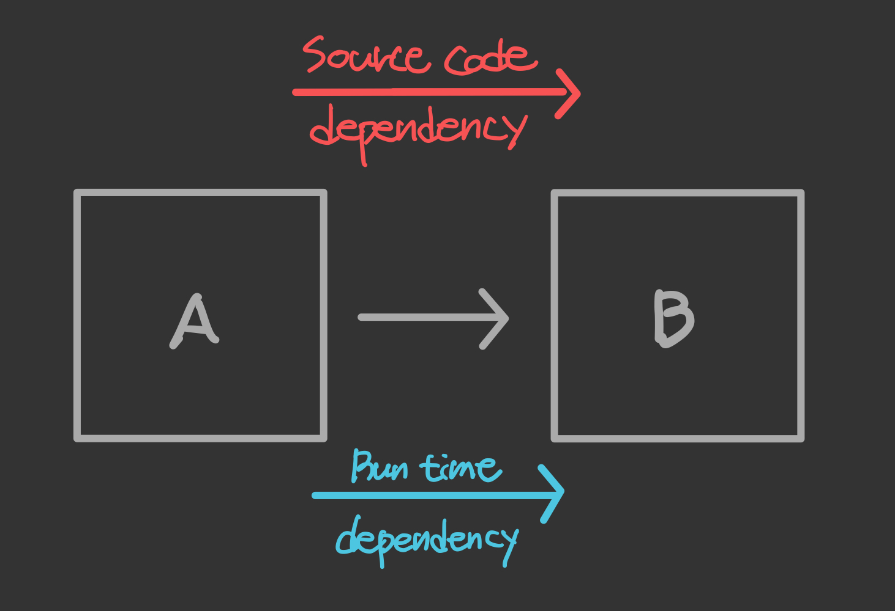
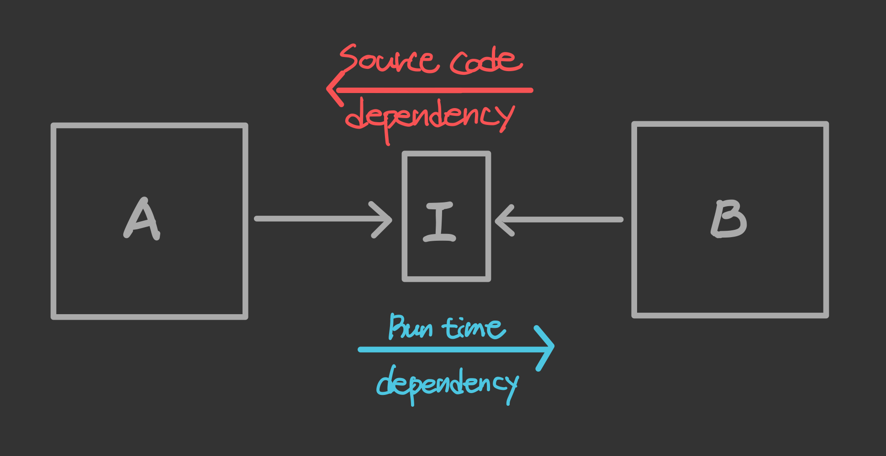
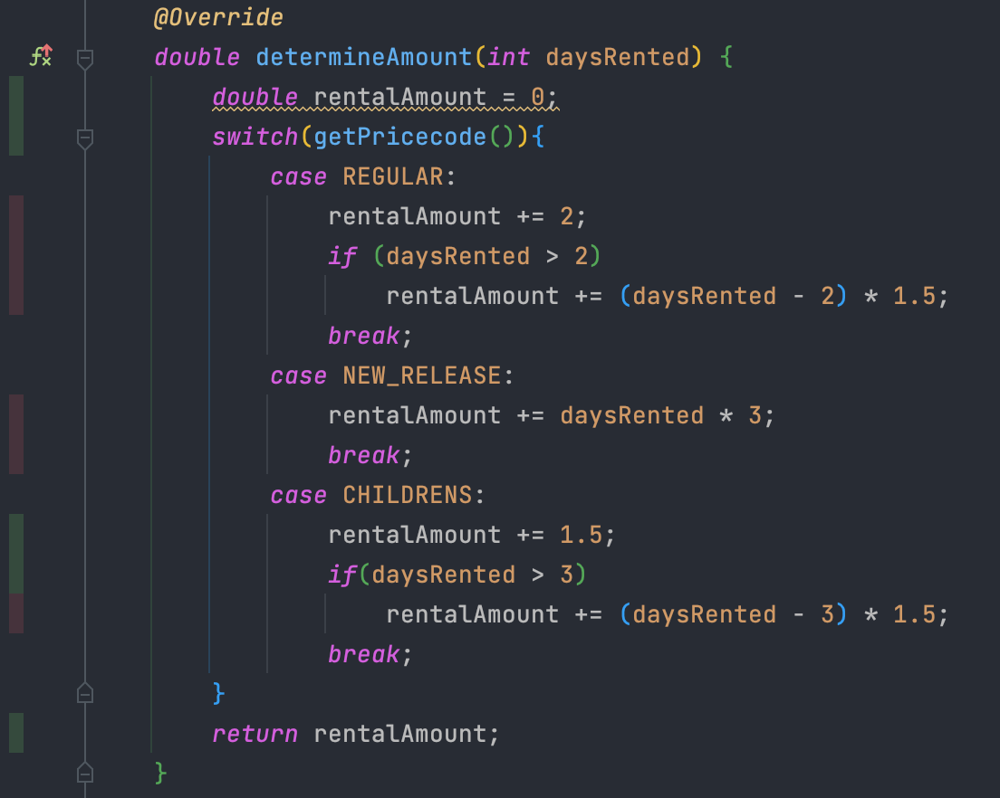
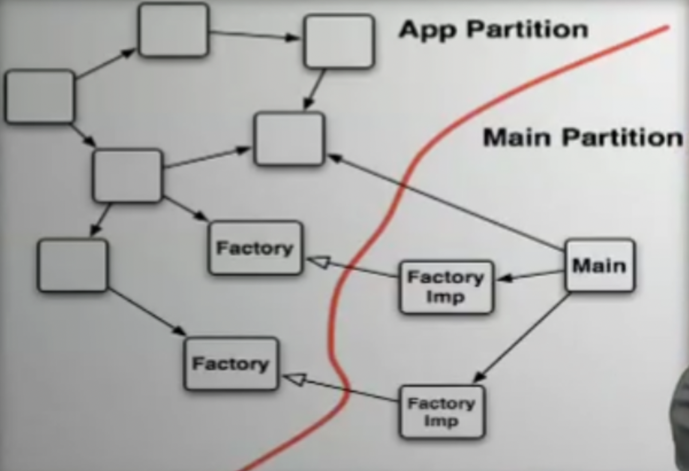

## 들어가면서

- 해당 포스트는 [최범균님의 클린 코더스 강의](https://www.youtube.com/watch?v=60lLSe1phks)를 정리한 내용입니다. 
- 강의 자료는 [깃 허브](https://github.com/msbaek/clean-coders-2013)에서 보실 수 있습니다.

## 클린 코더스 강의 5. Function Structure

### **1. Arguments**
- **인자가 많아지면 복잡도가 증가한다.**  
- **3개의 인자가 최대**  
    그 이상 넘어가면 외우기 어렵다. 따라서 Intellij의 Introduce Parameter Object 기능을 사용해서 파라미터들을 하나의 클래스로 만드는 것을 추천한다.
- **생성자에 많은 수의 인자를 넘겨야 한다면, `setter`를 사용하거나 `Builder`패턴을 적용하는 것이 좋다.**
- **Boolean 인자 사용 금지**  
    두 가지 이상의 일을 하는 것이 되어버린다. 이런 경우에는 `true` 경우를 위한 일, `false` 경우를 위한  일로 2개의 함수로 분리할 것
- **Innies not Outies**  
    파라미터는 Input으로 작용해야지 Output으로 작용해서는 안된다.
    ```java
    private String toSimpleText(Parse table, StringBuffer returnText) {
        if (table.parts == null) {
            simpleTextOfLeave(table, returnText);
            simpleTextOfMore(table, returnText);
            return returnText.toString();
        }
        simpleTextOfParts(table, returnText);
        simpleTextOfMore(table, returnText);
        return returnText.toString();
    }
    ```
    메소드의 Output은 메소드 내에서 만들어진 결과값으로 리턴해주거나, 리턴값을 `void`로 하고 값을 변경하거나 해야 하는데

    위 코드에서는 `table`과 `returnText`를 파라미터로 받아서 다시 다른 메소드의 파라미터로 넘겨주는 일을 한 뒤, 변경되었을 것으로 예상되는 `returnText`를 다시 리턴한다. 따라서 `returnText`는 파라미터(input)으로 들어와서 메소드 내에서 변경된 뒤에 리턴(output)되는 것이다.

    이런 상황이라면 `returnText`를 파라미터로 받은 후 메소드의 로컬변수를 변경한 뒤 로컬변수를 리턴해주어야 한다. 따라서 output으로 argument 대신 return value를 만들어서 처리해야 한다.

- **the null defense (null check)**  
    파라미터로 null을 전달받길 기대하는 메소드는 없다. 이것은 Boolean을 전달하는 것만큼 잘못된 것이며 null인 경우의 메소드와 null이 아닌 경우의 메소드로 분리하는 것이 맞다.  
    
    null을 마치 boolean인 것처럼 사용하지 말 것.

    defensive programming을 지양하라. 코드를 null과 에러 체크로 더럽히지 말아야 한다. null 여부를 지속적으로 조사하지 않고 단위 테스트에서 검증해야 한다. 만약 null이 발생할 확률이 높다면 차라리 예외를 던지는 편이 낫다.

    단, public api를 사용하는 경우에는 defensive하게 null check를 하는 것이 맞다. 


### **2. The Stepdown Rule**
- 모든 `public`은 위에, 모든 `private`는 아래에 위치하도록
- public part만 사용자들에게 전달하면 된다. backward reference없이 top에서 bottom으로 읽을 수 있게

### **3. switches and cases**
객체지향에 관한 어떤 책에서는 switch문은 객체지향스럽지 못하므로 사용하지 말라고 한다. 그런데 우리에게 이 대답은 그리 만족스럽지 않다. 

이 질문에 대한 답을 직접 알아보자.

먼저, 객체지향의 가장 큰 이점 중 하나는 의존성 관리 능력이다.

만약 모듈 A가 모듈 B의 메소드를 사용한다고 가정하면, 절차지향 방식에서는 2가지 의존성이 발생한다. 



이 경우, B의 메소드를 호출하는 A가 상위 로직이다. 따라서 A가 더 중요도가 높은 로직인데 반해 B에서 어떤 변경이 일어나면 A가 영향을 받는다. 이런 형태에서는 독립적인 배포/컴파일/개발이 불가능하다.

하지만 객체지향에서는 다음과 같은 형태가 가능하다.



본래 의존성을 제거하고 polymorphic interface를 삽입하면, 모듈 A는 인터페이스에 의존하고, 모듈 B는 인터페이스로부터 derive한다.

이렇게 되면 runtime 의존성은 그대로 둔 채, source code 의존성을 역전시킨다 => `Dependency Inversion Principle`
> 이런 구조는 유닛 테스팅시에도 매우 유리하다. 테스트 코드를 작성하기 힘든 이유는 구조가 잘못되었기 때문이다. 

따라서 Independent Deployability는 객체지향의 강점 중 하나이다.

그런데 **switch 문장은 독립적 배포에 방해가 된다.**

switch의 각 case 문장은 외부 모듈에 의존성을 갖고, 다수의 다른 모듈에 의존성을 가질 수 있다. 이런 것을 fan-out problem이라고 한다. 

따라서 switch문에서 source code 의존성은 flow of control과 방향이 같아지게 된다. 외부 모듈 중 하나라도 변경이 일어나면 switch 문장이 영향을 받고, switch에 의존하는 다른 모든 것들도 영향을 받게 된다.

switch문을 제거하기 위해서는 먼저 switch문을 polymorphic interface 호출로 변환한 뒤, case에 있는 문장들을 별도의 클래스로 추출하여 변경 영향이 발생하지 않도록 한다.

### VideoStore 예제
```java
public class Movie {
    public static final int CHILDRENS = 2;
    public static final int NEW_RELEASE = 1;
    public static final int REGULAR = 0;
    
    private String title;
    private int pricecode;

    public Movie(String title, int pricecode) {
        this.title = title;
        this.pricecode = pricecode;
    }

    public void setPricecode(int pricecode) {
        this.pricecode = pricecode;
    }

    public String getTitle() {
        return title;
    }

    public int getPricecode() {
        return pricecode;
    }

    double determineAmount(int daysRented) {
        double rentalAmount = 0;
        switch(pricecode){
            case REGULAR:
                rentalAmount += 2;
                if (daysRented > 2)
                    rentalAmount += (daysRented - 2) * 1.5;
                break;
            case NEW_RELEASE:
                rentalAmount += daysRented * 3;
                break;
            case CHILDRENS:
                rentalAmount += 1.5;
                if(daysRented > 3)
                    rentalAmount += (daysRented - 3) * 1.5;
                break;
        }
        return rentalAmount;
    }

    int determineFrequentRentalPoint(int daysRented) {
        boolean bonusIsEarned = pricecode == NEW_RELEASE && daysRented > 1;
        if(bonusIsEarned)
            return 2;
        return 1;
    }
}
```

```java
public class Rental {

    private Movie movie;
    private int daysRented;

    public Rental(Movie movie, int daysRented) {
        this.movie = movie;
        this.daysRented = daysRented;
    }

    public Movie getMovie() {
        return movie;
    }

    public String getTitle() {
        return movie.getTitle();
    }

    public double determineAmount() {
        return movie.determineAmount(daysRented);
    }

    public int determineFrequentRentalPoint() {
        return movie.determineFrequentRentalPoint(daysRented);
    }
}
```

```java
public class Statement {
    private String customerName;
    private List<Rental> rentals = new ArrayList<>();
    private double total;
    private int frequentRenterPoints;
    private double totalAmount;

    public Statement(String customerName) {
        this.customerName = customerName;
    }

    public void addRental(Rental arg) {
        rentals.add(arg);
    }

    public String getCustomerName() {
        return customerName;
    }

    public String generate() {
        clearTotals();
        String statementText = header();
        statementText += rentalLines();
        statementText += footer();
        return statementText;
    }

    private void clearTotals() {
        totalAmount = 0;
        frequentRenterPoints = 0;
    }

    private String header() {
        return String.format("Rental Record for %s\n", customerName);
    }

    private String rentalLines() {
        String rentalLines = "";
        for (Rental rental : rentals) {
            rentalLines += rentalLine(rental);
        }
        return rentalLines;
    }

    private String rentalLine(Rental rental) {
        double rentalAmount = rental.determineAmount();
        frequentRenterPoints += rental.determineFrequentRentalPoint();
        totalAmount += rentalAmount;

        return formatRentalLine(rental, rentalAmount);
    }

    private String formatRentalLine(Rental rental, double rentalAmount) {
        return String.format("\t%s\t%.1f\n", rental.getTitle(), rentalAmount);
    }

    private String footer() {
        return String.format(
                "Amount owed is %.1f\n" +
                        "You earned %d frequent renter points",
                totalAmount, frequentRenterPoints);
    }

    public double getTotal() {
        return totalAmount;
    }

    public int getFrequentRenterPoints() {
        return frequentRenterPoints;
    }
}
```

```java
@TestInstance(TestInstance.Lifecycle.PER_METHOD)
public class VideoStoreTest {
    private Statement statement;
    private final double DELTA = .001;
    private Movie newReleaseMovie1;
    private Movie newReleaseMovie2;
    private Movie childrensMovie;
    private Movie regular1;
    private Movie regular2;
    private Movie regular3;

    @BeforeEach
    public void setUp() {
        statement = new Statement("Customer");
        newReleaseMovie1 = new Movie("New Release 1", Movie.NEW_RELEASE);
        newReleaseMovie2 = new Movie("New Release 2", Movie.NEW_RELEASE);
        childrensMovie = new Movie("Childrens", Movie.CHILDRENS);
        regular1 = new Movie("Regular 1", Movie.REGULAR);
        regular2 = new Movie("Regular 2", Movie.REGULAR);
        regular3 = new Movie("Regular 3", Movie.REGULAR);
    }

    @Test
    public void testSingleNewReleaseStatementTotals() {
        statement.addRental(new Rental(newReleaseMovie1, 3));
        statement.generate();
        assertEquals(9.0d, statement.getTotal(), DELTA);
        assertEquals(2, statement.getFrequentRenterPoints());
    }

    @Test
    public void testDualNewReleaseStatementTotals() {
        statement.addRental(new Rental(newReleaseMovie1, 3));
        statement.addRental(new Rental(newReleaseMovie2, 3));
        statement.generate();
        assertEquals(18.0, statement.getTotal(), DELTA);
        assertEquals(4, statement.getFrequentRenterPoints());
    }

    @Test
    public void testSingleChildrenStatementTotals() {
        statement.addRental(new Rental(childrensMovie, 3));
        statement.generate();
        assertEquals(1.5, statement.getTotal(), DELTA);
        assertEquals(1, statement.getFrequentRenterPoints());
    }

    @Test
    public void testMultipleRegularStatementTotals() {
        statement.addRental(new Rental(regular1, 1));
        statement.addRental(new Rental(regular2, 2));
        statement.addRental(new Rental(regular3, 3));
        statement.generate();
        assertEquals(7.5, statement.getTotal(), DELTA);
        assertEquals(3, statement.getFrequentRenterPoints());
    }

    @Test
    public void testMultipleRegularStatementFormat() {
        statement.addRental(new Rental(regular1, 1));
        statement.addRental(new Rental(regular2, 2));
        statement.addRental(new Rental(regular3, 3));
        assertEquals(
                "Rental Record for Customer\n" +
                        "\tRegular 1\t2.0\n" +
                        "\tRegular 2\t2.0\n" +
                        "\tRegular 3\t3.5\n" +
                        "Amount owed is 7.5\n" +
                        "You earned 3 frequent renter points",
                statement.generate());
    }
}
```

<br>

먼저 `Movie` 클래스의 switch문을 지우기 위해서 test code부터 수정하는 것으로 시작한다.
```java
@BeforeEach
public void setUp() {
    statement = new Statement("Customer");
    newReleaseMovie1 = new NewReleaseMovie("New Release 1", Movie.NEW_RELEASE);
    newReleaseMovie2 = new NewReleaseMovie("New Release 2", Movie.NEW_RELEASE);
    childrensMovie = new ChildrensMovie("Childrens", Movie.CHILDRENS);
    regular1 = new RegularMovie("Regular 1", Movie.REGULAR);
    regular2 = new RegularMovie("Regular 2", Movie.REGULAR);
    regular3 = new RegularMovie("Regular 3", Movie.REGULAR);
}
```

이런 방식으로 `ChildrensMovie` 클래스와 `RegularMovie`도 만들어준다.
```java
public class NewReleaseMovie extends Movie {
    public NewReleaseMovie(String title, int pricecode) {
        super(title, pricecode);
    }
}
```

이렇게 하면 테스트는 성공적으로 통과하지만 생성자에서 중복을 발견할 수 있다. 이 중복을 모두 제거해주자.
```java
@BeforeEach
public void setUp() {
    statement = new Statement("Customer");
    newReleaseMovie1 = new NewReleaseMovie("New Release 1");
    newReleaseMovie2 = new NewReleaseMovie("New Release 2");
    childrensMovie = new ChildrensMovie("Childrens");
    regular1 = new RegularMovie("Regular 1");
    regular2 = new RegularMovie("Regular 2");
    regular3 = new RegularMovie("Regular 3");
}
```

그 후 pricecode는 클래스마다 부모의 생성자로 직접 전달한다. 
```java
public class NewReleaseMovie extends Movie {
    public NewReleaseMovie(String title) {
        super(title, NEW_RELEASE);
    }
}
```

이제 다시 `Movie` 클래스의 `determineAmount()`를 살펴보면, 각각의 case 문은 방금 구현한 각각의 클래스에 구현되어야 하는 로직임을 알 수 있다.
```java
double determineAmount(int daysRented) {
    double rentalAmount = 0;
    switch(pricecode){
        case REGULAR:
            rentalAmount += 2;
            if (daysRented > 2)
                rentalAmount += (daysRented - 2) * 1.5;
            break;
        case NEW_RELEASE:
            rentalAmount += daysRented * 3;
            break;
        case CHILDRENS:
            rentalAmount += 1.5;
            if(daysRented > 3)
                rentalAmount += (daysRented - 3) * 1.5;
            break;
    }
    return rentalAmount;
    }
```

따라서 `Movie` 클래스를 추상 메소드로 변경하고  `determineAmount()`와 `determineFrequentRentalPoint()`를 추상 메소드로 변경한다. 

이때 Intellij의 Push Members Down 기능을 사용하면 간편하게 리펙토링 가능하다.

```java
public abstract class Movie {
    public static final int CHILDRENS = 2;
    public static final int NEW_RELEASE = 1;
    public static final int REGULAR = 0;

    private String title;
    private int pricecode;

    abstract double determineAmount(int daysRented);
    abstract int determineFrequentRentalPoint(int daysRented);
    ...
}
```
구현했던 코드들은 각각의 자식 클래스들로 이동해있는데, 여기서 `pricecode`를 사용하는 부분만 `getPricecode()`로 변경하면 문제없이 테스트를 성공한다. 

하지만 각 클래스마다 불필요한 switch문이 중복되어 있다. 테스트 실행 시 실제로 동작하는 코드를 알아보기 위해 Intellij의 Run with Coverage 기능을 사용하면 다음과 같이 실행되는 라인에만 초록불이 들어온다.



붉은색으로 표시된 다른 클래스의 케이스들을 모두 지워주자.

`ChildrensMovie` 클래스의 `determineAmount()`는 아래와 같이 간략화된다. 같은 방식으로 다른 클래스에도 적용하자.
```java
@Override
double determineAmount(int daysRented) {
    double rentalAmount = 1.5;
    if(daysRented > 3)
        rentalAmount += (daysRented - 3) * 1.5;
    return rentalAmount;
}
```

`determineFrequentRentalPoint()`도 마찬가지로 `NEW_RELEASE`에만 적용되는 구문은 다른 클래스에서 삭제해준다.

`NewReleaseMovie` 클래스에서는 아래와 같고, 다른 클래스에서는 그저 `return 1`만 수행한다.
```java
@Override
int determineFrequentRentalPoint(int daysRented) {
    if(daysRented > 1)
        return 2;
    return 1;
}
```
<br>

이렇게 다형성을 사용한 리펙토링이 완료되었다. 진행한 과정을 정리해보면,

- 먼저 Test부터 Polymorphic하게 수정
- make it pass
- 중복제거
- Push Members Down
- run with coverage
- remove unused code
- remove type code

이 과정을 통해 Runtime 의존성은 그대로 두고 Source code 의존성을 역전했다. 이제 신경 쓸 일은 언제/어떻게 인스턴스를 생성하는가이다. 

대개 팩토리에서 이러한 작업을 수행하며 이것을 통해 `main`이라는 주요한 토픽을 가져온다. 

**application/main partition**



- Application Partition : 대개의 애플리케이션 코드가 존재하는 곳
- Main Partition : 하위 레벨 (factory, configuration data, main program...)
- 항상 모듈 다이어그램에서 App 파티션과 Main 파티션 사이에 선을 그을 수 있어야 한다.
- Main에서 App으로 향하는 한방향 의존성
- Main Partition은 App Partition의 plugin
- 이러한 기법을 `Dependency Injection`이라 하고, Spring을 사용하면 Main Partition 부분은 모두 스프링이 생성하고 관리한다. 

### **4. Temporal Coupling**
- 함수들이 순서를 지키며 호출되어야 한다.  
    예) open, execute, close
- Passing a Block
    ```java
    fileCommandTemplate.process(myFile, new FileCommand(){
        public void process(File f){
            // file processing codes here
        }
    });

    class FileCommandTemplate{
        public void process(File file, FileCommand command){
            file.open();
            command.process(file);
            file.close();
        }
    }
    ```
    위 코드처럼 `open()`, `process()`, `close()`를 같은 블록에 묶어서 안전성을 높이는 것이 좋음


### **5. CQS**
CQS란 `Command-Query Separation`의 줄임말로, 상태를 변경하는 메소드(Command)는 값을 반환하지 않아야 하고, 값을 반환하는 메소드는 상태를 변경하면 않아야 한다는 원칙을 말한다.  

Command
- 시스템의 상태 변경 가능
- side effect가 발생할 수 있음
- 아무것도 반환하지 않음

Query
- side effect가 없다
- 계산값이나 시스템의 상태를 반환

당신 코드의 독자들을 혼란스럽게 하지 말라.  
값을 반환하는 메소드는 상태를 변경하면 안되고, 상태를 변경하는 메소드는 exception을 발생시킬 수 있지만 값을 반환해서는 안된다.

CQS는 side effect를 관리하는 좋은 방법이다. 

### **6. Tell Don't Ask**
앞서 살펴본 CQS 원칙을 엄격하게 지키기 위해서는 Command와 Query를 함께 쓰는 것도 제한해야 한다.

아래 코드에서는 if문에서 Query를 사용하고 Command를 보낸다. 
```java
if (user.isLoggedIn())
    user.execute(command);
else
    authenticator.promptLogin();
```

위 코드보다 아래처럼 예외처리를 사용해서 Command만 사용하는 것이 더 나아보인다.
```java
try{
    user.execute(command);
}
catch(User.NotLoggedIn e){
    annuciator.promptLogin();
}
```

나아가 아래와 같이 user 객체가 모든 것을 처리하도록 하는 것이 독자 입장에서 가장 좋을 것이다.
```java
user.execute(command, annuciator)
```

로그인되었는지 아닌지 알고 있는 것은 user 객체이다. 하지만 첫 번째 코드에서는 user의 로그인 상태 여부를 가져다가 user를 대신해서 결정하고 있다. 

세 번째 코드처럼 user가 해당 행위를 수행하도록 하는 것이 맞다.

**Tell Don't Ask**  
- tell other object what to do
- but not ask object what the state is.

이 규칙을 준수하다보면 Query가 많이 필요 없어진다.  
Query는 곧 out of control되는 경향이 있기 때문에 Query를 많이 쓰지 않는 것이 좋다.

Long chain of function  
Tell, Don't Ask를 위반한 대표적인 예
```java
o.getX().getY().getZ().doSomething();
```
뭔가를 tell(doXXX)하기 전에 지속적으로 ask(getXXX) 함. 이 경우에는 테스트 코드 작성 시에도 매우 번거로움

```java
o.doSomething();
```
o에게 무엇을 하라고 했는데 o는 어떻게 해야할지 모른다. 하지만 o는 어떤 다른 객체에게 tell하면 되는지는 알고있다. 최종적으로 처리되기 전까지 요청이 전파된다. 

### **7. Law of Demeter**  
하나의 메소드가 전체 시스템의 객체들 간의 네비게이션을 아는 것은 잘못된 설계다.

```java
o.getX().getY().getZ().doSomething();
```
o는 X를 갖는다. X는 Y를 갖고, Y는 Z를 갖는다. Z는 doSomething()을 할 수 있다.  
한 라인의 코드가 알아야 하기에는 너무 방대한 정보이고, 메소드가 시스템에 너무 많은 의존성을 갖는다. 

따라서 Law of Demeter에서는 메소드가 시스템의 전체를 알게 하면 안되고 개별 메소드는 아주 제한된 지식만 가져야 한다. 

객체는 요청된 기능 수행을 위해 이웃 객체에게 요청해야 하고, 요청을 수신하면 적절한 객체가 수신할 때까지 전파되어야 한다.

Law of Demeter는 아래와 같은 일련의 규칙을 통해 Tell, Don't Ask를 형식화(formalize)한다.
- 다음 객체들의 메소드만 호출할 수 있다.
    - 파라미터로 전달된 객체
    - 로컬 변수로 생성한 객체
    - 필드로 선언된 객체
    - 전역 객체
- 이전 메소드 호출의 결과로 얻는 객체의 메소드를 호출하면 안된다.

### **8. early returns**

어떤 코드를 보면 if문에서 많은 로직을 처리하고, else에서 return하는 경우가 있다.  
이런 경우, 조건문을 부정으로 뒤집어서 return이 먼저 나오도록 하는 것이 좋다.

```java
private boolean nameIsValxxxx{
    if(name.equals(""))
        return true;
    if(!WikiWoedWidget.xxx)
        return true;
    return false;
}
```
early return이나 guarded return은 허용된다.

또한 loop의 중간에서 리턴하는 것은 문제가 된다. break와 루프 중간에서의 return은 loop를 복잡하고 이해하기 힘들게 한다.

### **9. error handling**
예를들어, stack을 구현하는 코드에서 에러 처리를 위해 `pop()`은 null을 반환하고, `push()`는 false를 반환할 수 있는데 이는 일관성이 없을 뿐더러 CQS를 어기게 된다.

따라서 이런 경우, exception을 발생시키는 것이 좋고 exception의 이름은 최대한 구체적이어야 한다.

```java
public static Stack mack(int capacity){
    if(capacity < 0)
        throw new IllefalCapacity();
    if(capacity == 0)
        throw new ZeroCapacityStack();

    return new BoundedStack(capacity);
}

public static class IllegalCapacity extends RuntimeException{
}
```

예외에는 `checked exception`과 `unchecked exception`이 있는데  
`checked exception`은 `reverse dependency`를 유발한다. 하위 클래스에서 어떤 `checked exception`이 유발되면 상위 클래스를 모두 변경해야 하고 해당 클래스를 사용하는 모든 코드를 변경해야 한다. 따라서 `checked exception`은 정말 필요한 경우가 아니라면 사용을 지양하는 것이 좋다. 

또한 exception의 이름을 정확하게 지어서 이름으로 의미가 전달되도록 해야한다. exception에 담을 메시지 중 가장 좋은 것은 메시지가 필요 없는 것이다. 


### **10. Special Cases**
stack 예제에서 만약 capacity가 0인 stack을 생성하려 한다면 이것도 오류인가? 아니면 zero size stack도 의미 있는 객체인가를 생각해봐야 한다.

로직에 대해 생각해봤을 때, zero size stack은 잘 정의된 행위를 가진다는 것을 알 수 있었다. `push()`를 호출하면 `Overflow`, `pop()`을 호출하면 `Underflow`가 발생하고, `getSize()`는 0을 반환하고 `isEmpty()`는 항상 `true`이다. 

이런 기능 구현을 Stack 클래스의 모든 메소드에 size가 0인지 비교하는 로직을 추가해서 구현할 수 있다. 하지만 이 보다 좋은 방법은 빈 스택을 정의하는 `ZeroCapacityStack` 클래스를 생성하는 것이다. 

```java
public static Stack make(int capacity){
    if(capacity < 0)
        throw new IllegalCapacity();
    if(capacity == 0)
        return new ZeroCapacityStack();
    
    return new BoundedStack(capacity);
}

public static class Overflow extends RuntimeException{
} 
public static class IllegalCapacity extends RuntimeException{
} 
public static class Underflow extends RuntimeException{
} 

private static class ZeroCapacityStack implements Stack{
    public Boolean isEmpty(){
        return true;
    }
    public Integer getSize(){
        return 0;
    }
    public void push(int element){
        throw new Overflow();
    }
    public int pop(){
        throw new Underflow();
    }
}
```

### **11. Null is not an error**
계속해서 stack 예제에 대해 얘기해보자.  

만약 stack이 empty일 때, `top()`함수는 무엇을 반환해야할까? 그냥 단순히 null을 반환할 수 있다.  

그런데, `top()`을 호출하는 그 누구도 리턴값으로 null을 기대하지는 않는다. 이런 상황에서 null을 반환하게 되면, `NullPointException`을 발생시킬 때까지 시스템의 여기저기에 문제가 퍼질 것이며, 이를 해결하기 위해 곳곳에 null check를 추가해야 한다. 

따라서 아무도 null을 기대하지 않는 `top()`의 경우에는 exception을 발생시키는 것이 좋아보인다.

```java
public Integer top(){
    if(size == 0)
        throw new Empty();
    return elements[size-1];
}
```

### **12. Null is a value**
그럼 이번엔 `find()` 메소드에 대해 생각해보자. 만약 `find()`가 element를 찾지 못하면 어떻게 해야할까?  

이때는 exception이 부적절할 수 있다. `find()`의 경우, 원하는 element를 찾지 못했을 때 리턴값으로 null을 기대하기 때문이다. exception은 기대하지 못한 때를 위한 것이다. 

때문에 이런 경우에는 exception이나 어떤 특정값(예를들어 -1 같은)을 사용하는 것보다 null을 반환하는 것이 낫다. null은 nothing을 의미하는 값이다. 

```java
public Integer find(int element){
    for(int i = size-1; i>=0; i--)
        if(elements[i] == element)
            return size - 1 - i;
    return null;
}
```

### **13. try도 하나의 역할/기능이다.**
메소드 내에 try문이 있다면 try문이 변수 선언을 제외하고는 첫 번째 문장이어야 한다. 또한 try 블럭 내에는 한 문장(메소드 호출)만 있어야 한다.  

메소드는 오직 하나의 일만 해야한다. error handling도 하나의 일이기 때문에 finally가 메소드의 마지막 블록이어야 하고 이후에 어떤 라인도 없어야 한다. 

