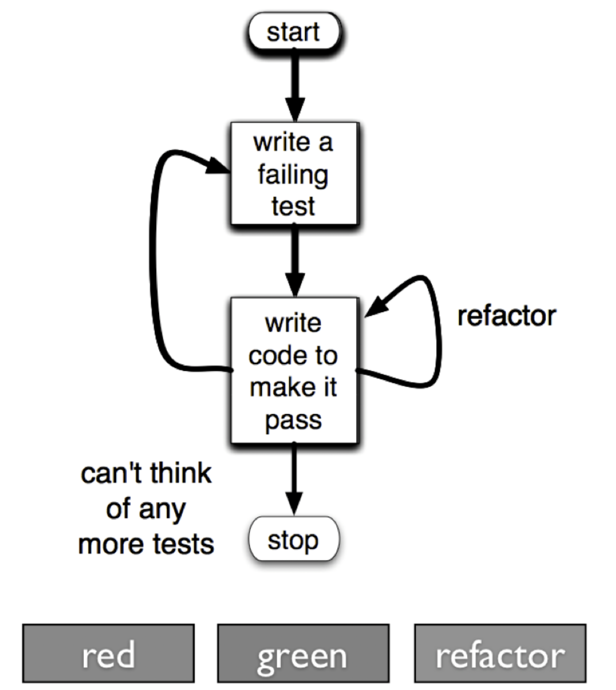

## 들어가면서

- 해당 포스트는 [백명석님의 클린 코더스 강의](https://www.youtube.com/watch?v=60lLSe1phks)를 정리한 내용입니다. 
- 강의 자료는 [깃 허브](https://github.com/msbaek/clean-coders-2013)에서 보실 수 있습니다.

## 클린 코더스 강의 7. TDD

### **1. The Three Laws of TDD**
- 실패한 테스트를 통과하기 위한 경우를 제외하고는 production code를 작성하지 않는다.
- 테스트 코드는 오류를 실패를 발생시키기에 적절한 테스트만 생성한다.
- production code는 실패한 테스트를 통과하기에 적절한 정도로만 작성한다. 

### **2. 원칙 & 팁**
- 가장 심플하고 일차원적인 테스트를 생성하라. 그렇게 해야 코드가 점진적으로 발전하고, 내가 생각할 수 있는 테스트 케이스들이 모두 포함된다.
- 테스트가 점점 구체화될 수록 코드는 점점 더 generic 해진다. 

### **3. TDD의 이점**
- 디버깅 시간을 줄일 수 있다. 
- TDD의 법칙을 잘 따르면 자연스레 설계 문서를 얻게 된다. 
- 테스트를 먼저 작성함으로써 production code를 테스트하기 쉬워진다.  
    - 기능을 구현하기 전에 그 기능을 사용하는 client 코드를 먼저 만들기때문에 테스트하기 쉽게 작성될 수밖에 없다. 
- 용기있게 변경할 수 있다.  
    - 테스트가 있어서 시스템이 정상적으로 동작하는 것을 확인할 수 있어 변경이 두렵지 않게 된다. 이로 인해 개발자는 코드를 깨끗하게 하는 리펙토링을 두려워하지 않는다. 
    - 만약 코드 실행 중 버그를 만났다면 버그를 해결한 뒤, 그 버그를 유발하는 테스트 코드를 작성하라. regression test로 인해 해당 버그가 다시 발생하지 않도록 할 수 있다.
- 신뢰할 수 있다.  
    - 모든 코드를 작성하고 테스트를 만드는 TAD(Test After Development)는 지루하고 낭비적으로 느껴지기 때문에 short cut을 취하게 된다. 낙하산을 만드는데도 그렇게 할 것인가?

## 클린 코더스 강의 8. TDD 3 - bowling game
[bowling-game](https://github.com/msbaek/bowling-game)

## 클린 코더스 강의 9. TDD 4 - primefactors and wordwrap
[primefactors](https://github.com/msbaek/primefactors) 

[wordwrap](https://github.com/msbaek/wordwrap)

 

TDD 예제들은 일일이 설명 포스팅을 하는 것보다 자주 반복해보는 것이 좋을 것 같다. readme를 읽으면서 꾸준히 반복하도록 하자.