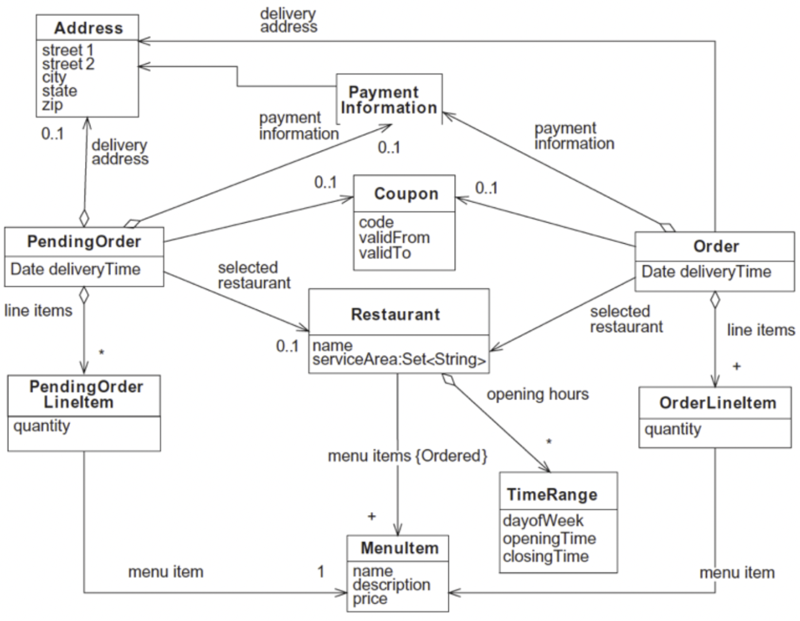

## 들어가면서

- 해당 포스트는 [최범균님의 클린 코더스 강의](https://www.youtube.com/watch?v=60lLSe1phks)를 정리한 내용입니다. 
- 강의 자료는 [깃 허브](https://github.com/msbaek/clean-coders-2013)에서 보실 수 있습니다.

## 클린 코더스 강의 10. Architecture
- Architecture란 무엇인가?
- 결정 미루기
- 핵심 추상화

### What is Architecture
아키텍처란, 전체적인 시스템 개발에 기반을 제공하는 변경 불가한 초기 결정사항의 집합이다. 

쉽게 말해서 초기에 결정해야할 사항 중 변경 불가능한 것들의 집합

하지만 java(language), Intellij(development environment), Spring, Tomcat, Hibernate, MySQL 등이 아키텍처에 속하지는 않는다. 

마치 건축의 아키텍처가 해머, 못, 벽돌 등을 의미하지 않듯이 소프트웨어의 아키텍처 또한 툴이나 도구같은 것이 아니라 사용법(Usage)에 대한 것을 말한다. 

### What is Use Case
사용자(actor)가 특정 목적을 이루기 위해 시스템과 어떻게 상호작용하는지에 대한 형식적인 기술

### Architecture Exposes Usage
따라서 아키텍처는 사용법에 대해서 설명해야 한다.

아키텍처라고 하는 많은 것들을 보면, use case를 숨기고 delivering 매커니즘(시스템적 흐름)만 노출하는 경우가 많다. 하지만 중요한 것은 delivering 매커니즘이 아니라 use case다. 

또한 use case는 delivering 매커니즘과 decoupled(분리)되어야 하고, 이뿐만 아니라 UI, DB, F/W, Tools 등에 대한 결정들 또한 use case와는 완전히 분리되어야 한다. 

`Use case should stand alone`

### Deferring Decisions
좋은 아키텍처는 FW, WAS, UI 등과 같은 stuff들에 대한 결정을 연기하는 것을 허용한다.   
시간이 지날 수록 결정을 위한 정보가 풍부해지기 때문에 stuff들에 대한 결정은 연기될 수 있어야하고, 연기되어야만 한다. 

이게 좋은 아키텍처의 주요한 목적 중 하나다.

### Central Abstraction
많은 아키텍트는 DB를 core abstraction이라고 생각한다. 그래서 DB가 동작하고 스키마가 준비되기 전에는 어떠한 생각도, 작업도 시작하지 않는다. 

그런데 개발 시에 데이터부터 생각하면 반드시 절차지향적으로 진행하게되기 때문에 큰 어려움이 따르게 된다. 

따라서 DB를 연기할 수 있는 Detail로 간주해야 한다. 좋은 아키텍처는 UI, WAS, DI FW 등과 같은 Detail에 대한 결정을 연기할 수 있도록 한다. 

결정을 연기하기 위해서는 연기하고 싶은 것과 구조를 decouple, irrelevant하게 설계한다. 그러기 위해서는 아키텍처 측면에서 SW 환경이 아닌 Use Case에 집중해야 한다.

### Conclusion
`아키텍처를 use case에 집중하라`
- UI, FW, WAS, DB 등과 같은 다른 시스템 컴포넌트에 대한 결정을 미룰 수 있다.
- 이러한 연기는 우리의 선택을 최대한 오래 열어 둘 수 있다.
- 이로인해 필요에 따라 결정을 변경할 수 있게 된다.
- 결정을 연기하면 프로젝트 진행 중에 충분한 정보가 생김에 따라 undo에 대한 비용을 줄일 수 있다.

## +) Developing Domain Model
소프트웨어를 개발하는 순서
- 클래스, 속성, 관계 식별
- 도메인 모델에 행위 추가하기
    - 요구사항 식별하기
    - 메소드 식별하기
    - TDD로 메소드 구현하기

먼저, 도메인 영역의 주요 개념(명사)를 식별해 정적 모델링을 하여 소프트웨어의 청사진을 만든다. 

그 후 도메인 모델에 행위를 추가함으로써 도메인 모델에 생명력을 부여한다. 

이때 도메인 모델의 행위를 결정하기 위해 도메인 모델의 책임(Responsibility)과 상호작용(Collaboration)을 식별해야 한다. 

**클래스의 책임**이란, 클래스가 아는 것(속성, 관계), 하는 것, 결정하는 것 등..  
**클래스의 상호작용**이란, 책임을 수행하기 위해 다른 클래스들을 호출하는 것

책임과 상호작용을 식별하는 절차는 다음과 같다.
1. 요구사항(유스케이스, 유저스토리, UI 디자인 등) 분석을 통해 어플리케이션이 처리해야 하는 요구사항 식별
    - 요구사항은 두 가지 부분으로 구성
        - 사용자 행위
        - 사용자 행위 요청에 대한 어플리케이션의 응답(책임)
    - 어플리케이션 책임은 두 가지로 그룹핑
        - 사용자 입력 검증, 값 계산, 데이터베이스 갱신
        - 값 출력
2. 도메인 모델의 클라이언트에게 도메인 모델을 노출하기 위한 도메인 모델의 인터페이스(타입, 메소드) 결정
    - 각 요청에 대해 두 가지 메소드들이 존재
        - 서비스 메소드 : 사용자 요청 검증, 계산 수행, 데이터베이스 갱신 (Command)
        - 리파지토리 메소드 : 출력을 위한 데이터 반환 (Query)
    - 도메인 모델의 클라이언트는 도메인 티어를 2번 호출
        - 서비스 메소드 + 리파지토리 메소드 
3. 해당 인터페이스를 각각의 요구사항을 고려하여 TDD 접근법으로 구현
    - 대상 서비스 메소드에 대해 하나 이상의 테스트케이스를 작성하는 것으로 시작
        - 각 테스트는 서로 다른 상황을 재현하기 위해 각기 다른 arguments로 구성  
    - mock 객체를 이용
        - service methods -> repository methods 순으로 top-down 방식으로 구현가능
        - 구현을 하다가 발견되는 collaborator를 구현하기 위해 머리 속에서 context-switching이 일어낳 필요가 없어서 집중해서 구현할 수 있다.  

## 클린 코더스 강의 11. Architecture UseCase

어떤 Web 기반 Accounting 시스템이 있다고 할 때, Accounting 시스템과 Web 시스템 중에서 이 아키텍처에서 주목해야 할 부분은 무엇일까?

당연히 소프트웨어 아키텍처는 Accounting Issue를 드러내고 Web에 대해서는 거의 언급하지 않아야 한다. 

하지만 대개의 Web 시스템은 반대로, Web Issue에 대해서만 열심히 설명하고 비즈니스 의도에 대해서는 거의 언급하지 않는다. 

### Web System에 만연하는 MVC Architecture

이런 경우, View와 Controller는 html과 강하게 연관된다.  

Model은 Controller와 강하게 연관되기 때문에 Model이 순수한 POJO가 되지 못하고 http나 html의 영향을 받게 된다.(request, response, cookie...) 이로 인해 Web MVC의 Model은 순수한 Model이 되지 못한다. 

Accounting System Architecture에서는 Architecture 변경 없이 delivery 메커니즘을 변경할 수 있어야 한다. 예를 들어, 동일한 시스템을 웹과 콘솔에 deliver할 수 있어야하고 이 두 시스템의 아키텍처는 동일해야 한다. 

### Use Case
따라서 유스 케이스를 통해서 delivery 메커니즘과 아키텍처를 분리해야 한다.  

Use Case는 delivery와 무관한 방식으로 사용자가 시스템과 상호작용하는 방식을 이해하는 것을 말하며 이때 delivery 메커니즘을 나타내는 용어(링크, 버튼, 클릭 등)를 사용하지 않고 표현해야 한다. 

어플리케이션 개발은 Delivery와 독립적인 Use Case에 의해 주도되어야 한다.

위와 같이 use case driven 시스템의 아키텍처를 보면 delivery 메커니즘이 아닌 use case를 통해 시스템의 의도를 보게 된다.

Use Case는 입력 데이터를 해석하여 출력 데이터를 생성하는 필수 알고리즘이다.

### Use Case Algorithm

유스 케이스 알고리즘은 비즈니스 규칙을 내포하고 있으며 다른 비즈니스 객체들을 언급한다.

하지만 이런 비즈니스 규칙은 어떤 한 객체에 속하지 않는다. 그렇다면 어디에 비즈니스 규칙을 내포시킬 것인가?

어떤 객체에 위치시킬 것이며 use case 객체를 아키텍처의 어디에 위치시킬 것인가?

어떻게 우리의 시스템을 partition해서 use case가 central organizing principle이 되게 할 것인가? 

### Partitioning

Ivar Jacobson : 아키텍처는 3개의 fundametal kinds of objects를 갖는다. 
- Business Objects
    - Entity라고 불리는 것들
    - Repository
- UI Objects
    - Boundary라고 불리는 것들
    - DTO, VO 
- Use Case Objects
    - 원래는 Controller라고 했으나 MVC의 Controller와 혼동을 피하기 위해 Interactors라고 부름  

Entities have :  
- Application과 무관한 독립적인 비즈니스 로직만 가짐  
- 따라서 다른 application에서도 같은 entity가 사용될 수 있음  
- 특정 application에 특화된 메소드를 가지면 안됨. 이런 메소드들은 interactor로 옮겨야 함  

Interators have :
- Application에 종속적인 비즈니스 로직
- 특정 Application에 특화된 메소드들은 Interactor 객체에 구현

Interactor는 entity의 로직을 호출해서 application에 특화된 로직을 통해 목적을 달성한다.  

위의 예에서 `CreateOrderInteractor`는 `OrdereEntity`의 생성자와 `getId()`를 호출한다. 

`OrdereEntity`의 생성자와 `getId()`는 어느 Application에서도 호출할 수 있지만 이러한 목적을 가지고 순서대로 호출하는 것은 `CreateOrderInteractor`뿐이다. 

Use Case의 목적을 달성하기 위해 이러한 메소드들을 어떻게 호출할지 아는 것이 Interactor의 책임이다. 

Boundary Object는 use case를 delivery 메커니즘으로부터 격리하고, 둘 간의 통신 수단을 제공한다.  

따라서 Use cases의 Partitioning을 정리해보자면,

유스 케이스에서 application에 특화괸 행위를 interator 객체로 캡쳐하고  
application과 무관한 행위를 entity 객체로 캡쳐한 뒤 interactor로 제어한다.

또한 UI 종속적인 행위는 Boundary 객체로 캡쳐하여 interactor와 커뮤니케이션하도록 한다. 

### Conclusion
- Architecture는 툴이나 프레임워크에 기반하지 않는다.
- 좋은 아키텍처는
    - 툴이나 프레임워크에 대한 결정을 아주 오랫동안 미룬다.
    - 이행되지 않은 결정의 개수를 최대화한다.
    - delivery 메커니즘에 의존하지 않고, 노출하지 않는다.
- 시스템의 모양을 보면 web 시스템인지 앱 시스템인지 여부를 알 수 없어야 한다.
- 시스템의 use case는 주요한 추상화이고 시스템 아키텍처를 구성하는 핵심적인 원칙이다.
- 아키텍처를 보면 UI가 아니라 시스템의 의도를 볼 수 있어야 함
- use case 지향 아키텍처를 만들기 위한 야콥슨의 Boundary, Interactor, Entity Partition
    - Interactor가 use case를 캡슐화하고 Entity는 비즈니스 객체를 캡슐화하고 Boundary는 UI와 격리를 제공한다.

