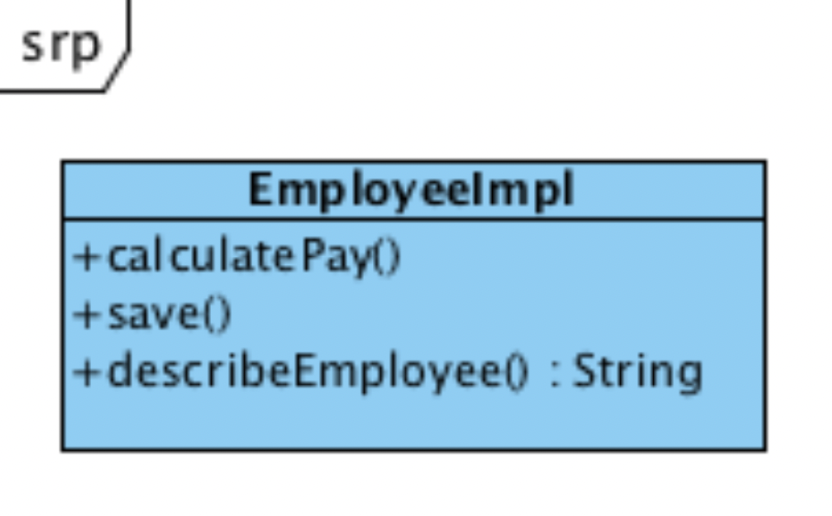
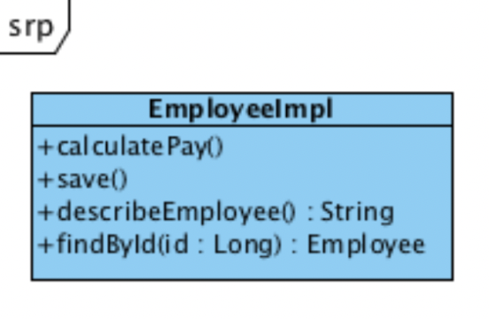
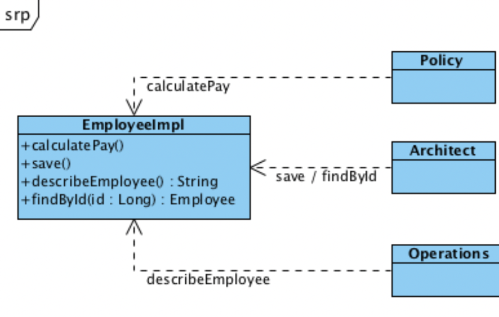
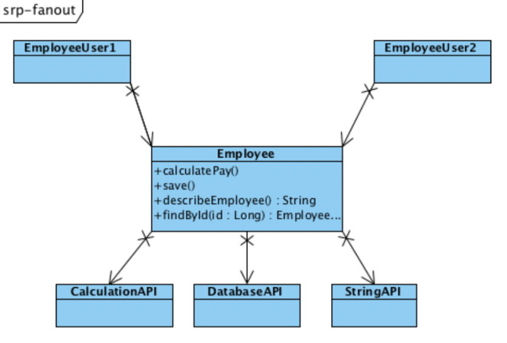
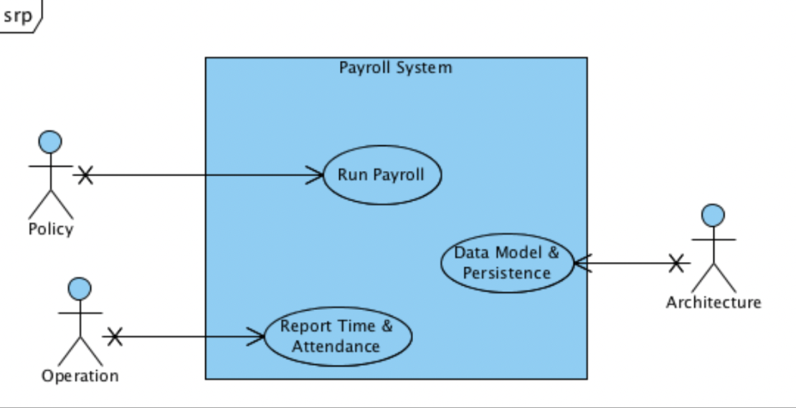
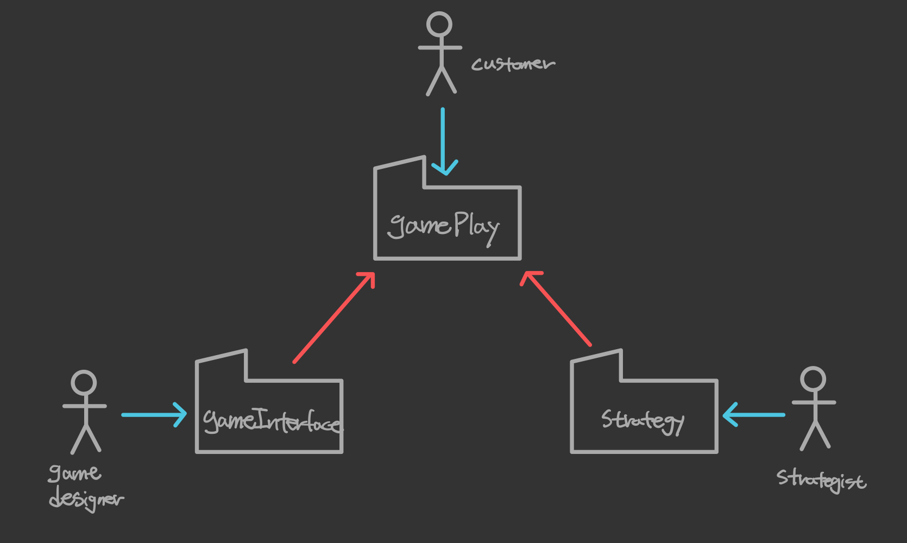
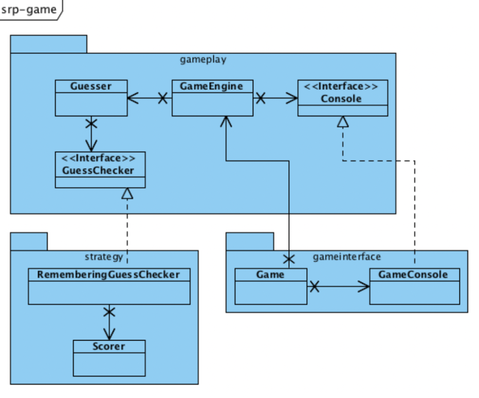

## 들어가면서

- 해당 포스트는 [최범균님의 클린 코더스 강의](https://www.youtube.com/watch?v=60lLSe1phks)를 정리한 내용입니다. 
- 강의 자료는 [깃 허브](https://github.com/msbaek/clean-coders-2013)에서 보실 수 있습니다.

## 클린 코더스 강의 13. SRP(Single Responsibility Principle)

### Responsibility
클래스는 하나의 책임을 가져야 한다. 

이런 `EmployeeImpl` 클래스가 있다고 할 때, 이 클래스의 책임은 무엇인가? 메소드가 3개 있으니 책임도 3가지일까? 

만약 여기서 `findById()` 메소드가 추가되었다면, 책임이 더 늘어나는 것인가? 

그렇지 않다. `save()`와 `findById()`는 같은 부류의 메소드이므로 같은 책임을 가진다. 

또한, `calculateDeduction()`, `calculateSalary()` 등이 추가되어도 기존의 `calculatePay()`와 같은 부류의 메소드이므로 책임의 수는 변하지 않는다. 

SRP에서 말하는 **부류**는 메소드의 client에 의해 결정된다. 다시말해, 누가 해당 메소드의 변경을 유발하는 사용자인가로 부류를 구분한다. 

### It's About Users
SRP에서 말하는 책임이란 사용자에 관한 것이다. 

책임은 SW의 변경을 요청하는 특정 사용자들에 대해 클래스나 함수가 갖는 것을 말하며, 책임을 찾기 위해서는 **변경의 근원**이 무엇인지 생각해봐야 한다.

`EmployeeImpl` 클래스에는 변경을 요구하는 사용자들(actor)이 있다. 

각각의 Actor는 서로 다른 Needs와 Expectation을 가진다.

### It's About Roles
사용자가 특정 역할을 수행할 때 Actor라고 부른다. 책임은 개개인의 사용자가 아니라 actor와 연결된다.  
따라서 `EmployeeImpl` 클래스에는 3개의 actor가 있다.  
-> Policy, Architect, Operations

따라서 `Resposibility`란, **특정 Actor의 요구사항을 만족시키기 위한 일련의 함수들의 집합**을 말한다. 

이러한 **Actor의 요구사항 변경**이 일련의 함수들의 **변경의 근원**이 된다. 

### Two Values of SW - Primary and Secondary Values

SW에서 두 가지 중요한 Value가 있다.  

그 중 **Secondary value는 현재의 SW가 현재 사용자의 현재 요구사항을 만족하는가?**를 의미한다.  

하지만, SW의 요구사항은 늘, 그것도 자주 변한다.  
그래서 고객의 요구사항과 SW의 행위 간의 불일치가 발생하는 경우를 많이 볼 수 있다.  

따라서 **Primary value는 지속적으로 변화하는 요구사항을 수용(tolerate, facilitate)하는가?**를 말한다.  
사람들은 보통 Primary value보다 Secondary value에 더 집중하기 때문에 대부분의 SW는 현재의 요구사항은 잘 만족하지만 변경하긴 어렵다.

### Collision

`EmployeeImpl` 클래스처럼 한 클래스가 여러 책임을 맡는 경우, Primary value가 저하된다.   
Policy Actor는 business rule의 변경을 필요로 하고  
Architecture Actor는 DB schema의 변경을 필요로 하고  
Operation Actor는 Business rule의 변경을 원한다.   

이런 경우, 동일 모듈(여기선 클래스)의 변경이 일어나 Merge 시 충돌이 발생하거나 Source Repository에서 충돌이 발생할 수 있다. 

### Fan Out
또한 `EmployeeImpl` 클래스는 너무 많은 것을 알고 있다.
> Business rules, DB, Reports, formatting...

많은것을 알기 때문에 많은 책임을 갖는다. 이런 각각의 책임은 Employee가 다른 API들을 사용하도록 한다. 

Employee 클래스에 거대한 Fan Out이 존재하는 것을 볼 수 있다. 

이로 인해 클래스는 변경에 민감해지고, `Employee` 클래스를 사용하는 `EmployeeUser` 클래스까지 변경에 민감해진다. 

따라서 Fan Out을 제한해야 한다. 이를 위해 좋은 방법은 **책임을 최소화**하는 것이다. 

### Collocation is Coupling

만약 Operation Actor가 새로운 리포트 기능을 필요로 한다고 했을 때, 새로운 리포트 기능도 `Employee` 클래스에 추가했다고 가정해보자.

기존 책임(Policy, Architecture)에는 변경이 없음에도 불구하고 새로운 리포트 기능이 추가되어 `Employee` 클래스가 변경되었다. 

새로운 리포트 기능이 추가되면서 `Employee` 클래스를 사용하는 모든 클래스들 중 이 기능을 필요로 하지 않는 클래스들까지 다시 컴파일/배포되어야 한다. 

따라서 다른 책임들 또한 리포트 기능에 coupled되어 영향을 받게 되는 것이다. 

### SRP - One and only one responsibility
모듈은 반드시 **하나의 변경 사유**를 가져야 한다.  
앞서 계속 언급했듯이 하나의 변경 사유는 하나의 Actor를 의미한다고 볼 수 있다. 

따라서 동일한 이유로 변경되어야 하는 것들은 동일 모듈에, 다른 이유로 변경되어야 하는 것들은 다른 모듈에 두어야 한다. 

SRP를 가장 적용하기 좋은 때는 시스템을 설계할 때이다. 

Actor를 파악하고 use case를 찾을 때, SRP를 고려하여 각 모듈이 반드시 하나의 책임을 갖도록 유지하면서  
다른 이유로 변경되고, 다른 때에 변경되는 모듈은 분리한다. 

### Case Study
무언가를 변경할 때는 다른 Actor들에 영향을 주지 않고 변경해야 한다. 

이 그림을 보면 Customer Actor를 위한 Responsibility가 어플리케이션 아키텍처의 중심이고, 각 패키지는 각 액터들을 위한 책임을 구현하고 있다. 

이 설계가 좋은 아키텍처인 이유는 **패키지 간의 의존성 방향**에 있다. 다른 패키지들은 customer에게 제공할 책임을 구현하는 gamePlay 패키지로 향하고 있기때문에 어플리케이션이 중앙에 있고 다른 책임들은 어플리케이션에 plug into되는 구조이다.

각 클래스는 하나의 액터만을 위한 기능을 제공하고, 하나의 책임만 가진다. 패키지 방향 또한 한 방향으로 흐르고 있다.

### Faking it
과연 이런 설계가 Waterfall 순서로 작성되었을까? 
> Waterfall : 액터를 찾고 -> 패키지 다이어그램을 그리고 -> 클래스 다이어그램을 그리고 -> 코드 작성

그렇지 않다. 실제 과정은 아래와 같다.
- 가장 먼저 테스트를 작성하고 통과하도록 했다.
- 스코어를 계산하는 메소드를 하나 만들고,
- 추측하는 로직을 위한 메소드를 만들고,
- 설계가 드러날 때까지 메소드들을 리팩토링했다.
- 동작하는 전체 게임을 얻을 때까지 모든 동작들이 테스트에 성공하도록 설계를 적용했다.
- 그리고 아키텍처를 살폈다. 테스트가 최종 설계의 80%를 유도했다.
- 그리고 테스트가 3개의 책임을 식별하는 것을 도왔다.
- unit test가 확보된 후에는 디자인을 향상시키기 위해 과감한 리팩토링을 수행한다. 
- 이런 후에 3개의 Actor들이 식별된다. 그러면 클래스들을 3개의 패키지로 분리시킨다.
- 마지막으로 예쁜 다이어그램을 그린다. 예쁜 다이어그램을 그리기 가장 좋은 때는 완료된 후이다.