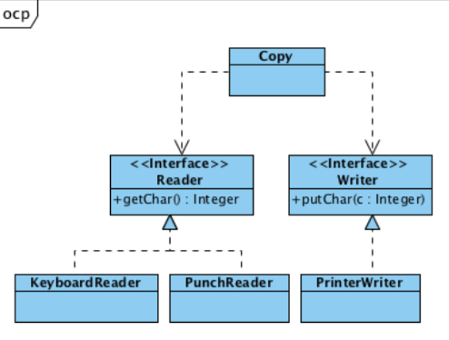
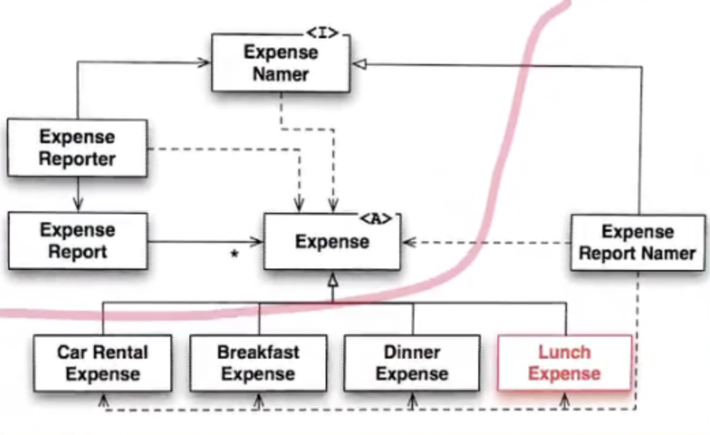

## 들어가면서

- 해당 포스트는 [최범균님의 클린 코더스 강의](https://www.youtube.com/watch?v=60lLSe1phks)를 정리한 내용입니다. 
- 강의 자료는 [깃 허브](https://github.com/msbaek/clean-coders-2013)에서 보실 수 있습니다.

## 클린 코더스 강의 14.1. OCP(Open-Closed Principle)

### Open and Closed
- Betrand Meyer, "Object-oriented Software Construction"

`Open for Extension But Closed for modification`  
확장에는 열려있고 변경에는 닫혀있는 것

확장에 열려있다는 것은 type을 추가함으로써 새로운 요구사항을 만족할 수 있는 것을 말하고, 변경에 닫혀있다는 것은 확장이 일어날때 상위 레벨 모듈의 변경이 발생하지 않는 것을 의미한다. 

OCP 원칙을 지키면 소스 코드의 수정없이 모듈의 행위를 쉽게 변경할 수 있게 된다. 

### Copy Example
앞선 SRP에서 나온 Copy 예제를 다시 살펴보면, OCP 원칙을 적용하면 Copy Module을 컴파일 하지 않고 Low Level Details를 변경할 수 있다. (예. 장치 추가)

그러기 위해서는 `Abstraction`과 `Inversion`을 사용해야 한다.  



copy와 device 사이에 interface를 추가해 copy가 인터페이스에 의존하도록 변경해서 dependency inversion을 유발했다.

이것을 코드로 살펴보자. 

먼저 기존의 코드이다. 
```java
public class Copy{
    public void copy(){
        int c;
        while((c = readKeyboard()) != null)
            writePrinter(c);
    }

    private void writerPrinter(int c){
        // some logic that write character to printer
    }
    
    private Integer readKeyboard(){
        // some logic that read character from keyboard
    }
}
```

여기서 Puncher로도 read해야한다는 요구사항이 추가되었을 때 소스코드를 수정해야 한다. 

```java
public class Copy{
    private boolean usePuncher = false;

    public void copy(){
        int c;
        while((c = (usePuncher ? readPuncher() : readKeyboard())) != null)
            writePrinter(c);
    }

    private Integer readPuncher(){
        // some logic that read character from puncher
    }
    
    private void writerPrinter(int c){
        // some logic that write character to printer
    }
    
    private Integer readKeyboard(){
        // some logic that read character from keyboard
    }
}
```

여기서 OCP를 적용해 확장이 필요한 행위를 Abstraction한 코드는 아래와 같이 변한다. 
```java
interface Reader{
    Integer getChar();
}
interface Writer{
    void putChar(Integer c );
}

public class Copy{
    public void copy(Reader reader, Writer writer){
        int c;
        while((c = reader.getChar()) != null)
            writer.putChar(c);
    }
}

class PunchReader implements Reader{
    public Integer getChar(){
        // some logic that read character from puncher
    }
}

class PrintWriter implements Writer{
    public void putChar(int c){
        // some logic that write character to printer
    }
}

class KeyboardReader implements Reader{
    public Integer getChar(){
        // some logic that read character from keyboard
    }
}
```

요구사항에 디바이스가 추가되면 해당 디바이스를 담당하는 클래스를 추가하기만 하면 된다. => Open for extension  
하지만 copy 로직의 수정은 발생하지 않는다. => Closed for modification

### Is this possible?
과연 OCP를 준수하면 Modification을 완벽하게 제거할 수 있는가?  
이는 이론적으로는 가능하나, 비실용적이다.

그 이유로는 `main partion`과 `Crystal ball problem`이라는 두 가지 문제가 있기 때문이다.

main partition은 OCP를 준수할 수 없다. Factory, Strategy 등이 변경되면 이를 Application에 주입하는 main partition은 변경되어야만 한다. 하지만 스프링을 사용한다면 스프링에서 main partition을 담당하기 때문에 이 문제는 차치하더라도, Crystal ball problem이 남아있다.

Cystal ball problem은 마법사의 예지력, 선견력을 말한다. 우리는 이렇게 미래를 예측해주는 수정구가 없기때문에 앞으로 발생할 요구사항을 알 방법이 없다. 그런데 앞으로 발생할 것이라고 예측되는 모든 것에 대해 확장을 대비하여 모든 인터페이스를 만들어 놓는 것은 실용성이 떨어진다.

### Expense 예제

[Expense 예제 깃허브 링크](https://github.com/msbaek/expense)

리펙토링에 대해 많이 배울 수 있는 좋은 예제이므로 직접 따라해보자. 



리펙토링 이후에는 위와 같은 아키텍처를 얻을 수 있다. 

붉은 색으로 나눠진 윗 부분은 변경에 영향을 받지 않고 재사용될 수 있는 부분이고, 아래 부분은 변경이 요구될 때 추가되어야하는 서브 클래스들과 변경되어야 할 구현체이다. 

### The Lie
이렇게 리펙토링을 통해 좋은 아키텍처를 얻었음에도 몇 가지 오류가 있을 수 있다.

- 고객이 주말(날짜 개념), Transportation(이동 거리) 등 새로운 기능을 요구하면 대책이 없다. 
- 대책이 없는 이유는 아무도 얘기를 해주지 않아서이다. 만일 미리 얘기해줬다면 이런 요구사항을 수용할 수 있도록 Abstraction을 적용했을 것이다.
- 이런 변경을 미리 알았더라면 OCP를 준수하도록 했을 것이다. 그렇다면 OCP는 앞으로 어떤 확장이 필요할 지 알아야만 제대로 할 수 있는 일인가? 
- 당신이 아무리 잘 찾고, 잘 예측해도 고객은 반드시 당신이 준비하지 못한 것에 대한 기능 추가/변경을 요구한다. - Unknown Unknowns
- 하지만 우리는 미래를 알 수 있는 Crystal ball이 없다. 
- OCP, OOD는 당신이 미래를 예측할 수 있을 때만 해당 기능을 보호할 수 있다. 

### Two Solutions
Crystal ball의 필요성을 제거하기 위한 2가지 주요한 접근법을 살펴보자. 

1. Big Design Up Front (BDUF)  
    조심스럽게 고객과 문제 영역을 고찰하고, 고객의 요구사항을 예측하여 도메인 모델을 만드는 방식이다.  
    OCP가 가능하도록 도메인 모델에 추상화를 적용하고 변경될 가능성이 있는 모든 것들에 대한 청사진을 얻을 때까지 헛된 짓을 반복한다.

    이 방법의 문제점은 대부분의 경우 필요치 않는 추상화로 도배된다는 것이다. 이는 무겁고 복잡한 쓰레기 설계를 유발한다.  

    추상화는 유용하고 강력한만큼 비용도 크다. 
    추상화를 사용하면 indirections를 생성한다. 우리가 연결되었다고 생각하는 것들은 의존성이 역전되어 원인에서 결과로 흐름을 따라가기 어렵게 만든다. 따라서 지금 당장 필요하지 않은 것에 Abstraction을 적용하는 것의 비용은 엄청나다.  
    간단한 설계를 변경하는 것이 엄청난 설계를 변경하는 것보다 훨씬 쉽다. 

2. Agile Design  
    실용적으로 반응하는 방법이다. 

    최대한 빨리 고객의 요구사항을 이끌어낼 수 있는 가장 단순한 일을 한다. 그럼 고객은 그 결과물에 대해 요구사항 변경을 시작한다. 그럼 어떤 변경이 요구되는지 알게된다.  

    변화에 대한 가장 좋은 대처는 예측이 아니라 변화를 경험하는 것이다. 고객이 요구할 모든 종류의 변경을 완벽하게 예측하고 이에 대응하기 위해 Abstraction을 적용하는 대신, 고객이 변경을 요구할 때까지 기다리고 리팩토링해서 변화로부터 보호할 수 있도록 하라. 

### Agile Design in Practice

따라서 Agile Design을 활용하면서 BDUF를 피해야 하지만 No DUF도 피해야 한다. 시스템에 대해서 사고하고 decoupled 모델을 사전 설계하는 것은 가치있는 일이다. 

하지만 이때 우리의 목적은 시스템의 기본 모양을 수립하는 것이지 모든 상세까지 수립하는 것은 아니다. 문제에 대해서 과하게 생각하면 유지보수 비용이 높은 불필요한 추상화를 만들게 된다.

빨리, 자주 배포하고 고객의 요구사항 변화에 기반하여 리팩토링하는 것은 매우 가치있다. 이럴 때 OCP가 진가를 발휘한다. 하지만 DUF하지 않고 간단한 도메인 모델 없이 진행하면 방향성 없는 혼란한 구조를 유발한다. 

사용자가 뭔가 동작하는 것을 보면 그들은 생각하기 시작하고 변경한다. 그런 변경이 Abstraction의 기반이 된다. 요구된 변경을 살펴보고 향후 유사한 변경에 대해서 코드를 보호하기 위해 어떻게 OCP를 적용할 수 있는지 생각한다. 

그럼 개발자들은 코드를 리팩토링하면서 아키텍처 변경을 염두해두고 새로운 기능을 추가한다. 이때 TDD를 따라야 코드를 꺠끗하고 변경하기 쉽도록 유지할 수 있다. 

### Reprise
- OCP를 완벽하게 준수하는 것은 불가능하다. 우린 미래에 발생할 모든 요구사항을 생각해낼 수 없다. 
- 아무리 철저히 규칙을 준수하고 조심해도 결국 고객은 시스템 전반에 걸친 대대적인 수정이 필요한 변경을 생각해낸다.
- 우리의 목적은 변경의 고통을 완전히 제거하는 것이 아니라 변경을 최소화하는 것이다. 이게 바로 OCP를 준수하는 디자인의 이점이다.
- 피드백과 리팩토링에 기반한 Iteration 프로세스를 통해 OCP에 충분히 잘 순응하는 시스템을 만들 수 있다.

## 클린 코더스 강의 14.2. LSP(Liskov Substitution Principle)

'컴퓨터 프로그램에서 자료형 S가 자료형 T의 하위형이라면 필요한 프로그램의 속성(정확성, 수행하는 업무 등)의 변경 없이 자료형 T의 객체를 자료형 S의 객체로 치환 할 수 있어야 한다'는 원칙

```java
public class LSP{
    static P p = new P();

    static class T{
        public void doSomething(){
            System.out.println("T#doSomething called");
        }
    }

    static class S extends T{
        public void doSomething(){
            System.out.println("S#doSomething called");
        }
    }

    static class P{
        public void doSomething(T p){
            p.doSomething();
        }
    }

    public static void main(String[] args){
        T p = new T();
        S c = new S();

        p.doSomething(p);
        p.doSomething(c);
    }
}
```
쉽게 말해, 서브 타입(자식 클래스)은 언제나 자신의 기반 타입(부모 클래스)으로 교체할 수 있어야 한다는 것을 말한다.  

### OCP vs LSP
- OCP
    - abstraction, polymorphism(inheritance)를 이용해서 구현
- LSP 
    - OCP를 받쳐주는 polymorphism에 관한 원칙을 제공
    - 따라서 LSP가 위반되면 OCP도 위반됨
    - instanceof, downcasting을 사용하는 것은 전형적인 LSP 위반의 징조

### Rectagle 예제

```java
public class Rectangle{
    private int width;
    private int height;

    public int area(){
        return width * height;
    }

    public void setWidth(int width){
        this.width = width;
    }

    public void setHeight(int height){
        this.height = height;
    }
}
```

```java
public class RectangleTest{
    private final int width = 5;
    private final int height = 3;

    @Test
    void 직사각형의_면적을_구한다(){
        Rectangle rectangle = createRectangle(new Rectangle());

        int area = rectangle.area();

        assertThat(area).isEqualTo(width*height);
    }

    private Rectangle createRectangle(Rectangle rectangle){
        rectangle.setWidth(width);
        rectangle.setHeight(height);
        return rectangle;
    }
}
```

`Rectangle` 클래스를 상속받는 `Square` 클래스를 추가한다.  
우리가 익히 알고있듯이 정사각형은 직사각형에 속하기 때문에 Is-A 관계가 성립한다고 볼 수 있다. 

```java
public class Square extends Rectangle{
    @Override
    public void setWidth(int width){
        super.setHeight(width);
        super.setWidth(width);
    }

    @Override
    public void setHeight(int height){
        super.setHeight(width);
        super.setWidth(width);
    }
}
```

하지만 테스트를 실행해보면 문제를 발견할 수 있다.

```java
@Test
public void 직사각형과_정사각형_면적구하기(){
    Rectangle rectangle = buildRectangle(new Rectangle());
    assertArea(rectangle);

    rectangle = buildRectangle(new Square());
    assertArea(rectangle);
}

private void assertArea(Rectangle rectangle){
    assertThat(rectangle.area()).isEqualTo(width*height);
}

private Rectangle buildRectangle(Rectangle rectangle){
    rectangle.setWidth(width);
    rectangle.setHeight(height);
    return rectangle;
}
```

`Square` 클래스의 `area()` 또한 15를 리턴하길 기대했지만, 20을 리턴했다. 
따라서 자식 클래스 `Square`가 부모 클래스 `Rectangle`의 기능을 제대로 수행하지 못하는 것을 알 수 있다.  

테스트를 통과하기 위해서는 다음과 같이 `instanceof`를 사용해야 하는데, 이는 명백한 LSP 위반의 징후이다. 

```java
...
private void aassertArea(Rectangle rectangle){
    if(rectangle instanceof Square)
        assertThat(rectangle.area()).isEqualTo(height*height);
    else
        assertThat(rectangle.area()).isEqualTo(width*height);
}
```

이 경우에서는 상속 관계를 제거하거나, 기능을 제대로 하지 못하는 `area()`를 자식 클래스로 이동시켜야 한다. 


### The Representative Rule

왜 이런 문제가 발생하는 것일까? 우리는 SW의 관점에서 바라보아야 한다.

대리인은 자신이 대리하는 어떤 것들에 대한 관계까지 공유하지는 않는다. 마치 이혼 소송 변호사들(대리인)이 이혼하는 부부들의 관계(부부)까지 공유하지 않는 것처럼, 

기하학에서는 Square IS A Rectangle이지만 이들을 표현/대리하는 SW는 그들의 관계까지 공유하지는 않을 수도 있다. 

따라서 다운 캐스트, instanceof, 서브클래스에서 슈퍼클래스를 호출하는 등의 상황에서는 상속 관계를 끊고 composition 관계로 만드는 것을 고려해야 한다.

