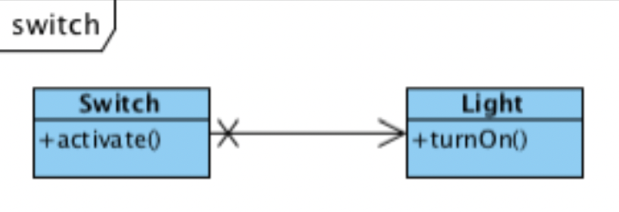
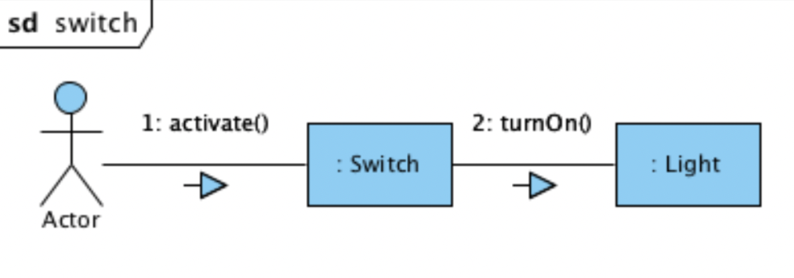
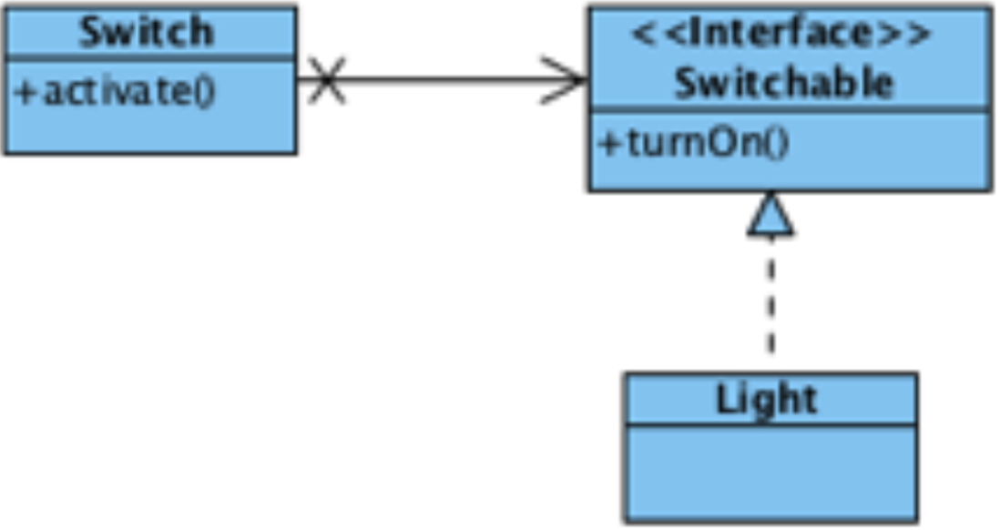
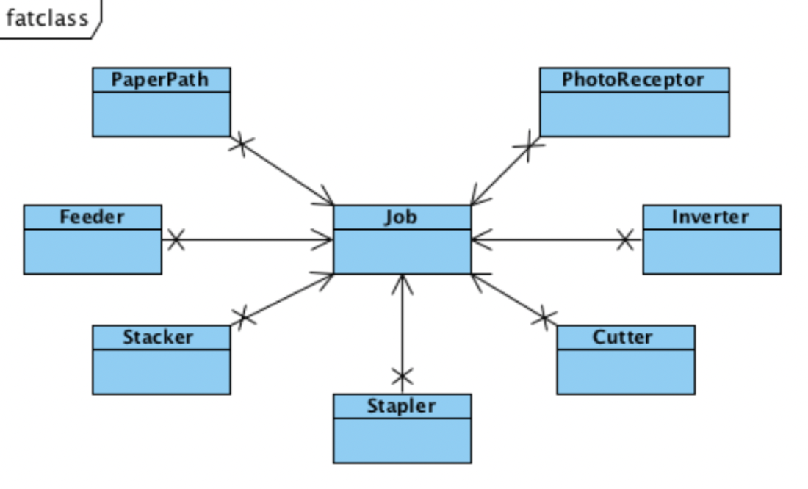
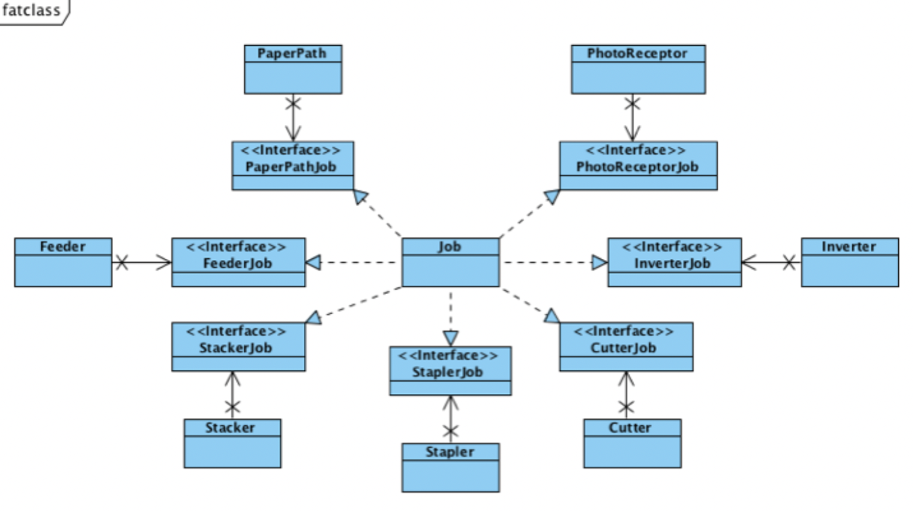
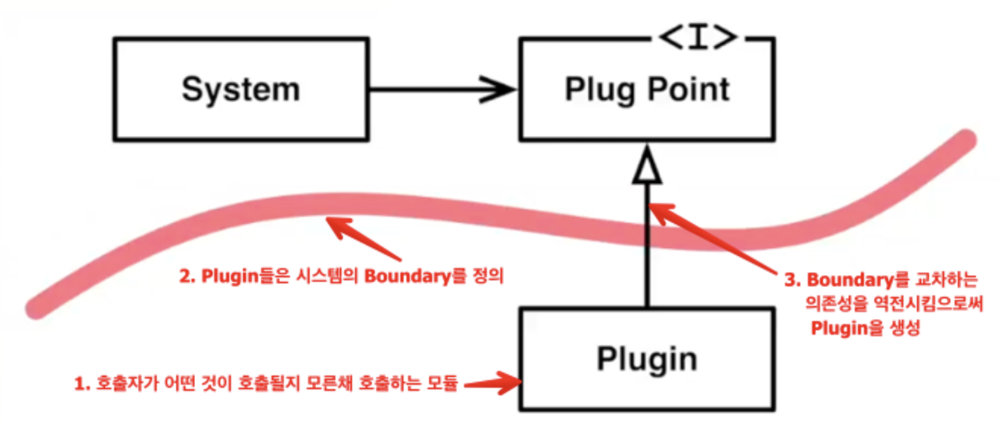
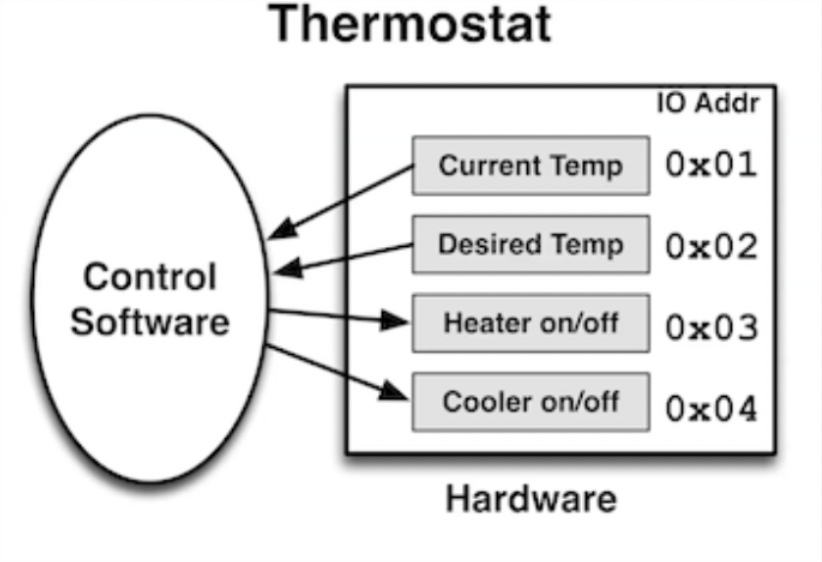
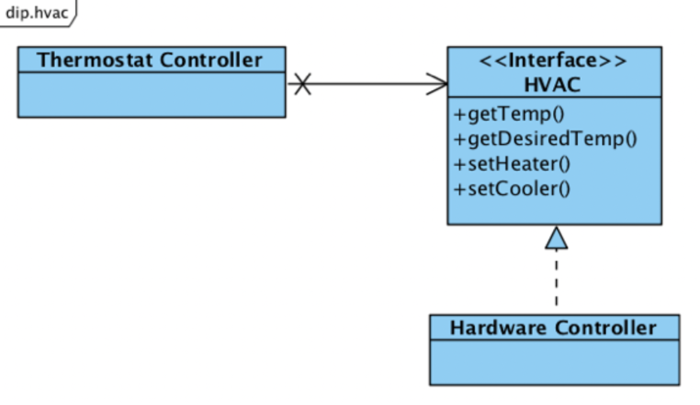

## 들어가면서

- 해당 포스트는 [최범균님의 클린 코더스 강의](https://www.youtube.com/watch?v=60lLSe1phks)를 정리한 내용입니다. 
- 강의 자료는 [깃 허브](https://github.com/msbaek/clean-coders-2013)에서 보실 수 있습니다.

## 클린 코더스 강의 14.3. ISP(Interface Segregation Principle)

Don't depend on things that you don't need

사용하지 않는 인터페이스에 대해 의존성을 가지고 있다면 그 인터페이스가 변결될 때마다 함께 재컴파일/빌드/배포되어야 한다. 사용하지 않는 인터페이스때문에 독립적인 개발/배포가 불가해진다는 의미이다. 

이는 한 기능에 변경이 발생하면 다른 기능을 사용하는 클라이언트들에게도 영향을 끼치기 때문에 SRP와도 연관된다.

따라서 사용하는 기능만 제공하도록 인터페이스를 분리함으로써 한 기능에 대한 변경의 여파를 최소화해야 하며, ISP는 **클라이언트 입장에서 인터페이스를 분리하라**는 원칙이다.

### Switch 예제
switch가 activate되면 light를 turn on하는 SW를 설계하라.





```java
public class Switch{
    private Light light;

    public Switch(Light light){
        this.light = light;
    }

    public void activate(){
        light.turnOn();
    }
}
```
여기서 문제점은 Switch가 Light에 의존적이라는 점이다. Switch가 Light뿐 아니라 Fan, Motor등을 turnOn할 수 있다면 Switch는 Light에 대해 너무 자세히 알면 안된다.



이를 해결하기 위해서 Switch는 Light에 대해 의존성을 갖지 않도록 Switchable 인터페이스를 바라보도록 변경한다.  

이 때 Switchable(인터페이스)은 Switch(클라이언트)와 같은 패키지/배포 단위에 속하며, 구현체(Light)와는 관련이 없기때문에 인터페이스의 이름은 클라이언트와 연관된 것이어야 한다.

### Fat class 예제



이 예제에서는 Job 클래스가 많은 일을 하고 있어서 많은 Fan-in이 발생한다.  
각 서브 시스템은 서로 다른 이유로 Job에 의존하기 때문에 하나의 시스템이라도 변경되면 Job 클래스는 리컴파일된다. 또한 이 과정에서 Job 클래스에 변경이 발생하면 Job 클래스를 사용하는 모든 클래스에 변경이 일어나야 한다.  
따라서 rebuild에 많은 시간이 소요되고, 독립적인 배포/개발이 불가능하다. 




해결책으로 One interface for a sub system으로 구성한다.  
이렇게되면 어떤 인터페이스에 변경이 발생해도 Job 클래스와 해당 인터페이스를 사용하는 서브 시스템만 rebuild하면 된다.

### Fat class를 만나면
- interface를 생성해서 Fat class를 다수의 클라이언트로부터 isolate 시켜야 한다. 
- interface는 구현체보다 클라이언트와 논리적으로 결합되므로, 클라이언트가 호출하는 매소드만 interface에 정의되었다는 것을 확신할 수 있어 ISP를 준수한다. 
- 특정 interface의 변경으로 인해 다른 클라이언트가 영향을 받는 것을 없앴다.
    - 이로인해, 재컴파일/재배포를 없애고
    - 클라이언트들을 다른 독립된 컴포넌트에 배치할 수 있고 (클라이언트 + interface가 배치 단위)
    - 독립적으로 개발/배포 가능하게 되었다. 


## 클린 코더스 강의 15.1. DIP(Dependency Inversion Principle)

### Dependency Inversion Principle

**High Level Policy should not depend on Low Level Details**  

둘은 Abstract Type에 의존해야 한다.

## Object Oriented의 핵심

`Inheritance`, `Encapsulation`, `Polymorphism`은 객체지향의 핵심이 아니라 주요 메커니즘이다.

**객체지향의 핵심은 IoC를 통해 상위 레벨의 모듈을 하위 레벨의 모듈로부터 보호하는 것**이다. OCP를 통해 새로운 요구사항을 반영할 수 있다.

따라서 객체지향 설계는 dependency management가 중요하다. 

### Plugins



어떤 시스템에서 시스템이 사용하는 변경가능한 부분을 플러그인이라고 한다. 이때 시스템은 어떤 플러그인이 호출될지 모른채 호출한다. Plug Point 인터페이스를 구현하는 것 중에서 Plugin을 갈아끼울 수 있으며 이런 Plugin들이 시스템의 Boundary를 정의한다.

의존성 역전을 통해 SW 모듈간의 Boundary를 만들 수 있으며, Boundary를 교차하는 의존성의 방향은 반드시 하나여야만 한다.
위의 예시에서 윗 부분은 Application Layer, 아랫 부분은 Web Layer/Database Layer등이 될 수 있다. 

### The Furnace Example
벽에 있는 Thermostat(온도조절 장치)을 제어하는 SW를 개발해야 한다고 가정해보자.



Hardware는 2개의 input과 2개의 output을 갖는 장치이다.

```java
void regulate(){
    int goal_t, t;
    while(1){
        sleep(ONE_MINUTE);
        goal_t = in(0x02);
        t = in(0x01);
        if(t < goal_t){
            out(0x03, true);
            out(0x04, false);
        }
        else if(t > goal_t){
            out(0x03, false);
            out(0x04, true);
        }
        else{
            out(0x03, false);
            out(0x04, false);
        }
    }
}
```
high level 알고리즘이 low level detail인 Hardwware에 의존하고 있어서 이 SW는 다른 디바이스와 사용될 수 없고, DIP를 위반한다.

DIP에 순응하도록 변경하려면 `HVAC`라는 인터페이스를 생성한 뒤, 필요한 함수들을 정의한다. 



```java
void regulate(Hvac hvac){
    int goal_t, t;
    while(1){
        sleep(ONE_MINUTE);
        goal_t = hvac.getDesiredTemp();
        t = hvac.getTemp();
        if(t < goal_t){
            hvac.setHeater(true);
            hvac.setCooler(false);
        }
        else if(t > goal_t){
            hvac.setHeater(false);
            hvac.setCooler(true);
        }
        else{
            hvac.setHeater(false);
            hvac.setCooler(false);
        }
    }
}
```

### OCP vs DIP
위 코드가 변경되는 과정을 보면 OCP를 지키는 것과 다를 바가 없어 보인다.  
이렇게 OCP와 DIP는 비슷해보이지만 그 목적과 의도가 다르다. 
- OCP는 확장에 필요한 행위를 Abstraction한다. (메모리를 read, write하는 행위를 abstraction)
- DIP는 low level에서 의존성을 갖지 않도록 Abstraction한다. 