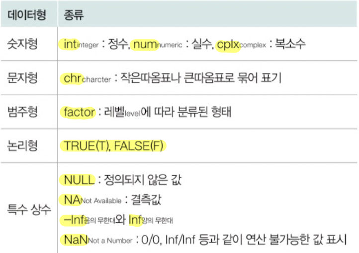
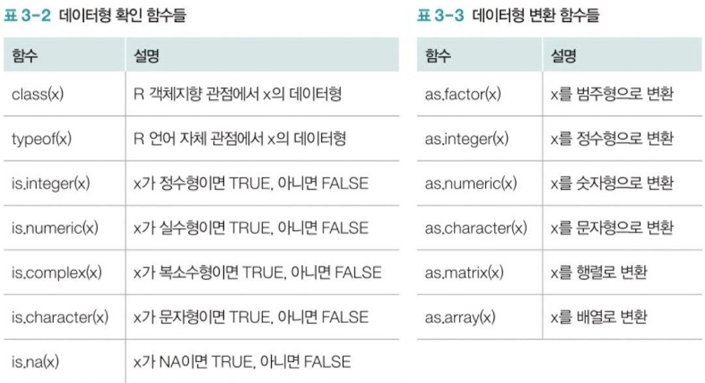
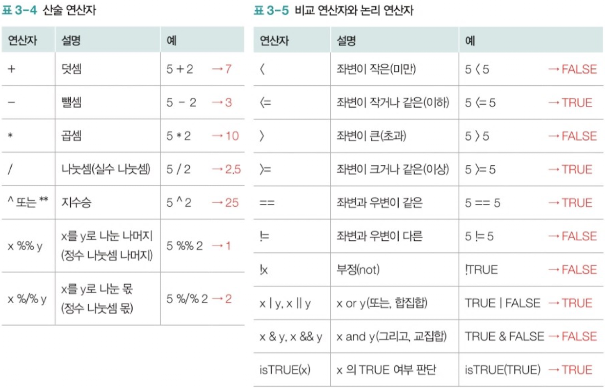
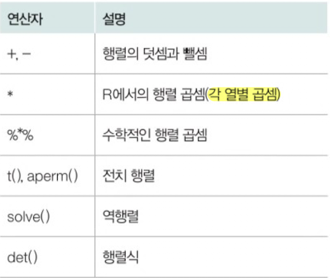

## 목차
- 데이터형
- 배열(행렬)
- 데이터 프레임
- 리스트


### **데이터형**

R에서 주로 사용하는 기본 데이터형은 다음과 같다. 



R에서는 변수 선언 시 해당 변수의 데이터형을 지정하지 않고, 변수에 어떤 값을 저장하는 지에 따라 데이터형이 결정된다.

```r
x = 5
y = 2

str = "Hello, World"

blood.type = factor(c('A','B','O','AB'))

xinf = Inf
```

관련된 함수는 다음과 같다. 



### **연산자**



### **벡터**

R에서는 단일값들의 모임을 `벡터`라고 하며, 하나의 벡터 변수에 여러 개의 값을 저장할 수 있다. 

벡터는 다양한 벡터 생성 연산자와 함수를 통해 만들 수 잇으며, 벡터 변수에는 동일한 데이터형을 가지는 값들이 들어간다.

#### 벡터 생성
생성 연산자 `:`를 이용할 때는 다음과 같이 `시작값:종료값`을 이용해 숫자를 1씩 더하거나 빼서 벡터를 생성한다.

```r
> 1:7
[1] 1 2 3 4 5 6 7
```

`vector(length=n)` 함수 : 요소가 n개인 빈 벡터 생성
```r
> vector(length=5)
[1] FALSE FALSE FALSE FALSE FALSE
```

`c 함수` : 일반 벡터 생성

```r
> c(1:5)
[1] 1 2 3 4 5

> x = c(1,2,3, c(4:6))
> x
[1] 1 2 3 4 5 6
```

`seq 함수` : 순열 벡터 생성
```r
> seq(1, 10, by=2)
[1] 1 3 5 7 9
```

`req 함수` : 반복 벡터 생성

```r
> rep(c(1,3), times=2)
[1] 1 2 3 1 2 3

> rep(c(1,3), each=2)
[1] 1 1 2 2 3 3
```

#### 벡터 연산
```r
> x = c(2, 4, 6, 8, 10)
> length(x)
[1] 5

> x[1]
[1] 2

> x[1,2,3] 
Error

> x[c(1,2,3)]
[1] 2 4 6

> x[-c(1,2,3)]
[1] 8 10
```

벡터끼리 연산을 수행할 때는 벡터의 길이가 같거나, 벡처 요소 개수가 배수의 관계에 있을 때만 가능하다.

#### 벡터 연산에 유용한 함수

`all / any` : 벡터 내 모든 / 일부 요소의 조건 검토
```r
> x = 1:10

> x > 5
[1] FALSE FALSE FALSE FALSE FALSE TRUE TRUE TRUE TRUE TRUE

> all(x>5)
[1] FALSE 

> any(x>5)
[1] TRUE
```

`head / tail` : 데이터의 앞 / 뒤 일부 요소 추출 (기본은 6개)

```r
> x = 1:10

> head(x)
[1] 1 2 3 4 5 6

> tail(x, 3)
[1] 8 9 10
```

`union`, `intersect`, `setdiff`, `setequal` : 벡터 간 집합 연산

```r
> x = c(1,2,3)
> y = c(3,4,5)
> z = c(3,1,2)

> union(x,y)
[1] 1 2 3 4 5

> intersect(x,y)
[1] 3

> setdiff(x,y)
[1] 1 2

> setdiff(y,x)
[1] 4 5

> setequal(x,z)
[1] TRUE
```

#### 연습문제
1번
```r
> x = c(1:5)
> x = union(x, c(6:10))
> x
 [1]  1  2  3  4  5  6  7  8  9 10
```

2번
```r
> x = c(1:10)
> x = x[x%%2==0]
> x
[1]  2  4  6  8 10
```


### **배열(행렬)**

#### 배열 생성
```r
> x = array(1:5, c(2,4))
> x
     [,1] [,2] [,3] [,4]
[1,]    1    3    5    2
[2,]    2    4    1    3

> x[1,]
[1] 1 3 5 2
> x[,2]
[1] 3 4
```

```r
> #행과 열 이름 설정
> dimnames = list(c("1st", "2nd"), c("1st", "2nd", "3rd", "4th"))
> x = array(1:5, c(2,4), dimnames=dimnames)
> x
    1st 2nd 3rd 4th
1st   1   3   5   2
2nd   2   4   1   3
> x["1st",]
1st 2nd 3rd 4th 
  1   3   5   2 
> x[, "4th"]
1st 2nd 
  2   3 
```

```r
> x = 1:12
> matrix(x, nrow=3)
     [,1] [,2] [,3] [,4]
[1,]    1    4    7   10
[2,]    2    5    8   11
[3,]    3    6    9   12

# 데이터를 행 단위로 배치할지 여부
> matrix(x, nrow=3, byrow=T)
     [,1] [,2] [,3] [,4]
[1,]    1    2    3    4
[2,]    5    6    7    8
[3,]    9   10   11   12
```

```r
> #벡터를 묶어서 배열 생성
> v1 = c(1,2,3,4)
> v2 = c(5,6,7,8)
> v3 = c(9,10,11,12)
>
> # 열 단위로 묶어서 배열 생성
> cbind(v1,v2,v3)
     v1 v2 v3
[1,]  1  5  9
[2,]  2  6 10
[3,]  3  7 11
[4,]  4  8 12
>
> # 행 단위로 묶어서 배열 생성
> rbind(v1,v2,v3)
   [,1] [,2] [,3] [,4]
v1    1    2    3    4
v2    5    6    7    8
v3    9   10   11   12
```

#### 배열 연산



```r
> x = array(1:4, dim=c(2,2))
> y = array(5:8, dim=c(2,2))
> x
     [,1] [,2]
[1,]    1    3
[2,]    2    4

> y
     [,1] [,2]
[1,]    5    7
[2,]    6    8

> x+y
     [,1] [,2]
[1,]    6   10
[2,]    8   12

> x-y
     [,1] [,2]
[1,]   -4   -4
[2,]   -4   -4

> # 각 열별 곱셈
> x*y
     [,1] [,2]
[1,]    5   21
[2,]   12   32

> # 수학적인 행렬 곱셈
> x%*%y
     [,1] [,2]
[1,]   23   31
[2,]   34   46

> # x의 전치 행렬
> t(x)
     [,1] [,2]
[1,]    1    2
[2,]    3    4

> # x의 역행렬
> solve(x)
     [,1] [,2]
[1,]   -2  1.5
[2,]    1 -0.5

> # x의 행렬식
> det(x)
[1] -2
```

#### 배열에 유용한 함수

`apply` : 배열의 행 또는 열별로 함수 적용
```r
> x = array(1:12, c(3,4))
> x
     [,1] [,2] [,3] [,4]
[1,]    1    4    7   10
[2,]    2    5    8   11
[3,]    3    6    9   12

> apply(x, 1, mean)
[1] 5.5 6.5 7.5

> apply(x,2,mean)
[1]  2  5  8 11
```
가운데 값이 1이면 함수를 행별로 적용하고, 가운데 값이 2이면 함수를 열별로 적용한다.

`dim` : 배열의 크기(차원의 수)
```r
> dim(x)
[1] 3 4
```

`sample` : 벡터나 배열에서 샘플 추출
```r
> sample(x)
 [1]  3  6  4  5 11 10  2  7  9  8 12  1

> sample(x, 10)
 [1]  1  3 12  7  4  6  9 10  8  5

> sample(x, 10, prob=c(1:12)/24)
 [1]  8  6 12  3  9  7  2 10 11  5

> sample(10)
 [1]  3  1  8  6  2  5 10  7  4  9
```
배열의 요소를 임의로 섞어서 출력한다. 출력할 개수를 지정하거나 요소별로 추출확률을 달리할 수 있다. 배열을 전달하지 않고 단순히 숫자만 전달하여 샘플을 만들 수도 있다.

#### 연습문제
1번
퍼스크클래스 어린이들

2번
```r
> x = array(1:24, c(4,6))
> x
     [,1] [,2] [,3] [,4] [,5] [,6]
[1,]    1    5    9   13   17   21
[2,]    2    6   10   14   18   22
[3,]    3    7   11   15   19   23
[4,]    4    8   12   16   20   24
> x = x[, num%%2==1]
> x
     [,1] [,2] [,3]
[1,]    1    9   17
[2,]    2   10   18
[3,]    3   11   19
[4,]    4   12   20
```


### **데이터 프레임**
표 형태의 데이터를 데이터 프레임이라고 한다. 행렬과 유사하지만, 행렬과 달리 여러 데이터형을 가질 수 있다. 

#### 데이터 프레임 생성
```r
> name = c("철수", "춘향", "길동")
> age = c(22,20,25)
> gender = factor(c("M","F","M"))
> blood.type = factor(c("A","O","B"))
> 
> patients = data.frame(name, age, gender, blood.type)
> patients
  name age gender blood.type
1 철수  22      M          A
2 춘향  20      F          O
3 길동  25      M          B
```
여기서 name, age, gender, blood.type을 속성이라하고, 하나의 값을 요소라고 한다.


#### 데이터 프레임 요소에 접근
데이터 프레임의 요소에 접근하기 위해서는 속성 값을 출력하는 `$`를 이용하거나, 배열 요소에 접근하는 것처럼 `[,]`를 이용해 행과 열에 접근할 수 있다. 

특히 `[]`안의 조건을 검토하여 해당 조건에 맞는 데이터만 추출할 수 있다. `[]`안의 `,`앞에는 찾을 행을 적고, 다음에는 추출할 열을 적으면 되는데 이 때 `,`를 빠뜨리지 않고 기입해야 한다.

```r
> patients$name
[1] "철수" "춘향" "길동"

> patients[1,]
  name age gender blood.type
1 철수  22      M          A

> patients[,2]
[1] 22 20 25

> patients[3,1]
[1] "길동"

> patients[patients$name=="철수",]
  name age gender blood.type
1 철수  22      M          A

> patients[patients$name=="철수",c("name","age")]
  name age
1 철수  22
```

#### 데이터 프레임에 유용한 함수

`attach / detach` : 데이터 프레임의 속성명을 변수명으로 변경
```r
> head(cars)
  speed dist
1     4    2
2     4   10
3     7    4
4     7   22
5     8   16
6     9   10
> speed
Error: object 'speed' not found
> attach(cars)
> speed
 [1]  4  4  7  7  8  9 10 10 10 11 11 12 12 12 12 13 13 13 13 14
[21] 14 14 14 15 15 15 16 16 17 17 17 18 18 18 18 19 19 19 20 20
[41] 20 20 20 22 23 24 24 24 24 25
> detach(cars)
> speed
Error: object 'speed' not found
```

`widh` : 데이터 프레임에 다양한 함수 적용
```r
> mean(cars$speed)
[1] 15.4
> max(cars$speed)
[1] 25

> with(cars, mean(speed))
[1] 15.4
> with(cars, max(speed))
[1] 25
```
이 때 `attach`를 사용하지 않고도 열 이름을 바로 사용할 수 있게 한다는 특징이 있다.


`subset` : 데이터 프레임에서 일부 데이터만 추출
```r
> subset(cars, speed>20)
   speed dist
44    22   66
45    23   54
46    24   70
47    24   92
48    24   93
49    24  120
50    25   85
> subset(cars, speed>20, select=c("speed"))
   speed
44    22
45    23
46    24
47    24
48    24
49    24
50    25
```

`no.omit` : 데이터 프레임의 결측값 제거
```r
> head(airquality)
  Ozone Solar.R Wind Temp Month Day
1    41     190  7.4   67     5   1
2    36     118  8.0   72     5   2
3    12     149 12.6   74     5   3
4    18     313 11.5   62     5   4
5    NA      NA 14.3   56     5   5
6    28      NA 14.9   66     5   6
> head(na.omit(airquality))
  Ozone Solar.R Wind Temp Month Day
1    41     190  7.4   67     5   1
2    36     118  8.0   72     5   2
3    12     149 12.6   74     5   3
4    18     313 11.5   62     5   4
7    23     299  8.6   65     5   7
8    19      99 13.8   59     5   8
```

`merge` : 여러 데이터 프레임 병합
```r
> patients1 = data.frame(name, age, gender)
> patients1
  name age gender
1 철수  22      M
2 춘향  20      F
3 길동  25      M
> patients2 = data.frame(name, blood.type)
> patients2
  name blood.type
1 철수          A
2 춘향          O
3 길동          B
> patients = merge(patients1, patients2, by="name")
> patients
  name age gender blood.type
1 길동  25      M          B
2 철수  22      M          A
3 춘향  20      F          O
```

#### 연습문제
1번
```r
> mean(na.omit(airquality)$Ozone)
```

2번
```r
> str(patients)
'data.frame':	3 obs. of  4 variables:
 $ name      : chr  "길동" "철수" "춘향"
 $ age       : num  25 22 20
 $ gender    : Factor w/ 2 levels "F","M": 2 2 1
 $ blood.type: Factor w/ 3 levels "A","B","O": 2 1 3
```

### **리스트**
리스트는 데이터 프레임보다 넓은 의미의 데이터 모임이다. 리스트는 서로 다른 기본 데이터형을 갖는 자료구조를 포함할 수 있으며, 데이터 프레임과 달리 모든 속성의 크기가 같을 필요는 없다.

#### 리스트 생성
```r
> patients
  name age gender blood.type
1 길동  25      M          B
2 철수  22      M          A
3 춘향  20      F          O
> no.patients = data.frame(day=c(1:6),no=c(50,60,55,52,65,58))
> listPatients = list(patients, no.patients)
> listPatients
[[1]]
  name age gender blood.type
1 길동  25      M          B
2 철수  22      M          A
3 춘향  20      F          O

[[2]]
  day no
1   1 50
2   2 60
3   3 55
4   4 52
5   5 65
6   6 58
```

```r
> listPatients = list(patients=patients, no.patients=no.patients)
> listPatients
$patients
  name age gender blood.type
1 길동  25      M          B
2 철수  22      M          A
3 춘향  20      F          O

$no.patients
  day no
1   1 50
2   2 60
3   3 55
4   4 52
5   5 65
6   6 58
```
각 데이터에 이름을 부여할 수 있다.

#### 리스트 요소에 접근
리스트 요소에 접근하는 방법에는 `$` 기호를 이용하는 방법과 `[[]]`를 이용하는 방법이 있다. `[[]]`를 사용할 때는 `" "`안에 요소명을 사용하거나 인덱스 번호를 기입한다.

```r
> listPatients$patients
  name age gender blood.type
1 길동  25      M          B
2 철수  22      M          A
3 춘향  20      F          O

> listPatients[[1]]
  name age gender blood.type
1 길동  25      M          B
2 철수  22      M          A
3 춘향  20      F          O

> listPatients[["no.patients"]]
  day no
1   1 50
2   2 60
3   3 55
4   4 52
5   5 65
6   6 58
```

#### 리스트에 유용한 함수

`lapply / sapply` : 리스트 요소에 다양한 함수 적용  

`lappy`는 `list+apply`로 리스트에 대해 `apply`함수를 적용하는 것과 같으며, `sapply`는 `lapply`와 유사하나, 결과를 좀 더 간단하게 나타내준다.
```r
> lapply(listPatients$no.patients, mean)
$day
[1] 3.5

$no
[1] 56.66667

> lapply(listPatients$patients, mean)
$name
[1] NA

$age
[1] 22.33333

$gender
[1] NA

$blood.type
[1] NA

Warning messages:
1: In mean.default(X[[i]], ...) :
  argument is not numeric or logical: returning NA
2: In mean.default(X[[i]], ...) :
  argument is not numeric or logical: returning NA
3: In mean.default(X[[i]], ...) :
  argument is not numeric or logical: returning NA

> sapply(listPatients$no.patients, mean)
     day       no 
 3.50000 56.66667 
```

#### 연습문제
1번
```r
> listPatients = list(patients=patients, no.patients=no.patients)
> listPatients
$patients
  name age gender blood.type
1 철수  22      M          A
2 춘향  20      F          O
3 길동  25      M          B

$no.patients
  day no
1   1 50
2   2 60
3   3 55
4   4 52
5   5 65
6   6 58

> listPatients$room = 30
> listPatients
$patients
  name age gender blood.type
1 철수  22      M          A
2 춘향  20      F          O
3 길동  25      M          B

$no.patients
  day no
1   1 50
2   2 60
3   3 55
4   4 52
5   5 65
6   6 58

$room
[1] 30
```

2번
```r
> listPatients$room=NULL
> listPatients
$patients
  name age gender blood.type
1 철수  22      M          A
2 춘향  20      F          O
3 길동  25      M          B

$no.patients
  day no
1   1 50
2   2 60
3   3 55
4   4 52
5   5 65
6   6 58
```

### **단원문제**

#### 1번 
```r
> x = c(1:100)
> x = x[x%%3==0]

> y = c(1:100)
> y = y[y%%4==0]
```


#### 2번 
```r
> sum(intersect(x, y))
[1] 432
```

#### 3번 

New York
```r
> ?airquality
```

#### 4번 
degrees F 화씨


#### 5번 
```r
> airquality[airquality$Wind==max(airquality$Wind),]
   Ozone Solar.R Wind Temp Month Day
48    37     284 20.7   72     6  17
```

#### 6번 
```r
> sum(is.na(airquality))
[1] 44

> table(is.na(airquality))
FALSE  TRUE 
  874    44 
```

#### 7번 
피지섬
```r
> ?quakes
```

#### 8번 
```r
> max(quakes$mag)
[1] 6.4
```