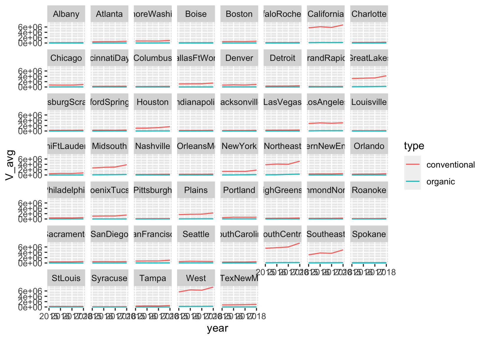

### 베이스 R을 이용한 데이터 가공
```r
> library(gapminder)
> library(dplyr)
> glimpse(gapminder)
Rows: 1,704
Columns: 6
$ country   <fct> "Afghanistan", "Afghanistan", "Afghanistan", "Af…
$ continent <fct> Asia, Asia, Asia, Asia, Asia, Asia, Asia, Asia, …
$ year      <int> 1952, 1957, 1962, 1967, 1972, 1977, 1982, 1987, …
$ lifeExp   <dbl> 28.801, 30.332, 31.997, 34.020, 36.088, 38.438, …
$ pop       <int> 8425333, 9240934, 10267083, 11537966, 13079460, …
$ gdpPercap <dbl> 779.4453, 820.8530, 853.1007, 836.1971, 739.9811…
```

```r
> #각 나라의 기대 수명
> gapminder[, c("country","lifeExp")]
# A tibble: 1,704 × 2
   country     lifeExp
   <fct>         <dbl>
 1 Afghanistan    28.8
 2 Afghanistan    30.3
 3 Afghanistan    32.0
 4 Afghanistan    34.0
 5 Afghanistan    36.1
 6 Afghanistan    38.4
 7 Afghanistan    39.9
 8 Afghanistan    40.8
 9 Afghanistan    41.7
10 Afghanistan    41.8
# … with 1,694 more rows

> gapminder[, c("country","lifeExp","year")]
 A tibble: 1,704 × 3
   country     lifeExp  year
   <fct>         <dbl> <int>
 1 Afghanistan    28.8  1952
 2 Afghanistan    30.3  1957
 3 Afghanistan    32.0  1962
 4 Afghanistan    34.0  1967
 5 Afghanistan    36.1  1972
 6 Afghanistan    38.4  1977
 7 Afghanistan    39.9  1982
 8 Afghanistan    40.8  1987
 9 Afghanistan    41.7  1992
10 Afghanistan    41.8  1997
# … with 1,694 more rows

```
```r
> gapminder[1:15, ]
# A tibble: 15 × 6
   country     continent  year lifeExp      pop gdpPercap
   <fct>       <fct>     <int>   <dbl>    <int>     <dbl>
 1 Afghanistan Asia       1952    28.8  8425333      779.
 2 Afghanistan Asia       1957    30.3  9240934      821.
 3 Afghanistan Asia       1962    32.0 10267083      853.
 4 Afghanistan Asia       1967    34.0 11537966      836.
 5 Afghanistan Asia       1972    36.1 13079460      740.
 6 Afghanistan Asia       1977    38.4 14880372      786.
 7 Afghanistan Asia       1982    39.9 12881816      978.
 8 Afghanistan Asia       1987    40.8 13867957      852.
 9 Afghanistan Asia       1992    41.7 16317921      649.
10 Afghanistan Asia       1997    41.8 22227415      635.
11 Afghanistan Asia       2002    42.1 25268405      727.
12 Afghanistan Asia       2007    43.8 31889923      975.
13 Albania     Europe     1952    55.2  1282697     1601.
14 Albania     Europe     1957    59.3  1476505     1942.
15 Albania     Europe     1962    64.8  1728137     2313.
```

```r
> gapminder[gapminder$country=="Croatia","pop"]
# A tibble: 12 × 1
       pop
     <int>
 1 3882229
 2 3991242
 3 4076557
 4 4174366
 5 4225310
 6 4318673
 7 4413368
 8 4484310
 9 4494013
10 4444595
11 4481020
12 4493312

> gapminder[gapminder$country=="Croatia",c("lifeExp","pop")]
# A tibble: 12 × 2
   lifeExp     pop
     <dbl>   <int>
 1    61.2 3882229
 2    64.8 3991242
 3    67.1 4076557
 4    68.5 4174366
 5    69.6 4225310
 6    70.6 4318673
 7    70.5 4413368
 8    71.5 4484310
 9    72.5 4494013
10    73.7 4444595
11    74.9 4481020
12    75.7 4493312
```

행/열 단위의 연산  
R에서 제공하는 `apply`함수를 사용하면 다음과 같이 데이터 프레임에 포함된 여러 항목을 한꺼번에 연산 처리할 수 있다.
```r
> apply(gapminder[gapminder$country=="Croatia", c("lifeExp","pop")],2,mean)
     lifeExp          pop 
7.005592e+01 4.289916e+06 
```
여기서 숫자 2는 열을 의미한다. 행에 적용하고 싶으면 1을 입력하면 된다.

#### 연습문제
1번
```r
> kor = gapminder[gapminder$country=="Korea, Rep.",]
> kor[which.max(kor$pop),]
# A tibble: 1 × 6
  country     continent  year lifeExp      pop gdpPercap
  <fct>       <fct>     <int>   <dbl>    <int>     <dbl>
1 Korea, Rep. Asia       2007    78.6 49044790    23348.
```
```r
> gapminder %>% filter(country=="Korea, Rep.") %>% select(pop) %>% max()
[1] 49044790
> gapminder%>%filter(country=="Korea, Rep.")%>%filter(pop==49044790)%>%select(country)
# A tibble: 1 × 1
  country    
  <fct>      
1 Korea, Rep.
```


2번
```r
> asia_2007 = gapminder[gapminder$continent=="Asia" & gapminder$year=="2007",]
> sum(asia_2007$pop)
[1] 3811953827
```
```r
> gapminder%>%filter(year==2007 & continent=="Asia")%>%select(pop)%>%sum()
[1] 3811953827
```

### dplyr 라이브러리를 이용한 데이터 가공

`dplyr` 라이브러리를 이용해 특정 속성(열)을 추출할 때는 다음과 같이 `select`함수를 이용한다. 열을 지정할 때 $나 ""없이 열 이름을 그대로 사용할 수 있어서 편리하다. 

```r
> select(gapminder, country, year, lifeExp)
# A tibble: 1,704 × 3
   country      year lifeExp
   <fct>       <int>   <dbl>
 1 Afghanistan  1952    28.8
 2 Afghanistan  1957    30.3
 3 Afghanistan  1962    32.0
 4 Afghanistan  1967    34.0
 5 Afghanistan  1972    36.1
 6 Afghanistan  1977    38.4
 7 Afghanistan  1982    39.9
 8 Afghanistan  1987    40.8
 9 Afghanistan  1992    41.7
10 Afghanistan  1997    41.8
# … with 1,694 more rows
```

특정 샘플(행)을 추출할 때는 다음과 같이 `filter`함수를 사용한다.
```r
> filter(gapminder, country=="Croatia")
# A tibble: 12 × 6
   country continent  year lifeExp     pop gdpPercap
   <fct>   <fct>     <int>   <dbl>   <int>     <dbl>
 1 Croatia Europe     1952    61.2 3882229     3119.
 2 Croatia Europe     1957    64.8 3991242     4338.
 3 Croatia Europe     1962    67.1 4076557     5478.
 4 Croatia Europe     1967    68.5 4174366     6960.
 5 Croatia Europe     1972    69.6 4225310     9164.
 6 Croatia Europe     1977    70.6 4318673    11305.
 7 Croatia Europe     1982    70.5 4413368    13222.
 8 Croatia Europe     1987    71.5 4484310    13823.
 9 Croatia Europe     1992    72.5 4494013     8448.
10 Croatia Europe     1997    73.7 4444595     9876.
11 Croatia Europe     2002    74.9 4481020    11628.
12 Croatia Europe     2007    75.7 4493312    14619.
```

**행/열 단위의 연산**  
`group_by`함수를 이용하면 데이터프레임에 포함된 범주형 속성을 활용해 전체 데이터를 그룹으로 분류할 수 있다. 보통 다음과 같이 `summarize`함수를 같이 사용해 각 그룹별 통계 지표를 한 번에 산출한다.

```r
> summarize(gapminder, pop_avg=mean(pop))
# A tibble: 1 × 1
    pop_avg
      <dbl>
1 29601212.
> summarise(group_by(gapminder, continent), pop_avg=mean(pop))
# A tibble: 5 × 2
  continent   pop_avg
  <fct>         <dbl>
1 Africa     9916003.
2 Americas  24504795.
3 Asia      77038722.
4 Europe    17169765.
5 Oceania    8874672.
> summarise(group_by(gapminder, continent, country), pop_avg=mean(pop))
# A tibble: 142 × 3
# Groups:   continent [5]
   continent country                    pop_avg
   <fct>     <fct>                        <dbl>
 1 Africa    Algeria                  19875406.
 2 Africa    Angola                    7309390.
 3 Africa    Benin                     4017497.
 4 Africa    Botswana                   971186.
 5 Africa    Burkina Faso              7548677.
 6 Africa    Burundi                   4651608.
 7 Africa    Cameroon                  9816648.
 8 Africa    Central African Republic  2560963 
 9 Africa    Chad                      5329256.
10 Africa    Comoros                    361684.
# … with 132 more rows
```

**%>%연산자를 이용한 연속처리**  
`>%>`연산자를 사용하면 일련의 가공 작업을 연속적으로 사용할 수 있다.
```r
> gapminder%>%group_by(continent, country)%>%summarise(pop_avg=mean(pop))
# A tibble: 142 × 3
# Groups:   continent [5]
   continent country                    pop_avg
   <fct>     <fct>                        <dbl>
 1 Africa    Algeria                  19875406.
 2 Africa    Angola                    7309390.
 3 Africa    Benin                     4017497.
 4 Africa    Botswana                   971186.
 5 Africa    Burkina Faso              7548677.
 6 Africa    Burundi                   4651608.
 7 Africa    Cameroon                  9816648.
 8 Africa    Central African Republic  2560963 
 9 Africa    Chad                      5329256.
10 Africa    Comoros                    361684.
# … with 132 more rows
```
```r
> temp1 = filter(gapminder, country=="Croatia")
> temp2 = select(temp1, country, year, lifeExp)
> temp3 = apply(temp2[, c("lifeExp")],2,mean)
> temp3
 lifeExp 
70.05592 

> gapminder%>%filter(country=="Croatia")%>%select(country, year, lifeExp)
                        %>%summarise(lifeExp_avg=mean(lifeExp))
# A tibble: 1 × 1
  lifeExp_avg
        <dbl>
1        70.1
```

#### 연습문제
1번
```r
> gapminder%>%filter(country=="Korea, Rep.")%>%select(year, country, gdpPercap, lifeExp)
> gapminder%>%filter(country=="China")%>%select(year, country, gdpPercap, lifeExp)
> gapminder%>%filter(country=="Japan")%>%select(year, country, gdpPercap, lifeExp)
```

2번
```r
> europe_data = gapminder%>%group_by(continent, year)
                            %>%filter(continent=="Europe")%>%summarise(sum(pop))
> europe_data
# A tibble: 12 × 3
# Groups:   continent [1]
   continent  year `sum(pop)`
   <fct>     <int>      <int>
 1 Europe     1952  418120846
 2 Europe     1957  437890351
 3 Europe     1962  460355155
 4 Europe     1967  481178958
 5 Europe     1972  500635059
 6 Europe     1977  517164531
 7 Europe     1982  531266901
 8 Europe     1987  543094160
 9 Europe     1992  558142797
10 Europe     1997  568944148
11 Europe     2002  578223869
12 Europe     2007  586098529
> africa_data = gapminder%>%group_by(continent, year)
                            %>%filter(continent=="Africa")%>%summarise(sum(pop))
> africa_data$year
 [1] 1952 1957 1962 1967 1972 1977 1982 1987 1992 1997 2002 2007
> africa_data$year[africa_data$`sum(pop)`>europe_data$`sum(pop)`]
[1] 1987 1992 1997 2002 2007
```

```r
> gapminder%>%filter(continent=="Africa")%>%group_by(year)%>%summarise(s = sum(pop)) -> s1
> gapminder%>%filter(continent=="Europe")%>%group_by(year)%>%summarise(s = sum(pop)) -> s2
> s1$s > s2$s
 [1] FALSE FALSE FALSE FALSE FALSE FALSE FALSE  TRUE  TRUE  TRUE  TRUE
[12]  TRUE
> s1[s1$s > s2$s, "year"]
# A tibble: 5 × 1
   year
  <int>
1  1987
2  1992
3  1997
4  2002
5  2007
```

3번
```r
> gapminder_unfiltered%>%group_by(country)%>%summarise(count=n())%>%filter(count>=12)%>%arrange(desc(count))
# A tibble: 149 × 2
   country         count
   <fct>           <int>
 1 Czech Republic     58
 2 Denmark            58
 3 Finland            58
 4 Iceland            58
 5 Japan              58
 6 Netherlands        58
 7 Norway             58
 8 Portugal           58
 9 Slovak Republic    58
10 Spain              58
# … with 139 more rows
```

### 데이터 가공의 실제
```r
> avocado = read.csv("/Users/yeojiwon/Downloads/avocado.csv", header=TRUE, sep=",")
> str(avocado)
'data.frame':	18249 obs. of  14 variables:
 $ X           : int  0 1 2 3 4 5 6 7 8 9 ...
 $ Date        : chr  "2015-12-27" "2015-12-20" "2015-12-13" "2015-12-06" ...
 $ AveragePrice: num  1.33 1.35 0.93 1.08 1.28 1.26 0.99 0.98 1.02 1.07 ...
 $ Total.Volume: num  64237 54877 118220 78992 51040 ...
 $ X4046       : num  1037 674 795 1132 941 ...
 $ X4225       : num  54455 44639 109150 71976 43838 ...
 $ X4770       : num  48.2 58.3 130.5 72.6 75.8 ...
 $ Total.Bags  : num  8697 9506 8145 5811 6184 ...
 $ Small.Bags  : num  8604 9408 8042 5677 5986 ...
 $ Large.Bags  : num  93.2 97.5 103.1 133.8 197.7 ...
 $ XLarge.Bags : num  0 0 0 0 0 0 0 0 0 0 ...
 $ type        : chr  "conventional" "conventional" "conventional" "conventional" ...
 $ year        : int  2015 2015 2015 2015 2015 2015 2015 2015 2015 2015 ...
 $ region      : chr  "Albany" "Albany" "Albany" "Albany" ...
```

```r
> #총 판매량과 평균 가격 속성을 지역에 따라 구분
> (x_avg= avocado%>%group_by(region)%>%summarise(V_avg=mean(Total.Volume), P_avg=mean(AveragePrice)))
# A tibble: 54 × 3
   region                 V_avg P_avg
   <chr>                  <dbl> <dbl>
 1 Albany                47538.  1.56
 2 Atlanta              262145.  1.34
 3 BaltimoreWashington  398562.  1.53
 4 Boise                 42643.  1.35
 5 Boston               287793.  1.53
 6 BuffaloRochester      67936.  1.52
 7 California          3044324.  1.40
 8 Charlotte            105194.  1.61
 9 Chicago              395569.  1.56
10 CincinnatiDayton     131722.  1.21
# … with 44 more rows
```
```r
> #년도와 유기농 여부를 추가하여 세분화
> (x_avg= avocado%>%group_by(region, year, type)%>%summarise(V_avg=mean(Total.Volume), P_avg=mean(AveragePrice)))
`summarise()` has grouped output by 'region', 'year'. You can override using the `.groups` argument.
# A tibble: 432 × 5
# Groups:   region, year [216]
   region   year type           V_avg P_avg
   <chr>   <int> <chr>          <dbl> <dbl>
 1 Albany   2015 conventional  76209.  1.17
 2 Albany   2015 organic        1289.  1.91
 3 Albany   2016 conventional  99453.  1.35
 4 Albany   2016 organic        1784.  1.72
 5 Albany   2017 conventional  95779.  1.53
 6 Albany   2017 organic        2931.  1.75
 7 Albany   2018 conventional 124161.  1.34
 8 Albany   2018 organic        4338.  1.53
 9 Atlanta  2015 conventional 440346.  1.05
10 Atlanta  2015 organic        6417.  1.71
# … with 422 more rows
```

이 통계값을 연도에 따라 관찰하기 위해 시각화 
```r
> x_avg %>% filter(region!="TotalUS")%>%ggplot(aes(year, V_avg, col=type))
                                    +geom_line()+facet_wrap(~region)
```



**데이터 정렬과 검색**  
`arrange`함수를 사용해 총 판매량을 기준으로 판매량 순위는 물론 최댓값을 기록한 연도와 지역을 알아낼 수 있다. 
```r
> arrange(x_avg, desc(V_avg))
# A tibble: 432 × 5
# Groups:   region, year [216]
   region        year type             V_avg P_avg
   <chr>        <int> <chr>            <dbl> <dbl>
 1 TotalUS       2018 conventional 42125533. 1.06 
 2 TotalUS       2016 conventional 34043450. 1.05 
 3 TotalUS       2017 conventional 33995658. 1.22 
 4 TotalUS       2015 conventional 31224729. 1.01 
 5 SouthCentral  2018 conventional  7465557. 0.806
 6 West          2018 conventional  7451445. 0.981
 7 California    2018 conventional  6786962. 1.08 
 8 West          2016 conventional  6404892. 0.916
 9 West          2017 conventional  6279482. 1.10 
10 California    2016 conventional  6105539. 1.05 
# … with 422 more rows
```

그런데 1~4위의 TotalUS 데이터는 관측 샘플이 아닌 총합이다. 데이터셋에 이런 중간 통계값이 포함된 경우도 있으므로 주의가 필요하다. 

최댓값을 검색할 때는 `max`함수를 사용해도 되지만, `region`속성값을 확인할 수 있는 `arrange`함수를 사용하는 것이 더 안전하다.
```r
> x_avg1 = x_avg%>%filter(region!="TotalUS")
> x_avg[x_avg$V_avg == max(x_avg1$V_avg),]
# A tibble: 1 × 5
# Groups:   region, year [1]
  region        year type            V_avg P_avg
  <chr>        <int> <chr>           <dbl> <dbl>
1 SouthCentral  2018 conventional 7465557. 0.806
```

**Date형 데이터의 활용**  
avocado 판매 정보를 이번에는 연도별 평균 대신 월별 평균으로 요약해보자. `Date`형 속성인 `Date`에서 `month`를 추출하려면 `lubridate` 라이브러리에서 제공하는 `month`함수를 사용한다.

```r
> library(lubridate)
> (x_avg = avocado%>%group_by(region, year, month(Date),type)%>%summarise(V_avg=mean(Total.Volume), P_avg=mean(AveragePrice)))
`summarise()` has grouped output by 'region', 'year', 'month(Date)'. You can override using the `.groups` argument.
# A tibble: 4,212 × 6
# Groups:   region, year, month(Date) [2,106]
   region  year `month(Date)` type          V_avg P_avg
   <chr>  <int>         <dbl> <chr>         <dbl> <dbl>
 1 Albany  2015             1 conventional 42932.  1.17
 2 Albany  2015             1 organic       1198.  1.84
 3 Albany  2015             2 conventional 52343.  1.03
 4 Albany  2015             2 organic       1334.  1.76
 5 Albany  2015             3 conventional 50659.  1.06
 6 Albany  2015             3 organic       1444.  1.83
 7 Albany  2015             4 conventional 48594.  1.17
 8 Albany  2015             4 organic       1402.  1.89
 9 Albany  2015             5 conventional 97216.  1.26
10 Albany  2015             5 organic       1836.  1.94
# … with 4,202 more rows
```
