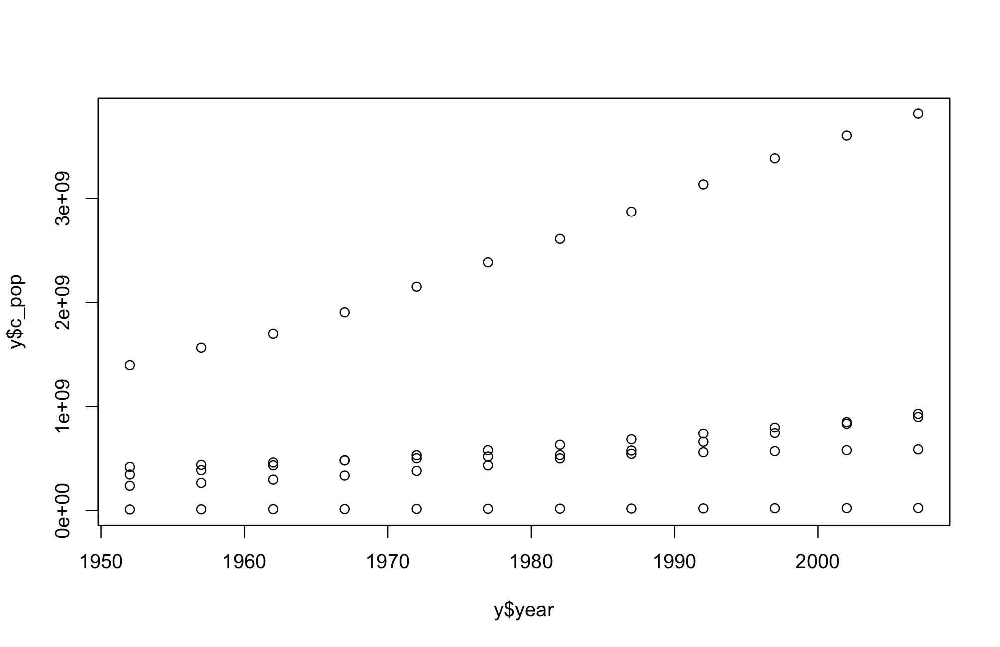
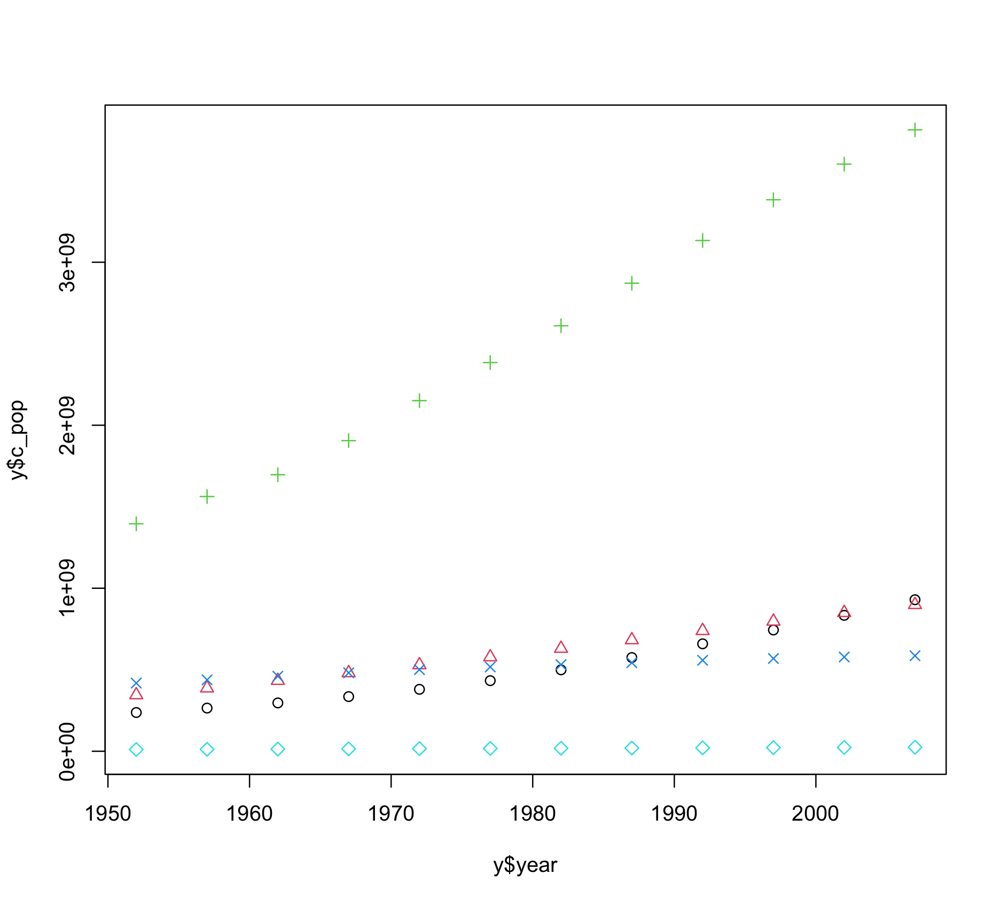
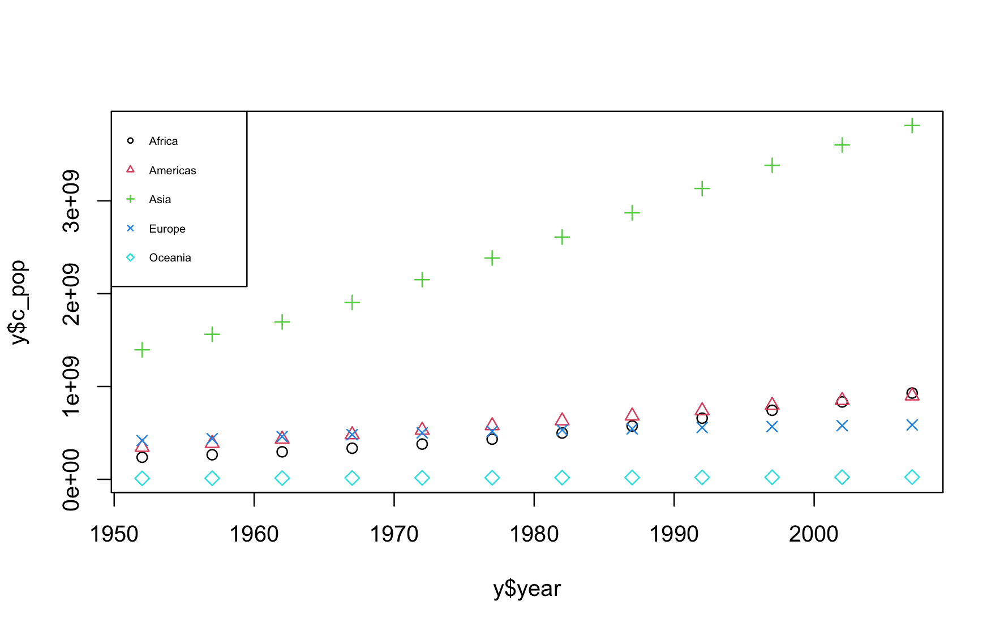
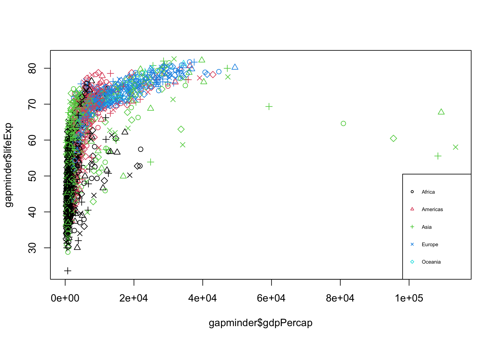
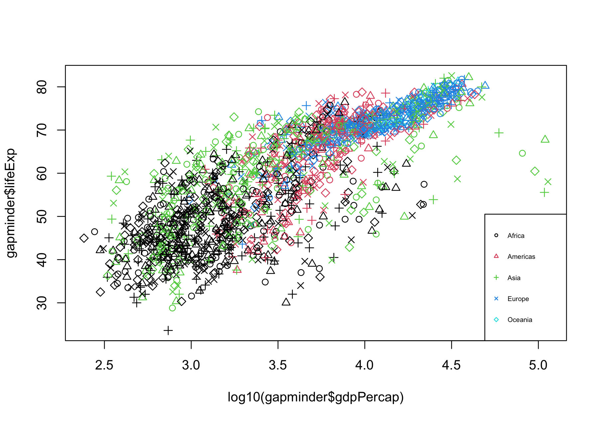
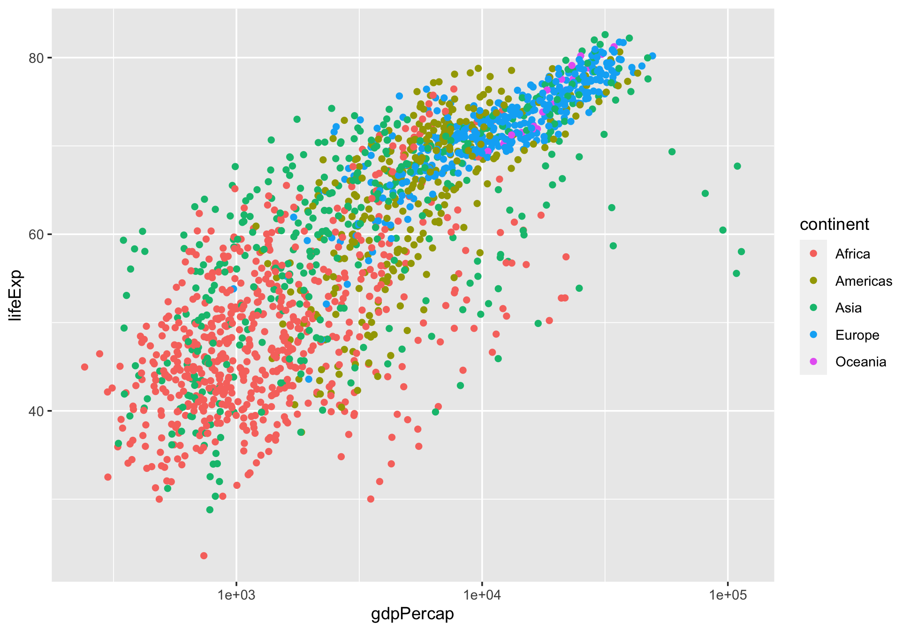
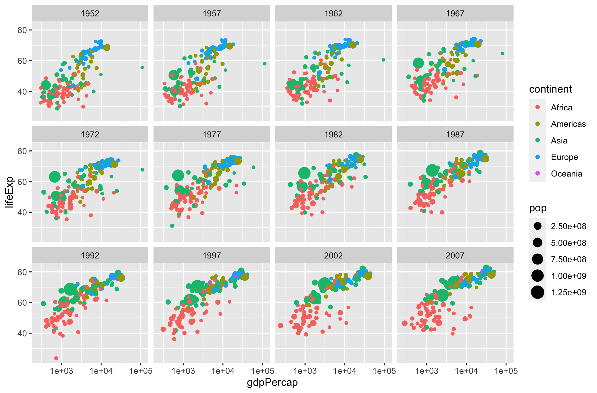
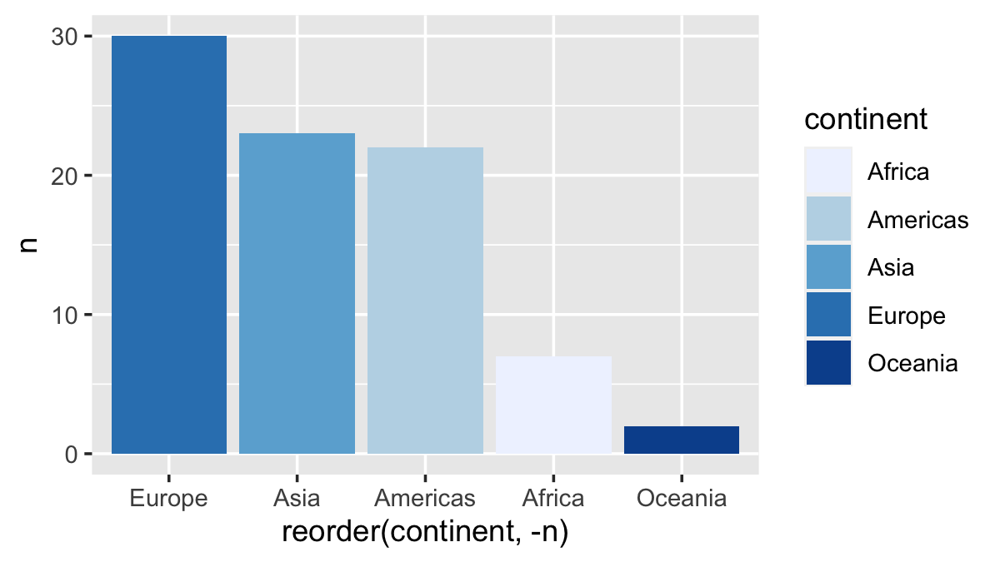

### 시각화의 기본요소
```r
> library(gapminder)
> library(dplyr)
> y = gapminder%>%group_by(year, continent)%>%summarise(c_pop=sum(pop))
> head(y, 20)
# A tibble: 20 × 3
# Groups:   year [4]
    year continent      c_pop
   <int> <fct>          <dbl>
 1  1952 Africa     237640501
 2  1952 Americas   345152446
 3  1952 Asia      1395357351
 4  1952 Europe     418120846
 5  1952 Oceania     10686006
 6  1957 Africa     264837738
 7  1957 Americas   386953916
 8  1957 Asia      1562780599
 9  1957 Europe     437890351
10  1957 Oceania     11941976
11  1962 Africa     296516865
12  1962 Americas   433270254
13  1962 Asia      1696357182
14  1962 Europe     460355155
15  1962 Oceania     13283518
16  1967 Africa     335289489
17  1967 Americas   480746623
18  1967 Asia      1905662900
19  1967 Europe     481178958
20  1967 Oceania     14600414
```
```r
> plot(y$year, y$c_pop)
```



```r
> #색 추가, 마커 추가
> plot(y$year, y$c_pop, col=y$continent, pch=c(1:length(levels(y$continent))))
```


```r
> plot(y$year, y$c_pop, col=y$continent, pch=c(1:length(levels(y$continent))))
> legend("topleft", legend=levels(y$continent), pch=c(1:length(levels(y$continent)))
                        ,col=c(1:length(levels(y$continent))), cex=0.5)
```



#### 연습문제
1번
```r
> plot(y$continent, y$gdp_mean, pch=c(1:length(levels(y$continent))))
> legend("topleft", legend=levels(y$continent), pch=c(1:length(levels(y$continent))), cex=0.5)
```

```r
> gapminder %>% group_by(year, continent) %>% summarize(avg_gdpPercap = mean(gdpPercap)) -> x
`summarise()` has grouped output by 'year'. You can override using the `.groups` argument.
> plot(x$year, x$avg_gdpPercap, col=x$continent, pch=c(1:length(levels(x$continent))))
> legend("topleft", legend=levels(x$continent), col=c(1:length(levels(x$continent))), pch=c(1:length(levels(x$continent))))
```

2번
```r
> data = gapminder%>%filter(year=="1952")%>%group_by(continent)
            %>%summarise(gdp_mean=mean(gdpPercap), life_mean=mean(lifeExp))
> data
# A tibble: 5 × 3
  continent gdp_mean life_mean
  <fct>        <dbl>     <dbl>
1 Africa       1253.      39.1
2 Americas     4079.      53.3
3 Asia         5195.      46.3
4 Europe       5661.      64.4
5 Oceania     10298.      69.3
> plot(data$gdp_mean, data$life_mean)
```


### 시각화의 기본 기능


#### 1. 많은 양의 데이터를 효과적으로 관찰
```r
> plot(gapminder$gdpPercap, gapminder$lifeExp, col=gapminder$continent, pch=c(1:length(levels(y$continent))))
> legend("bottomright", legend=levels(gapminder$continent), pch=c(1:length(levels(gapminder$continent))), col=c(1:length(levels(y$continent))), cex=0.5)
```



그런데 그래프의 가로축에 표시된 gdpPercap 값의 전체 범위에 비해 낮은 범위에 샘플들이 많이 몰려 있어서 관찰이 쉽지 않다. 이런 경우에는 로그 스케일을 이용해 샘플들을 고르게 관찰할 수 있다.

```r
> plot(log10(gapminder$gdpPercap), gapminder$lifeExp, col=gapminder$continent, pch=c(1:length(levels(y$continent))))
> legend("bottomright", legend=levels(gapminder$continent), pch=c(1:length(levels(gapminder$continent))), col=c(1:length(levels(y$continent))), cex=0.5)
```




이렇게 베이스 R의 `plot`함수를 이용해 기본적인 시각화가 가능하지만, 시각화 전용 라이브러리인 `ggplot2`를 사용하면 그래프의 추가 옵션을 간단히 지정할 수 있을 뿐 아니라 완성도 높은 시각화 결과를 훨씬 쉽게 얻을 수 있다. 

```r
> library(ggplot2)
> ggplot(gapminder, aes(x=gdpPercap, y=lifeExp, col=continent)) + geom_point() + scale_x_log10()
```



이 때, `size=pop` 옵션을 추가함으로써 플롯 마커의 크기가 각 국가의 인구에 비례하도록 지정할 수 있다. 

```r
> ggplot(gapminder, aes(x=gdpPercap, y=lifeExp, col=continent, size=pop)) + geom_point() + scale_x_log10()
```

마커들이 서로 중첩되어 가려지는 문제는 마커의 투명도를 설정해 해결할 수 있다. 
```r
> ggplot(gapminder, aes(x=gdpPercap, y=lifeExp, col=continent, size=pop)) + geom_point(alpha=0.5) + scale_x_log10()
```

데이터를 정교하게 시각화하려면 관측 연도를 구분하여 표시하는 것이 효과적이다. ggplot2에서 제공하는 `facet_wrap`함수를 이용하면 데이터 가공과 반복을 위한 프로그래밍을 간단히 대신할 수 있다.

```r
> ggplot(gapminder, aes(x=gdpPercap, y=lifeExp, col=continent, size=pop)) + geom_point() + scale_x_log10()+facet_wrap(~year)
```




#### 2. 데이터를 여러 관점에서 보게 함

1952년 아시아 대륙의 인구 분포에서 각 국가의 순위를 매겨보자. 가로축에 표시될 때 국가명이 서로 겹치는 문제를 해결하기 위해 `coord_flip`함수를 사용해 가로축과 세로축의 위치를 바꾸었다.
```r
> gapminder%>%filter(year==1952 & continent=="Asia")%>%ggplot(aes(reorder(country, pop), pop))+geom_bar(stat="identity")+coord_flip()
```

gapminder 데이터에 포함된 한국의 lifeExp 변화를 연도에 따라 시각화해보자
```r
> gapminder%>%filter(country=="Korea, Rep.")%>%ggplot(aes(year, lifeExp, col=country)) + geom_point()+geom_line()
```

```r
> gapminder%>%ggplot(aes(x=year, y=lifeExp, col=continent)) + geom_point(alpha=0.2)+geom_smooth()
```

그래프에 표시되는 데이터의 순서를 조정하기 위해서는 `reorder`함수를 활용한다.

```r
> gapminder%>%filter(lifeExp>70)%>%group_by(continent)%>%summarise(n=n_distinct(country))%>%ggplot(aes(x=reorder(continent, -n), y=n))+geom_bar(stat="identity", aes(fill=continent))+scale_fill_brewer(palette="Blues")
```




### 단원문제

1번
```r
> people = gapminder%>%filter(year==1952)%>%select(country,pop)%>%mutate(per=pop/sum(pop))%>%arrange(desc(pop))
> people
# A tibble: 142 × 3
   country              pop    per
   <fct>              <int>  <dbl>
 1 China          556263527 0.231 
 2 India          372000000 0.155 
 3 United States  157553000 0.0655
 4 Japan           86459025 0.0359
 5 Indonesia       82052000 0.0341
 6 Germany         69145952 0.0287
 7 Brazil          56602560 0.0235
 8 United Kingdom  50430000 0.0210
 9 Italy           47666000 0.0198
10 Bangladesh      46886859 0.0195
# … with 132 more rows
> pie(people$per, people$country)
```

