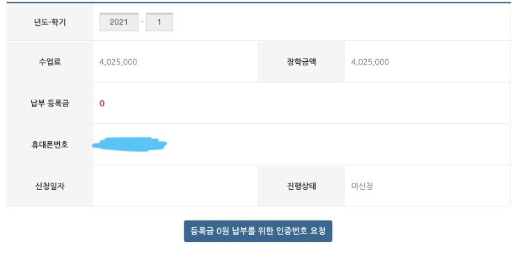
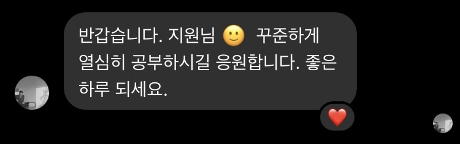

## 2021년을 보내면서

이 글을 쓰고 있는 지금도 2021년이 다 지나갔다는게 믿기지 않는다. 주변에서 대학교 삼학년은 사망년이라고 하는 우스갯소리를 들은 적이 있는데, 막상 겪어보니 농담이 아니라 다큐였다.

나름 바쁘기도 많이 바빴고, 이룬 것도 꽤 많은 한해였는데  
난 어제 뭐 먹었는지도 기억 안나기 때문에 다 잊어버리기 전에 기억할 만한 일들을 정리해보려고 한다.  

## 나의 2021년 이슈들  :white_check_mark:
- 두 번의 성적 장학금
- 진로에 대한 결정
- 백엔드 개발자 준비의 시작
- 졸업 작품

### 두 번의 성적 장학금
올 초부터 너무 큰 선물을 받았다. 사실 2학년 2학기 성적은 괜찮았으나 토익 성적이 없어서 성적 장학금을 받을 수 있을지 걱정했는데 다행히도 장학생에 선정되었다.

살면서 처음 장학금이란걸 받아봐서 내겐 의미가 굉장히 컸다.  
금전적인 액수보다도 내가 지금 잘 하고 있구나라는 느낌을 받을 수 있었고, 이 경험이 올 한해를 열심히 보낼 수 있는 원동력이 되었다.

컴퓨터 공학과에 입학했지만, 1학년 성적이 2점대를 달리며 오락문화의 선구자 혹은 일탈을 꿈꾸는 소시민이었던 나는 복학에 대한 막연한 불안감이 있었다.

전역 후 2학년으로 복학하면서 포기하지 않고 기초부터 따라가려고 노력했고, 1년이 지난 후 장학금이 그 결과를 말해주는 것 같았다.

국가 장학금에 성적 장학금을 더해서 3학년 1학기는 등록금 0원을 납부했는데 이때 기분이 정말 :+1: :+1:

3학년 1학기에는 데이터베이스 관리, 컴퓨터 네트워크, ~~영상 정보 처리,~~ 웹 기반 정보 시스템 등 재밌는 강의들이 많아서 열심히 공부할 수 있었고, 

여름 방학 때 두 번째로 장학생에 선정되었다는 문자를 받을 수 있었다.

돌아보면 장학생에 선정된 문자를 받은 두 번이 올해 가장 짜릿한 기억들로 남아있다. 노력에 대한 보상을 받은 이 감정을 앞으로도 기억하되, 자만하거나 만족하지 않고 꾸준히 정진해야겠다.

 

### 진로에 대한 결정

이전까지 착실히 학교 커리큘럼을 따라가며 공부하고 있었지만, 진로에 대한 명확한 비전을 가지고 있진않았다.

전공이 적성에 맞다고 생각했기에 무조건 전공을 살리고 싶긴 했지만, 구체적으로 어떤 분야로 나아갈지는 정하지 못했었다. 방학동안 유튜브를 통해 프론트쪽도 아주 살짝 맛을 봤고, 파이썬 tkinter로 간단한 프로그램을 만들어보기도 했지만 확 땡기는 건 없었달까..

그런데 내게 3학년 1학기에 수강한 웹 기반 정보 시스템 수업이 크게 작용했다. 서블릿을 통해서 웹 페이지의 구성을 조립하는 듯한 내용과 네트워크, DB를 아우르며 지금까지 다른 강의에서 배운 내용들을 활용해서 웹이라는 하나의 시스템을 구성하는데에 큰 재미를 느꼈다.

강의 내용에서 나아가 스프링이라는 프레임워크에 대해 학습하면 백엔드 개발자로서의 기반을 다질 수 있다는 것을 알게되었고, 자연스레 나의 진로는 백엔드 개발자로 굳혀졌다. 

아직 배울 것이 한참 많은 백엔드 개발자 지망생 :hatched_chick: 이지만, 나의 진로 선택에 매우 만족하고 있으며 재밌게 공부하고 있다.

 

### 백엔드 개발자 준비의 시작

학기 중 백엔드 개발자로 진로를 잡은 나는, 여름 방학부터 본격적으로 관련 분야 공부를 시작했다. 

먼저, JSP&서블릿에서 나아가 스프링에 대해 배워보고 싶은 마음이 컸기에 책이나 인강을 많이 찾아보다가 인프런에 김영한님의 스프링 강의에 대해 알게되어 영한님의 로드맵을 따라갔다.

차근히 스프링과 JPA에 대한 강의를 모두 듣고, 현재 Querydsl 강의를 수강 중인데, 하나도 버릴 것 없이 너무 좋은 강의들이다. 나중에 꼭 개발자 대 개발자로 만나서 영한님께 감사 인사를 드리고싶다!

> 여담으로, 페이스북으로 간단하게 인사를 드렸는데 정말 친절하게 답장까지 주셨다 :joy_cat:
>  

영한님의 강의는 너무 좋았으나, 내가 많이 부족하다는 것을 여실히 느꼈다.  
학교에서 자바를 배웠음에도 기본적인 자바 문법인 stream, lambda, collection 등을 전혀 몰랐기 때문에 한편으로는 '내가 지금 스프링 공부하고 있을 때가 맞나?'라는 생각이 들었고

방학이 끝나기 3주 전부터 자바 기초를 다시 공부했다. 이때 백기선님의 자바 스터디가 너무 큰 도움이 되었고, 블로그도 이 스터디를 통해서 시작했다. 

기선님 스터디를 통해 작성한 포스트들은 이후에도 꾸준히 보고 있으며, 스터디에서 학습한 내용뿐 아니라 개발자로서의 마인드나 블로그를 통한 학습 등 너무 많은 것을 배웠다. 스터디 후기 글에서도 언급했지만, 기선님에게도 꼭 감사 인사 전하고싶다! :pray:

 

### 졸업 작품
우리 과는 3학년 2학기부터 4학년 1학기까지 졸업 작품을 진행한다. 여름 방학때부터 시작해서 학기를 지나오면서 조금씩 아이디어 구상에 들어가고, 팀원이 정해지고, 기획과 설계를 진행했다.

아직 대외적으로 자세한 내용을 공개하긴 힘들지만, 우리 팀은 졸업 작품으로 앱 개발을 진행하게 되었고 나는 백엔드 개발을 담당한다.

이제 겨울 방학동안 개발 단계가 본격적으로 진행될텐데 열정적인 팀원들과 함께하게 되어 행운으로 생각하고 있으며, 협업하는 장기 프로젝트는 처음이라 많은 것을 배우고 있고, 앞으로도 많이 배울 것 같다. 앞으로가 기대된다.

 

## 마무리..
특히 12월 달에 많이 바빴어서 그런지 한해가 더 정신없이 지나간 느낌이 들었는데 이렇게 회고를 하며 돌아보니 무탈하게 잘 보낸 해였던 것 같다. 

특히 올해는 진로에 대해 확고한 꿈을 가지게 되었기 때문에 다가오는 2022년은 꿈을 이룰 수 있도록 더욱 노력할 수 있도록 하겠다. 호랑이 기운 받아서 다들 파이팅 :tiger: :tiger: