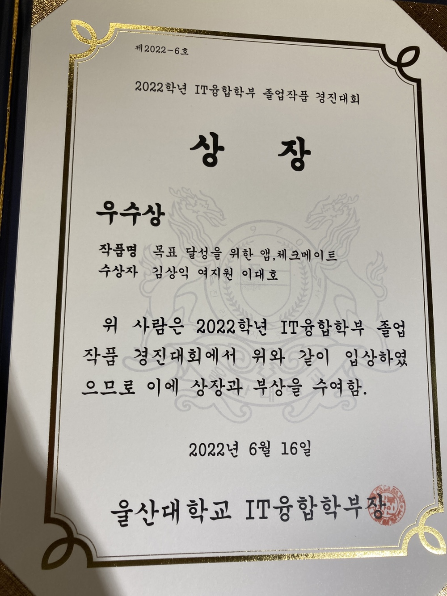

## 끝나긴 끝나네

끝나지 않을 것만 같던 졸업 작품 프로젝트가 모두 마무리되었다.

프로젝트는 작년 6월경에 담당 교수님이 배정되고 팀을 구성했으니 약 1년간 진행되었다.

처음으로 진행해보는 장기 프로젝트였고 팀을 구성해 협업하는 프로젝트 역시 처음이었기에

부족한 점도 많았고 시행착오도 많았으나 돌이켜보니 정말 많은 것을 배웠다.

미리 자랑 좀 하자면 **우수상🏅** 까지 수상하며 과정과 결과 모두 너무나 만족스러운 프로젝트였다!!

올해 들어서는 본격적인 개발 단계에 들어 알고리즘, 학교 공부, 졸업 작품 등을 병행하다 보니
블로깅을 거의 못 했는데

이 글을 시작으로 프로젝트를 진행하면서 경험한 기술적인 고민이나 개선에 관해서 얘기해보면서

블로깅도 다시 열심히 해보려고 한다.

<br>

## 함께 나아가요, 체크메이트

우리 팀은 앱 개발을 큰 주제로 선택한 사람들이 모였기 때문에 앱이라는 큰 틀 안에서 어떤 서비스를 만들지에대해 많은 고민을 했다.

다만, 우리 팀이 구성되었을 때부터 우리의 첫 번째 목표는 이 프로젝트를 개발하고 **앱 스토어에 배포해서 실제 사용자를 받아보는 것**이었다.

때문에 졸업 작품에 대한 평가나 수상보다도

우리가 1년 동안 개발할 수 있는 규모이면서, 다른 사람이 아닌 우리가 하고 싶은 주제로 선정하여
이후에도 꾸준히 개선해나가면서 서비스하고자 했다.

다양한 아이디어가 있었고, 고민 끝에 우리가 정한 아이디어는

자기 개발을 위해 팀원들 간 서로 목표를 향해 나아갈 수 있도록 돕는 앱, **체크메이트**다.


> 앱의 이름은 함께 목표를 위해 나아가는 팀원이 서로를 체크해주는 동료가 
> 되어준다는 의미에서 체크메이트로 결정하게 되었다 **♞**

<br>

## 내가 뭘 모르는지 아는 것


주제 선정 이후 기획 단계는 생각보다 순조로웠다.

처음부터 끝까지 우리 팀이 만들고 싶은 서비스를 만들면 되었고, 교수님께서도 우리의
철학대로 자유롭게 기능을 구상해보라고 하셔서 큰 틀에서의 기능들은
어렵지 않게 구상할 수 있었다.

하지만 개발 단계에 들어서는 한 발짝 한 발짝이 모두 기술적인 도전이었다.


```
"사용자가 편하게 회원 가입할 수 있도록 소셜 로그인을 사용하자!"   
-> 검색해보니 OAuth2.0..JWT..어쩌구 하는데 어디서부터 어떻게 해야하지..

"일정 퍼센트 이상 목표를 진행하지 않은 팀원은 자동으로 퇴출시키자!"   
-> 이걸 언제 어떻게 검사해서 퇴출 시키지?

"팀원 초대나 목표 인증 시 등등 사용자에게 다양한 푸쉬 알림을 보내주자!"   
-> 푸쉬 알림은 받아보기만 했는데...
  ```


등등 기술적인 어려움은 너무나도 많았다. 

하지만 모두가 처음이니 모르는 게 당연했고, 어려움을 만날 때마다 이에 대해 공부하면서 해결할 수 있었다.

개발 초기에는 단지 기능 구현에 초점을 맞춰 개발했지만, 실제 사용자에게 서비스하는 것을 염두해두고 개발하다 보니 성능과 안정성 등과 같은 기능 외적인 요소가 무척 중요하다는 것을 깨닫게 되어

자연스레 테스트 코드 작성에 신경을 많이 쓰게 되었으며 쿼리 성능을 개선하기 위해 실행 계획을 분석하고 인덱스를 잡는 등 

기존에 혼자 토이 프로젝트를 할 때보다 훨씬 다양하고 깊은 고민을 했다.

4학년 겨울 방학은 거의 체크메이트 개발에 전념하였는데, 개인적으로 이 시기에 개발적인 능력이 가장 많이
성장하지 않았나싶다.

문제를 하나씩 해결하면서 자신감이 붙었지만, 또 다른 문제를 만나면서 부족함을 느낄 때도 많았다. 

하지만 이 부족함에 좌절하기보다, 이를 원동력으로 삼아 계속 나아갈 수 있었으며

이 과정 속에서 **'내가 뭘 모르는지 아는 것'** 이 중요하다는 것을 알게 되었고, 모르는 것을 아는 것으로 바꿔나가기 위해 매일 부족함을 느끼며 공부하고 있다.

<br>

## 최고의 마무리

개인적으로 이번 4학년 1학기가 지금까지 대학 생활 중 가장 빠르게 지나가는 것처럼 느껴졌다.

하루하루 충실히 살다 보니 어느새 졸업작품 제출과 발표일이 다가왔는데,

앞서 말했듯이 우리 팀은 수상보단 실제 서비스를 위한 부분에 더 중점을 두었기 때문에 다들 수상에는 큰 기대를 하고 있지 않았다. 
> 안정성이 떨어지고 허점이 있어도 발표 때만 번지르르하게 보여 줄 기능들을 많이 추가할 수도 있으나, <br> 
> 우리는 안정적인 MVP 버전 배포를 위해 테스트 코드와 리팩토링에 중점을 두었다. 

하지만 우리 팀은 '어차피 못 받을 거야' 하고 포기하지 않고 관련 서류 제출과 발표 준비는 최선을 다했다. 

날로 먹으려는 사람 한 명 없이 모두가 마무리까지 최선을 다하는 것을 느낄 수 있어 너무 좋았고 으쌰으쌰하면서 잘 완주할 수 있었다.  
( 카페에 모여 하루종일 서류 작업을 하고, 늦은 밤 팀원들과 함께 먹었던 뒷고기에 소주 한 잔은 잊지 못할 것 같다. 😂 👍 )




발표 평가까지 끝까지 최선을 다한 우리는 무려 우수상을 받으며 최고의 마무리를 할 수 있었다!

팀원 모두가 1년간 노력해서 이루어낸 결과기에 개인적으로 성적 우수 장학생에 선정되었을 때보다도 훨씬 훨씬 더 기뻤다 😊😊

지금 돌이켜보면 내가 기술적으로 좀 빡빡하게 요구한 부분들이 있었는데, 믿고 따라준 팀원들에게 고맙다는 말을 전하고 싶다. 다른 사람들과 함께였다면 이렇게 좋은 결과는 힘들었을 거야. 진짜 수고했다 체크메이트!!
 
이렇게 우수상🏅과 함께 졸업 작품 프로젝트는 끝이 났다. 굉장히 진부하지만 끝은 또 다른 시작이라고 하였던가.  
체크메이트는 이제 시작이다!

방학 중 플레이 스토어에 체크메이트 MVP 버전 배포를 목표하고 있고, 이후에도 힘이 닿을 때까지 꾸준히 개선해나갈 예정이다.

지금 다짐한 이 목표들, 체크메이트와 함께 이뤄나갈 수 있도록 노력하겠다.

앞으로도 화이팅ㅋ


