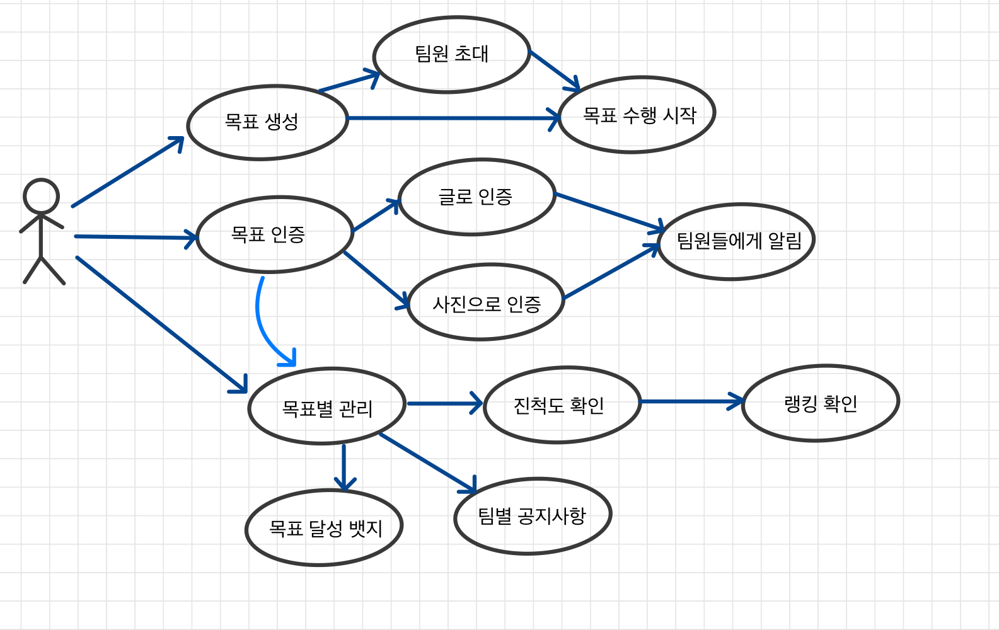
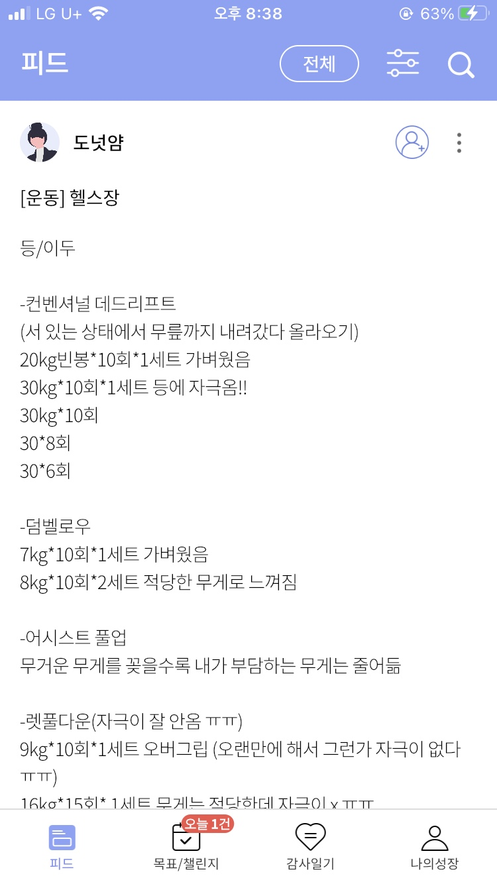

### **책 객체지향의 사실과 오해의 내용 중**

출처 : <http://www.yes24.com/Product/Goods/18249021>  

" 사용자는 자신의 목표를 달성하기 위해 시스템과의 상호작용을 시작한다. 사용자가 시스템에게 작업을 요청하면 시스템은 요청을 처리한 후 사용자에게 원하는 결과를 제공한다. 이러한 작업을 반복하는 상호작용을 통해서 서비스는 사용자의 목표를 만족시키기 위해 노력한다.  

이렇게 **사용자의 목표를 달성하기 위해 사용자와 시스템 간에 이뤄지는 상호작용의 흐름을 텍스트로 정리한 것을 유스케이스라고 한다.** 

유스케이스를 통해 사용자들의 목표를 중심으로 시스템의 기능적인 요구사항들을 이야기 형식으로 묶을 수 있다. 산발적으로 흩어져 있는 기능에 사용자 목표라는 문맥을 제공함으로써 각 기능이 유기적인 관계를 지닌 체계를 이룰 수 있게 한다.

이러한 유스케이스는 설계 기법도, 객체지향 기법도 아니다. **단지 기능적 요구사항을 사용자의 목표라는 문맥을 중심으로 묶기 위한 정리 기법일 뿐이다.**"

### **체크 메이트의 유스 케이스**

이 중에서 설명이 필요한 몇 가지에 대해서 추가적으로 설명하려고 한다. 

#### **글로 인증과 사진으로 인증을 분리**

특정 목표에 대해서는 사진으로 인증하는 것보다 글로 정리한 인증이 더 의미있는 경우가 있다. 

예를 들어, 운동을 목표로 삼을 경우에 헬스장에 도착한 사진 한 장 보다는, 오늘 어떤 운동을 몇 세트가져갔는지를 기록하는 것이 더 의미있을 것이기 때문에 목표 인증 방법에 대해서 사진으로 인증과 글로 인증하는 방법으로 나누었다. 

#### **랭킹 확인**
목표를 함께 하는 구성원 내의 랭킹을 의미하며, 목표 일수 당 목표 수행률을 기준으로 순위를 매긴다. 추후 같은 카테고리 내 다른 팀들간의 랭킹을 매기는 시스템도 고려중이다. 

#### **목표 달성 뱃지**
목표 생성 시 정했던 기간동안 성공적으로 목표를 달성했다면 그 것을 확인할 수 있는 온라인 뱃지를 제공한다.

출처 : <https://tow219.tistory.com/73>  

직관적으로 목표 달성을 확인할 수 있기 때문에 SNS 등에 공유하거나 인증하는 데에도 활용 가능할 것으로 기대된다. 

### **정리**
저번 주에 주제를 정리한 뒤, 이번 주에는 유스 케이스를 그려보면서, 우리 애플리케이션의 주요한 기능들에 대해 전반적인 그림을 잡을 수 있었다.

의견을 주고받으면서 세분화가 필요한 기능들에 대해서 짚고 넘어갈 수 있었고, 이후에 애플리케이션 사용 시나리오를 작성할 때도 큰 도움이 될 것으로 생각한다.
