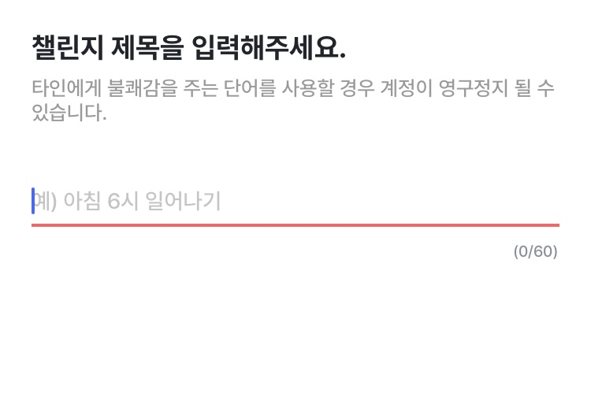

- 목표 생성
- 팀원 초대 
- 목표 수행 시작 

### **목표 생성**

원하는 목표를 생성합니다. 먼저 목표 이름을 설정하는데, 혐오감을 주거나 반사회적인 행동에 대한 키워드가 포함되어 있다면 적절한 제재를 합니다.  

저번 회의 중, 의미없는 목표 (ex. 누워있기) 를 설정하고 뱃지를 받아가는 것에 대한 대처를 어떻게 할 것인지에 대한 질문을 주셨는데, 욕설이나 혐오감을 조성하는 컨텐츠가 아니라면 사용자의 자유도를 위해서 운영진 측에서 크게 제재할 필요는 없다고 생각합니다. 

뱃지를 받는 것 또한 일정 기간이상 꾸준히 목표를 실천했을 때만 지급되기 때문에 누군가에겐 의미 없어보이는 목표라도, 뱃지 지급 요건을 만족할만큼 꾸준히 진행했다면 그 사람에게는 의미있는 목표라고 생각합니다.

이 후 총 목표 진행 기간과 인증 빈도를 설정합니다. 인증을 매일할 것인지, 주 마다 특정 요일에 할 것인지를 자유롭게 설정가능합니다.

**목표 인증 방법**
1. 자유롭게 그날마다 글이나 사진으로 인증
2. 엄격하게 규격을 제한 -> 목표장이 검사?

논의가 필요해보임

### **팀원 초대**

흔히 게임에서 파티원으로 초대하는 것처럼, 목표 생성자가 함께 할 팀원을 초대합니다. 

물론 혼자서 진행할 수도 있지만, 내가 원하는 지인들과 함께 목표 수행을 위해 나아가는 것이 우리 앱의 큰 특징이자 장점이기 때문에 사용자에게 이런 측면을 적극적으로 홍보할 예정입니다.

### **목표 수행 시작**

목표 생성 시 설정했던 시작일부터 목표 수행을 시작합니다. 참여하는 팀원들은 정해진 날마다 목표 수행을 인증합니다.