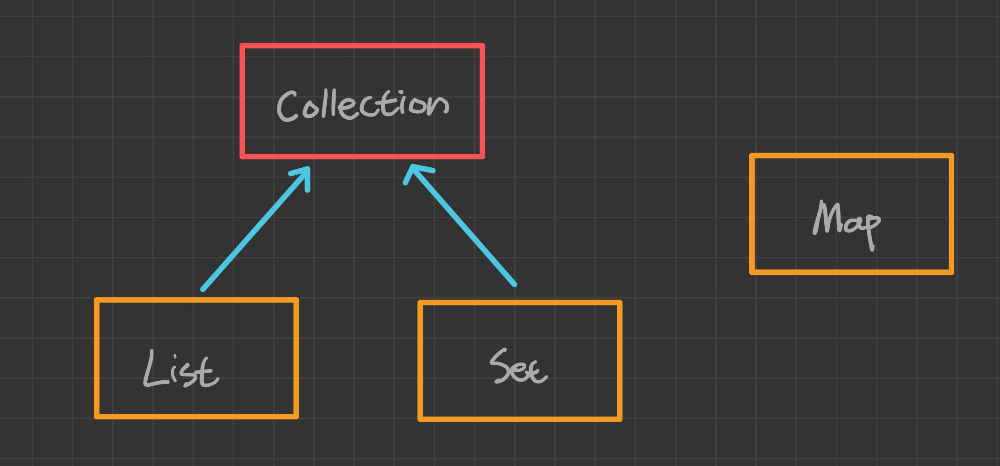
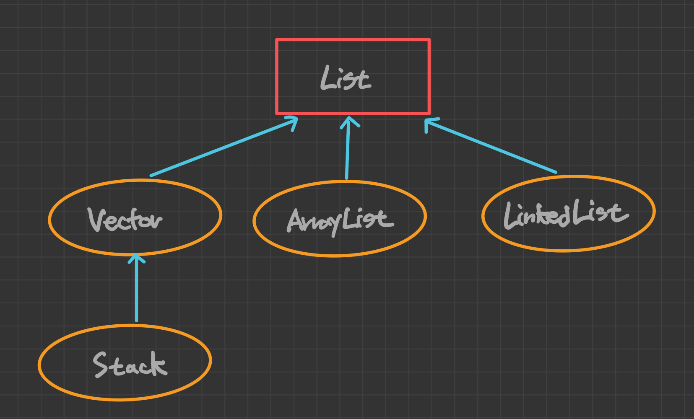
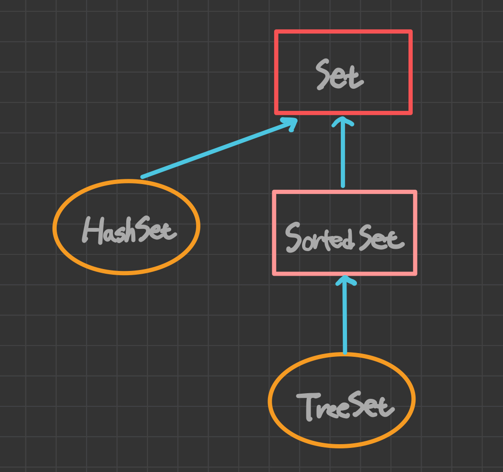
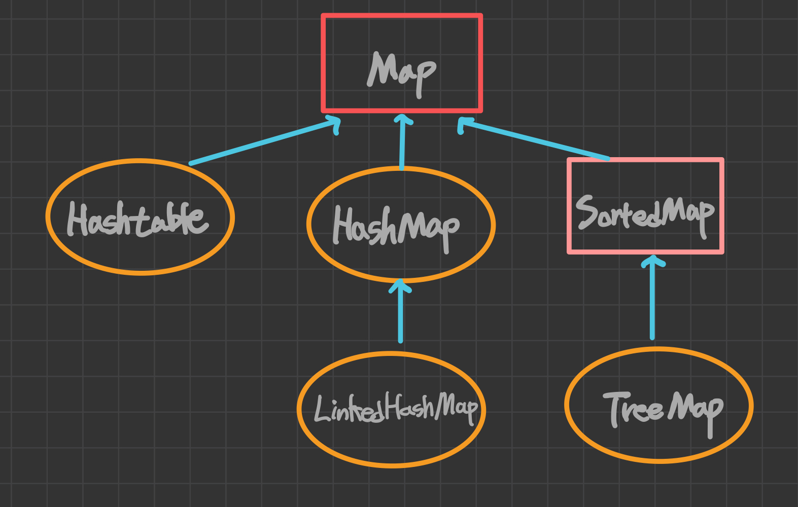
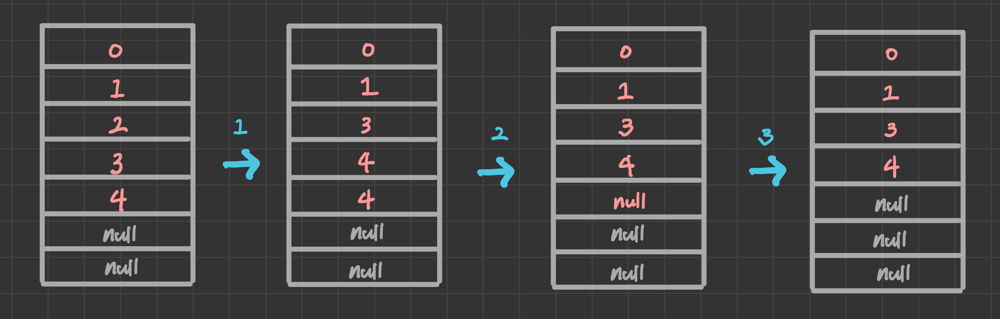

## 목차
- 컬렉션 프레임워크란?
- 컬렉션 프레임워크의 핵심 인터페이스
- ArrayList

### **컬렉션 프레임워크란?**

컬렉션 프레임워크란, 데이터 군을 저장하는 클래스들을 표준화한 설계를 뜻한다. 여기서 `컬렉션(Collection)`은 다수의 데이터, 데이터 그룹을 의미하고 `프레임워크(Framework)`는 표준화된 프로그래밍 방식을 말한다.

JDK 1.2 이전까지는 `Vector`, `Hashtable`, `Properties`와 같은 커렉션 클래스들을 각자의 방식으로 처리해야 했으나, JDK 1.2부터 컬렉션 프레임워크가 등장하면서 다양한 종류의 컬렉션 클래스가 추가되고 모든 컬렉션 클래스를 표준화된 방식으로 다룰 수 있도록 체계화되었다.  

### **컬렉션 프레임워크의 핵심 인터페이스**

컬렉션 프레임워크에서는 컬렉션 데이터 그룹을 크게 세 가지 타입의 인터페이스로 나누었다. 그리고 인터페이스 `List`와 `Set`의 공통 부분을 뽑아서 새로운 인터페이스인 `Collection`을 추가로 정의했다. `Map` 인터페이스는 이들과는 전혀 다른 형태로 컬렉션을 다루기 때문에 같은 상속 계층도에 포함되지 못했다.



>JDK 1.5부터 Iterable 인터페이스가 추가되고 Collection 인터페이스가 이것을 상속받도록 변경되었으나. 이것은 단지 공통적인 메소드를 뽑아서 중복을 제거하기 위한 것이므로 상속 계층도에서 별 의미가 없다.

|인터페이스|특징|구현 클래스|
|--|--:|--:|
|List|순서가 있는 데이터의 집합, 데이터의 중복 허용 <br> 예) 대기자 명단| ArrayList, LinkedList, Stack, Vactor|
|Set|순서를 유지하지 않고 데이터의 중복이 허용되지 않음 <br> 예)양의 정수집합, 소수의 집합|HashSet, TreeSet|
|Map|key와 value의 쌍으로 이루어진 데이터의 집합<br>순서 x, key는 중복허용 x, value는 중복허용<br>예)우편번호, 전화번호|HashMap,TreeMap,Hashtable,Properties|

컬렉션 프레임워크의 모든 컬렉션 클래스들은 이 셋 중의 하나를 구현하고 있으며, 구현한 인터페이스의 이름이 클래스의 이름에 포함되어 있어서 이름만으로도 클래스의 특징을 쉽게 알 수 있다. 

하지만 `Vector`, `Stack`, `Hashtable`, `Properties`와 같이 컬렉션 프레임워크가 만들어지기 이전부터 존재하던 클래스들은 이러한 명명 규칙을 따르지 않는다. 이런 기존의 컬렉션 클래스들은 호환을 위해 남겨두었지만 가능한 사용하지 않는 것이 좋다.

#### Collection 인터페이스 

|메소드|설명|
|--:|--:|
|boolean **add(Object o)**<br>boolean **addAll(Collection c)**|지정된 객체(o) 또는 Collection의 객체들을 Collection에 추가|
|void **clear()**|Collection의 모든 객체를 삭제|
|boolean **contains(Object o)**<br>boolean **containsAll(Collection c)**|지정된 객체 또는 Collection의 객체들이 Collection에 포함되어 있는지 확인|
|boolean **equals(Object o)**|동일한 Collection인지 비교|
|int **hashCode()**|Collection의 hash code 반환|
|boolean **isEmpty()**|Collection이 비어있는지 확인|
|Iterator **iterator()**|Collection의 iterator를 얻어서 반환|
|boolean **remove(Object o)**|지정된 객체를 삭제|
|boolean **removeAll(Collection c)**|지정된 Collection에 포함된 모든 객체를 삭제|
|boolean **retainAll(Collection c)**|지정된 Collection에 포함된 객체만 남기고 다른 나머지 객체들은 삭제 <br> 이로인해 Collection에 변화가 생기면 true를 반환|
|int **size()**|Collection에 저장된 객체의 개수를 반환|
|Object[] **toArray()**|Collection에 저장된 객체를 객체 배열로 반환|
|Object[] **toArray(Object[] a)**|지정된 배열에 Collection의 객체를 저장해서 반환|

이 외에도 `JDK 1.8`부터 추가된 `Lambda`와 `Stream`에 관련된 메소드들이 더 있는데, 이 것들은 해당 주제를 다루는 포스트에서 따로 언급하겠다.
> 실제 Java API 문서를 보면 표에서 사용된 Object가 아닌 제네릭 타입 E로 표기되어 있는데, 이해를 돕기 위해 Object로 표기했다.

#### List 인터페이스

`List` 인터페이스는 **중복을 허용**하면서 **저장순서가 유지**되는 컬렉션을 구현하는데 사용된다. 



|메소드|설명|
|--:|--:|
|void **add(int index, Object element)**<br>boolean **addAll(int index, Collection c)**|지정된 위치에 객체 또는 컬렉션에 포함된 객체들을 추가|
|Object **get(int index)**|지정된 위치에 있는 객체를 반환|
|int **indexOf(Object o)**|지정된 객체의 위치를 반환<br>(List의 첫번째 요소부터 순방향으로 탐색)|
|int **lastIndexOf(Object o)**|지정된 객체의 위치를 반환<br>(List의 마지막 요소부터 역방향으로 탐색)|
|ListIterator **listIterator()**<br>ListIterator **listIterator(int index)**|List의 객체에 접근할 수 있는 ListIterator 반환|
|Object **remove(int idex)**|지정된 위치에 있는 객체를 삭제하고 삭제된 객체를 반환|
|Object **set(int index, Object element**)|지정된 위치에 객체를 저장|
|void **sort(Comparator c)**|지정된 비교자로 List를 정렬|
|List **subList(int fromIndex, int toIndex)**|지정된 범위에 있는 객체를 반환|

#### Set 인터페이스
`Set` 인터페이스는 **중복을 허용하지 않고 저장순서가 유지되지 않는** 컬렉션 클래스를 구현하는데 사용된다. 



#### Map 인터페이스
`Map`인터페이스는 key와 value를 하나의 쌍으로 묶어서 저장하는 컬렉션 클래스를 구현하는 데 사용된다. 이 때 key는 중복될 수 없지만 value는 중복을 허용한다. 만약 기존에 저장된 데이터와 중복된 key로 데이터를 저장하면 기존의 value는 없어지고 덮어써진다. 



|메소드|설명|
|--:|--:|
|void **clear()**|Map의 모든 객체를 삭제|
|boolean **containsKey(Object key)**|지정된 key와 일치하는 Map의 key가 있는지 확인|
|boolean **containsValue(Object value)**|지정된 value와 일치하는 Map의 value가 있는지 확인|
|Set **entrySet()**|Map의 key-value쌍을 Map.Entry타입의 객체로 저장한 Set으로 반환|
|boolean **equals(Object o)**|동일한 Map인지 비교|
|Object **get(Object key)**|지정한 key에 대응하는 value를 반환|
|int **hashCode()**|해시코드를 반환|
|boolean **isEmpty()**|Map이 비어있는지 확인|
|Set **keySet()**|Map에 저장된 모든 key를 반환|
|Object **put(Object key, Object value)**|Map에 key-value쌍을 저장|
|void **putAll(Map t)**|지정된 Map의 모든 key-value쌍을 추가|
|Object **remove(Object key)**|지정된 key와 일치하는 key-value쌍을 삭제|
|int **size()**|Map에 저장된 key-value쌍의 개수를 반환|
|Collection **values()**|Map에 저장된 모든 value객체를 반환|

여기서 `values()`의 반환타입은 `Collection`이고, `keySet()`의 반환타입은 `Set`인 것에 주목하자. Map 인터페이스에서 값은 중복을 허용하기 때문에 Collection타입으로 반환하고, 키는 중복을 허용하지 않기 때문에 Set타입으로 반환한다. 

#### Map.Entry 인터페이스
`Map.Entry` 인터페이스는 `Map`인터페이스의 내부 인터페이스다. Map에 저장되는 key-value 쌍을 다루기 위해 내부적으로 `Entry` 인터페이스를 정의해 놓았다. 
> 내부 클래스처럼 인터페이스도 인터페이스 안에 인터페이스를 정의하는 내부 인터페이스를 정의할 수 있다. 

|메소드|설명|
|--:|--:|
|boolean **equals(Object o)**|동일한 Entry인지 비교|
|Object **getKey()**|Entry의 key객체를 반환|
|Object **getValue()**|Entry의 value객체를 반환|
|int **hashCode()**|Entry의 해시코드를 반환|
|Object **setValue(Object value)**|Entry의 value객체를 지정된 객체로 변경|

### **ArrayList**
`ArrayList`는 컬렉션 프레임워크 중에서 가장 많이 사용되는 컬렉션 클래스다. 이름에서 알 수 있듯이 `List` 인터페이스를 구현하기 때문에 데이터의 저장순서가 유지되고 중복을 허용한다는 특징을 갖는다.  

ArrayList는 기존의 `Vector`를 개선한 것으로, 구현원리와 기능적인 측면에서 동일하다고 할 수 있다. 앞서 얘기했듯이 Vector는 legacy code와의 호환성을 위해 계속 남겨두고 있을 뿐, 가능한 ArrayList를 사용해야 한다.

ArrayList는 내부적으로 Object 배열을 이용해서 데이터를 순차적으로 저장한다. 
```java
public class ArrayList<E> extends AbstractList<E> implements List<E>, 
    RandomAccess, Cloneable, java.io.Serializable{
        ...
transient Object[] elementData;
        ...
}
```

따라서 `ArrayList`나 `Vector` 같이 배열을 이용한 자료구조는 데이터를 읽어오고 저장하는 데는 효율이 좋지만, 용량을 변경해야 할 때는 새로운 배열을 생성한 후 기존으 배열로부터 새로 생성된 배열로 데이터를 복사해야하기 때문에 상당히 효율이 떨어진다는 단점을 가진다. 

그래서 처음에 인스턴스를 생성할 때, 저장할 데이터의 개수를 잘 고여하여 충분한 용량의 인스턴스를 생성하는 것이 좋다.

|생성자|설명|
|--:|--:|
|ArrayList()|크기가 10인 ArrayList를 생성|
|ArrayList(Collection c)|주어진 Collection이 저장된 ArrayList 생성|
|ArrayList(int initCapacity)|지정된 초기용량을 갖는 ArrayList 생성|

생성할 때 지정한 크기보다 더 많은 객체를 저장하면 자동적으로 크기가 늘어나기는 하지만 이 과정에서 처리 시간이 많이 소요된다. 



`ArrayList`의 `Object remove(int index)`메소드는 지정된 위치에 있는 객체를 삭제하고 삭제한 객체를 반환하는데, 삭제할 객체의 바로 아래에 있는 데이터를 한 칸씩 위로 복사해서 삭제할 객체를 덮어쓰는 방식으로 처리한다. 만일 삭제할 객체가 마지막 데이터라면, 단순히 `null`로 변경해주기만 하면 된다.

### **LinkedList**
배열은 간단하며 사용하기 쉽고, 데이터를 읽어오는데 걸리는 시간(access time)이 가장 빠르다는 장점을 가지고 있지만 다음과 같은 단점도 있다. 

1. 크기를 변경할 수 없다.  
    크기를 변경할 수 없어 새로운 배열을 생성해 기존 데이터를 복사해야 한다. 이를 막기 위해서 충분히 큰 크기의 배열을 생성해야 하므로 메모리가 낭비된다. 
2. 비순차적인 데이터의 추가 또는 삭제에 시간이 많이 걸린다.  
    차례대로 데이터를 추가하고 마지막 데이터를 삭제하는 것은 빠르지만, 배열의 중간에 데이터를 추가하거나 삭제하면 다른 데이터들이 이동해야 한다.

이러한 배열의 단점을 보완하기 위해서 `LinkedList`라는 자료구조가 고안되었다. LinkedList는 불연속적으로 존재하는 데이터를 서로 연결(link)한 형태로 구성되어 있다. 
>실제 LinkedList 클래스는 접근성을 높이기 위해 이름과 달리 linked list가 아닌 double linked list로 구현되어 있다. 

하지만 `LinkedList`는 원하는 값을 얻으려면 처음부터 n번째 데이터까지 차례대로 따라가야 한다는 단점이 있다. 그래서 저장해야하는 데이터의 개수가 많아질수록 데이터를 읽어오는 시간이 길어진다.

따라서 데이터의 개수가 변하지 않거나 순차적으로 추가/삭제하는 경우에는 `ArrayList`가 `LinkedList`보다 좋은 선택이고, 데이터 개수의 변경이 잦거나 중간 데이터를 추가/삭제하는 경우에는 `LinkedList`가 `ArrayList`보다 유리하다.

### **Stack과 Queue**

**stack 클래스의 메소드**

|메소드|설명|
|--:|--:|
|boolean **empty()**|Stack이 비었는지|
|Object **peek()**|Stack의 맨 위에 저장된 객체를 반환 (꺼내지는 않음)|
|Object **pop()**|Stack의 맨 위에 저장된 객체를 꺼냄|
|Object **push(Object item)**|Stack에 객체를 저장|
|int **search(Object o)**|주어진 객체를 찾아서 위치를 반환, 없으면 -1 <br> (배열과 달리 위치는 0이아닌 1부터 시작)|

<br>

**Queue 인터페이스의 메소드**

|메소드|설명|
|--:|--:|
|boolean **add(Object o)**|지정된 객체를 Queue에 추가<br>성공하면 true, 저장돈간이 부족하면 IllegalStateException 발생|
|Object **remove()**|Queue에서 객체를 꺼내 반환 <br> 비어있으면 NoSuchElementException 발생|
|Object **element()**|삭제없이 요소를 읽어옴 <br> 비어있으면 NoSuchElementException 발생|
|boolean **offer(Object o)**|Queue에 객체를 저장 <br> 성공하면 true, 실패하면 false 리턴|
|Object **poll()**|Queue에서 객체를 꺼내서 반환. 비어있으면 null|
|Object **peek()**|삭제없이 요소를 읽어옴. 비어있으면 null|


```java
public static void main(String[] args) {
    Stack<Integer> s = new Stack<>();
    Queue<Integer> q = new LinkedList<>();

    s.push(0);
    s.push(1);
    s.push(2);

    q.offer(0);
    q.offer(1);
    q.offer(2);

    System.out.println("---stack---");
    while (!s.isEmpty()) {
        System.out.println(s.pop());
    }

    System.out.println("---queue---");
    while (!q.isEmpty()) {
        System.out.println(q.poll());
    }
}
```

`Stack`과 `Queue`에 데이터를 저장하고 출력하는 기본적인 예제다. 여기서 특이점을 발견했는가? 

Java에서 스택은 `Stack클래스`로 구현해 제공하고 있지만, 큐는 `Queue인터페이스`로만 정의해 놓았을 뿐 별도의 클래스를 제공하지 않고 있다. 대신 Queue인터페이스를 구현한 클래스들이 있어서 이 중에 하나를 선택해서 사용하면 된다.  

큐는 데이터를 꺼낼 때 항상 첫 번째에 저장된 데이터를 삭제하므로, `ArrayList`와 같이 배열기반의 컬렉션 클래스를 사용하면 데이터를 꺼낼 때마다 빈 공간을 채우기 위해 데이터의 복사가 발생하므로 비효율적이다. 그래서 큐는 데이터의 추가/삭제가 쉬운 `LinkedList`로 구현하는 것이 적합하다.

### **HashSet**

`HashSet`은 `Set`인터페이스를 구현한 가장 대표적인 컬렉션이다. `HashSet`에 새로운 요소를 추가할 때는 `add`메소드나 `addAll`메소드를 사용하는데, 이미 `HashSet`에 저장되어 있는 요소와 중복된 요소를 추가하고자 한다면 이 메소드들은 `false`를 반환함으로써 중복된 요소이기때문에 추가에 실패했다는 것을 알린다.

`List`인터페이스를 구현한 컬렉션과 달리 `HashSet`은 저장순서를 유지하지 않으므로 저장순서를 유지하고자 한다면 `LinkedHashSet`을 사용해야 한다. 

|생성자|설명|
|--:|--:|
|HashSet()|HashSet 객체를 생성|
|HashSet(Collection c)|주어진 컬렉션을 포한하는 HashSet 객체 생성|
|HashSet(int initialCapacity)|주어진 값을 초기용량으로 하는 HashSet 객체 생성|
|HashSet(int initialCapacity, float loadFactor)|초기용량과 loadFactor를 지정하는 생성자|

> load factor는 컬렉션 클래스의 저장공간이 가득 차기 전에 미리 용량을 확보하기 위한 것으로 이 값을 0.8로 지정하면, 저장공간의 80%가 채워졌을 때 용량이 두 배로 늘어난다. 기본값은 0.75이다.  

```java
class HashSetEx{
    public static void main(String[] args) {
        Object[] objArr = {"1",new Integer(1), "2","2","2","3","4","4","4"};
        Set set = new HashSet();

        for (int i = 0; i < objArr.length; i++) {
            set.add(objArr[i]);
        }
        System.out.println(set);
    }
}
```
```console
[1, 1, 2, 3, 4]
```

`HashSet`을 사용한 기본적인 예제이다. 그런데 예상과 달리, 결과를 보면 1이 두 번 출력되는 것을 알 수 있다. 두개의 1 중에서 하나는 `String인스턴스`이고 다른 하나는 `Integer인스턴스`로 서로 다른 객체이므로 중복으로 간주되지 않는 것이다.

