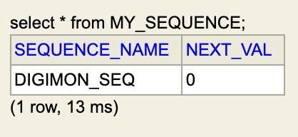
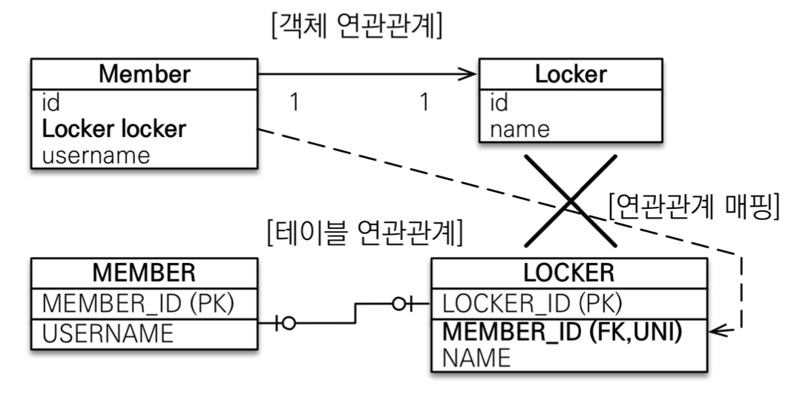
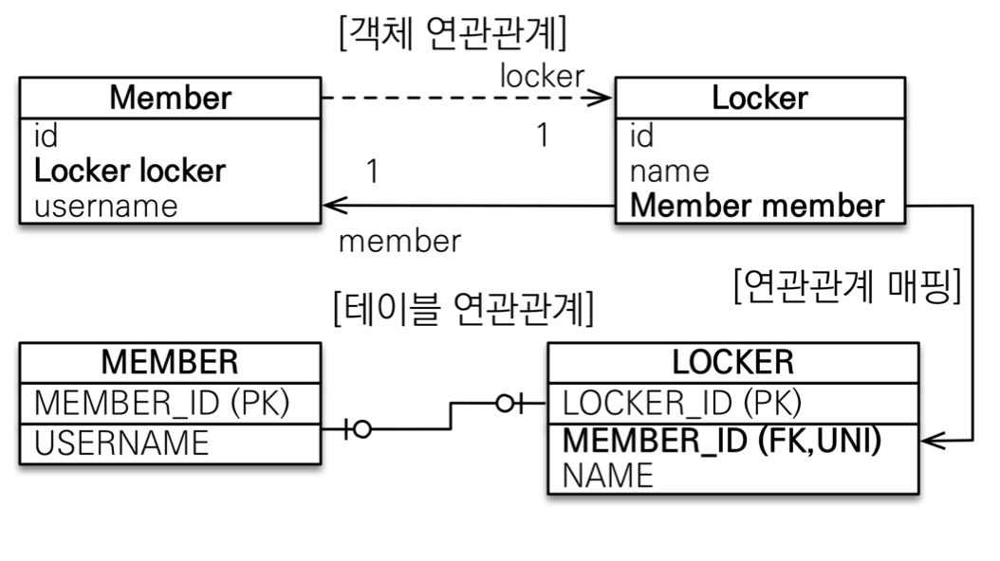
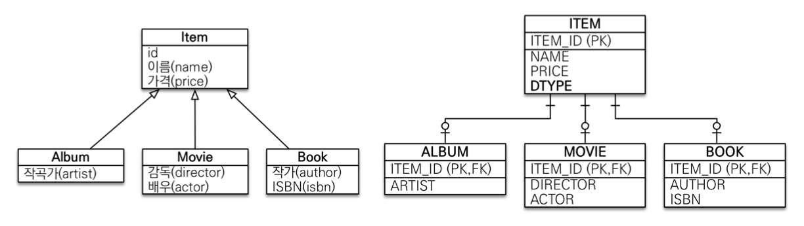
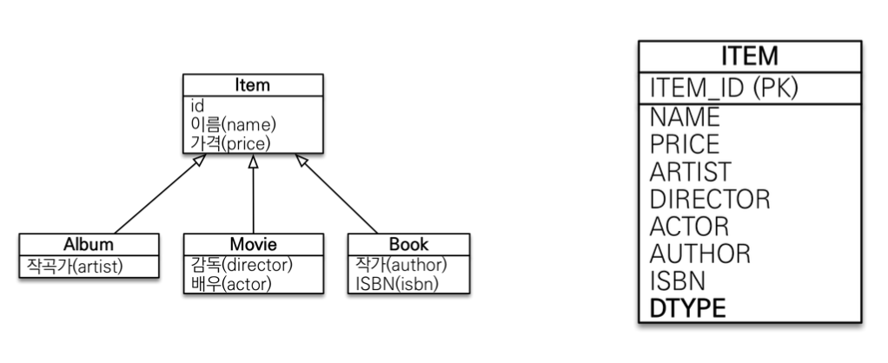
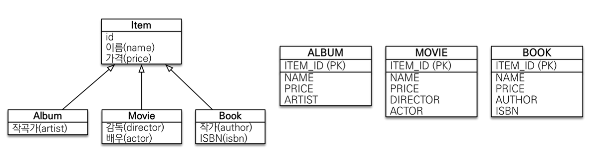
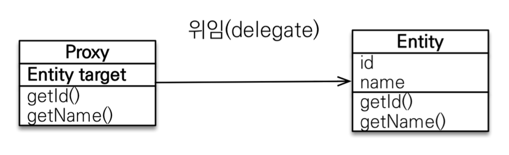
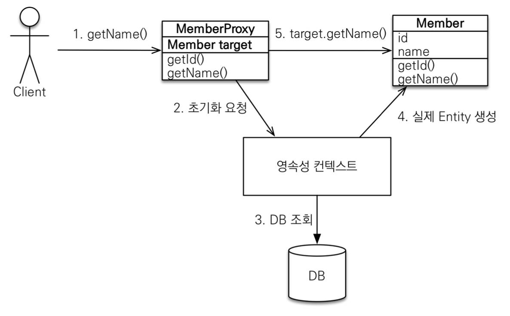

## 들어가면서
인프런에 있는 김영한님의 [자바 ORM 표준 JPA 프로그래밍 - 기본편](https://www.inflearn.com/course/ORM-JPA-Basic/dashboard) 강의를 정리한 글입니다. 세부사항이나 설정 등은 포스팅하지 않으니, 자세한 내용은 강의를 통해 확인해주시길 바랍니다.

## 목차
- JPA 시작
- 영속성 관리
- 엔티티 매핑
- 연관관계 매핑 기초
- 다양한 연관관계 매핑
- 고급 매핑
- 프록시와 연관관계 관리

### **JPA 시작**
#### Hello JPA - 애플리케이션 개발


#### 객체와 테이블을 생성하고 매핑하기

```java
@Entity
@Getter @Setter
public class Member{
    @Id
    private long id;
    private String name;
}
```

```sql
create table Member(
    id bigint not null,
    name varchar(255),
    primary key (id)
);
```

#### 회원 등록 

```java
public static void main(String[] args) {
    EntityManagerFactory emf = Persistence.createEntityManagerFactory("hello");
    EntityManager em = emf.createEntityManager();
    EntityTransaction transaction = em.getTransaction();
    transaction.begin();
    try{
        Member member = new Member();
        member.setId(1L);
        member.setUsername("memberA");
        em.persist(member);
        transaction.commit();
    }catch(Exception e){
        transaction.rollback();
    }finally {
        em.close();
    }
    emf.close();
}
```

#### 회원수정

```java
Member findMember = em.find(Member.class, 1L);
findMember.setUsername("HelloJPA");
transaction.commit();
```

`Collection`에서 데이터를 꺼내서 수정한 뒤 다시 컬렉션에 저장하지 않는 것처럼, `JPA`로 꺼내 온 데이터도 수정한 뒤에 다시 저장하지 않는다. 

#### 회원 삭제

```java
Member findMember = em.find(Member.class, 1L);
em.remove(findMember);
transaction.commit();
```

#### 회원 모두 조회 - JPQL

```java
List<Member> result = em.createQuery("select m from Member as m", Member.class)
                                                                .getResultList();
result.forEach(m -> System.out.println(m.getUsername()));
```

### **영속성 관리**

JPA에서 가장 중요한 두 가지는 아래와 같다.
- 객체와 관계형 데이터베이스 매핑하기 (Object Relational Mapping)
- 영속성 컨텍스트

#### 영속성 컨텍스트란?
영속성 컨텍스트는 눈에 보이지 않는 논리적인 개념인데, **엔티티를 영구 저장하는 환경**이라는 뜻이다. 엔티티 매니저를 통해서 영속성 컨텍스트에 접근할 수 있게 된다. 

예를 들어, `EntityManager.persist(entity)`는 사실 DB에 데이터를 저장하는 것이 아니고 엔티티를 영속성 컨텍스트에 저장하는 메소드이다.

#### 엔티티의 생명주기


- 비영속 (new/transient)  
    영속성 컨텍스트와 전혀 관계가 없는 새로운 상태

- 영속 (managed)  
    영속성 컨텍스트에 의해 관리되고 있는 상태 

- 준영속 (detached)  
    영속 상태의 엔티티가 영속성 컨텍스트에서 분리(detached)된 상태, 영속성 컨텍스트가 제공하는 기능을 사용하지 못한다. 

- 삭제 (removed)  
    삭제된 상태

#### 영속성 컨텍스트의 이점
- 1차 캐시  
    DB에서 데이터를 조회하기 위해 `em.find()`를 호출하면 바로 DB에서 데이터를 찾는 것이 아니고 영속성 컨텍스트 내의 1차 캐시에서 먼저 데이터를 찾아본다.

    만약 1차 캐시에 없는 데이터를 읽으려고 하면 DB에서 해당 데이터를 조회한 후 1차캐시에 저장 후 데이터를 반환해준다. 
    > 1차 캐시는 한 트랜잭션 안에서만 유효하기 때문에 캐시로 인한 성능적 이점이 매우 크지는 않다.
    
- 동일성(identity) 보장  
    
    ```java
    Member memberOne = em.find(Member.class, 1L);
    Member memberTwo = em.find(Member.class, 1L);
    System.out.println(memberOne == memberTwo);     //true
    ```

    마치 컬렉션에서 데이터를 꺼내서 비교하는 것처럼 JPA에서 같은 PK를 통해 꺼내온 데이터는 동일성이 보장된다.

- 트랜잭션을 지원하는 쓰기 지연 (transactional write-behind)  

    ```java
    transaction.begin();
    Member memberA = new Member("memberA");
    Member memberB = new Member("memberB");

    em.persist(memberA);
    em.persist(memberB);
    //여기까지 INSERT QUERY를 DB에 보내지 않고
    
    //커밋하는 순간 DB에 쿼리를 전송
    transaction.commit();
    ```

    JPA 관련 메소드 실행 시, 바로 DB에 쿼리를 보내지 않고 우선 영속성 컨텍스트 내 `쓰기 지연 SQL 저장소`에 저장해둔다. 그리고 `commit()`이 호출되거나 `flush()`를 호출될 때 쓰기 지연 SQL 저장소에 보관하고 있던 쿼리들을 DB에 반영하는 `쓰기 지연` 방식을 사용한다. 

- 변경감지(Dirty Checking)  

    

    앞서 언급한 것처럼, JPA로 꺼내온 엔티티의 데이터를 수정한 뒤에 다시 DB에 해당 엔티티를 저장하는 코드를 작성하지 않아도 된다. 

    영속성 컨텍스트 내 1차 캐시에서는 해당 엔티티들의 스냅샷을 가지고 있기때문에 엔티티의 데이터 변경이 발생하면 자동으로 `UPDATE` 쿼리를 보낸다. 


- 지연 로딩(Lazy Loading)  
    만약 `Member`라는 엔티티와 `Team` 엔티티가 다대일 관계로 매핑되어 있을 때, `Member` 엔티티를 조회할 시 `Team` 엔티티의 값을 바로 읽어오지 않고 프록시 값으로 채워진다. 이후 `Team` 엔티티의 값을 사용해야 할 때가 되어서야 `Team` 엔티티를 조회하는데, 이러한 방식을 지연 로딩이라 한다. 
    
    `@ManyToOne(fetch = FetchType.EAGER)`를 사용해서 fatch 타입을 LAZY에서 EAGER로 변환하면 즉시 로딩을 사용할 수도 있는데, 관련 내용은 이후에 엔티티 매핑 파트에서 더 자세히 다루겠다. 

#### 플러시
`flush()`는 영속성 컨텍스트의 변경 내용을 데이터베이스에 반영하는 것을 말한다. `flush()`를 호출한다고 1차 캐시에 있는 내용이 영향을 받는 것은 아니고, 단지 쓰기 지연 저장소에 있던 SQL이 DB에 반영된다.  

영속성 컨텍스트를 플러시하기 위해서는 다음과 같은 방법이 있다. 
- `em.flush()` - 직접호출
- 트랜잭션 커밋 - 플러시 자동 호출
- JPQL 쿼리 실행 - 플러시 자동 호출

### **엔티티 매핑**

#### 엔티티 매핑 어노테이션
- 객체와 테이블 매핑 : `@Entity`, `@Table`
- 필드와 컬럼 매핑 : `@Column`
- 기본 키 매핑 : `@Id`
- 연관관계 매핑 : `@ManyToOne`, `@JoinColumn`

#### 1. 객체와 테이블 매핑

`@Entity`가 붙은 클래스는 JPA가 관리하고, 이것을 엔티티라고 한다. JPA를 사용해서 테이블과 매핑할 클래스는 `@Entity`가 필수이다. 해당 엔티티 클래스에는 **기본 생성자**가 필수이고 `final` 클래스나 `enum`, `interface`, `inner` 클래스는 엔티티가 될 수 없다. 

`@Table`은 엔티티와 매핑할 테이블을 지정한다. 

|속성|기능|
|--:|--:|
|name|매핑할 테이블 이름|
|catalog|데이터베이스 catalog 매핑|
|schema|데이터베이스 schema 매핑|
|uniqueConstraints(DDL)|DDL 생성 시에 유니크 제약 조건 생성|

#### 2. 필드와 컬럼 매핑

매핑 어노테이션 정리

|어노테이션|설명|
|@Column|컬럼 매핑|
|@Temporal|날짜 타입 매핑|
|@Enumerated|enum 타입 매핑|
|@Lob| BLOB, CLOB 매핑|
|@Transient|특정 필드를 컬럼에 매핑하지 않음|

위 어노테이션들을 하나씩 자세히 알아보자

**@Column**

|속성|설명|기본값|
|--:|--:|--:|
|name|필드와 매핑할 테이블의 컬럼명|객체의 필드이름|
|insertable,<br> updatable|등록, 변경 가능 여부|TRUE|
|nullable(DDL)|null값 허용 여부. false로 설정하면 DDL 생성 시에 <br> not null 제약 조건이 붙는다.|
|unique(DDL)|@Table의 uniqueConstraints와 같은 역할||
|columnDefinition(DDL)|데이터베이스 컬럼 정보를 직접 입력<br> ex) varchar(100) default 'EMPTY'|필드의 자바 타입과 방언 정보|
|length(DDL)|문자 길이 제약 조건, String타입에만 사용|255|
|precision, <br> scale(DDL)|BigDecimal이나 BigInteger처럼 아주 큰 숫자나 <br>정밀한 소수를 다룰 때 사용|precision = 19,<br>scale=2|

**@Enumerated**  
\: 자바 enum 타입을 매핑할 때 사용

|속성|설명|기본값|
|--:|--:|--:|
|value|EnumType.ORDINAL : enum 순서를 저장 <br> EnumType.STRING : enum 이름을 저장 | EnumType.ORDINAL|

기본값이 `ORDINAL`이므로, `@Enumerated`를 사용할 때는 항상 `value` 설정을 명시적으로 `STRING`으로 변경해주자

**@Temporal**  
\: 날짜 타입(`java.util.Date`, `java.util.Calendar`)을 매핑할 때 사용한다. Java8 이후 버전은 `LocalDate`, `LocalDateTime`을 사용하면 `@Temporal`을 사용하지 않아도 자동 매핑된다. 

|속성|설명|
|--|:--|
|value|TemporalType.DATE : 날짜를 데이터베이스 date 타입과 매핑<br>(ex. 2021-09-15)<br>TemporalType.TIME : 시간과 데이터베이스 time 타입을 매핑 <br> (ex. 18:01:42)<br> TemporalType.TIMESTAMP : 날짜와 시간을 데이터베이스 timestamp 타입과 매핑 <br> (ex. 2021-09-15 18:01:42)|

**@Lob**  
\: 데이터베이스 BLOB, CLOB 타입과 매핑

여기서 `LOB`이란 Text, 그래픽, 이미지, 비디오, 사운드 등 구조화되지 않은 대형 데이터를 저장하는 타입을 말한다. `BLOB`은 이진 대형 객체를 저장하고, `CLOB`은 문자 대형 객체를 저장한다. 

`@Lob`은 따로 지정할 수 있는 속성이 없다. 매핑하는 필드 타입이 문자면 `CLOB`에 매핑되고, 나머지는 모두 `BLOB`으로 매핑된다.

**@Transient**  
\: 해당 필드를 데이터베이스에 매핑하지 않도록 한다. 주로 메모리 상에서만 임시로 어떤 값을 보관하고 싶을 때 사용한다. 

```java
@Transient
private Integer temp;
```

#### 3. 기본 키 매핑
기본 키 매핑에 사용하는 어노테이션은 `@Id`와 `@GeneratedValue`가 있다. 
```java
@Id @GeneratedValue(strategy = GenerationType.AUTO)
private Long id;
```

**기본 키 매핑 방법**
- 직접 할당 : `@Id`만 사용
- 자동 생성 : `@GeneratedValue`  
    - IDENTITY : 데이터베이스에 위임, MYSQL
    - SEQUENCE : 데이터베이스 시퀀스 오브젝트 사용, ORACLE (@SequenceGenerator 필요)
    - TABLE : 키 생성용 테이블 사용, 모든 DB에서 사용가능 (@TableGenerator 필요)
    - AUTO : 방언에 따라 자동 지정, AUTO가 defualt임 


**IDENTITY 전략 - 특징**  
- 기본 키 생성을 데이터베이스에 위임한다. 
- 주로 MySQL, PostgreSQL, SQL Server, DB2에서 사용 (MySQL의 `AUTO_INCREMENT`)
- JPA는 영속성 컨텍스트 내에서 기본값을 기준으로 1차 캐시에 엔티티들을 저장하고 있다가 트랜잭션 커밋 시점에 `INSERT SQL`을 실행하는데, IDENTITY를 사용하면 DB에 INSERT SQL을 사용한 후에 기본값을 알 수 있다.  
    때문에 IDENTITY 전략을 사용할 때는 `em.persist()`호출 시점에 즉시 INSERT SQL을 실행하고 DB에서 기본값을 조회한다.
    
```java
@Id @GeneratedValue(strategy = GenerationType.IDENTITY)
private Long id;
```

**SEQUENCE 전략 - 특징**  
- 데이터베이스 시퀀스는 유일한 값을 순서대로 생성하는 특별한 데이터베이스 오브젝트이다. (Oracle의 시퀀스)
- Oracle, PostgreSQL, DB2, H2 데이터베이스에서 사용한다.

```java
@Entity
@SequenceGenerator(
        name = "DIGIMON_SEQ_GENERATOR",
        sequenceName = "DIGIMON_SEQ", //매핑할 데이터베이스 시퀀스 이름
        initialValue = 1, allocationSize = 1)
public class Digimon{
    @Id
    @GeneratedValue(strategy = GenerationType.SEQUENCE, 
            generator = "DIGIMON_SEQ_GENERATOR")
    private long id;
}
```

**SEQUENCE - @SequenceGenerator**

|속성|설명|기본값|
|--:|--:|--:|
|name|식별자 생성기 이름|필수|
|sequenceName|데이터베이스에 등록한 시퀀스 이름|hibernate_sequence|
|initialValue|DDL생성 시에만 사용되는데, 시퀀스 DDL 생성 시 <br>처음 시작하는 수를 지정한다.|1|
|allocationSize|시퀀스 한 번 호출에 증가하는 수 (성능최적화) <br> 데이터베이스 시퀀스 값이 하나씩 증가하도록 설정되어있으면 <br>이 값을 반드시 1로 설정해야 한다.|50|
|catalog, schema|데이터베이스 catalog, schema 이름||

**TABLE 전략**  
- 키 생성 전용 테이블을 하나 만들어서 데이터베이스 시퀀스를 흉내내는 전략
- 모든 데이터베이스에 적용 가능하다는 장점을 가지지만 성능 이슈가 있다.

```java
@Entity
@TableGenerator(
        name="DIGIMON_SEQ_GENERATOR",
        table="MY_SEQUENCE",
        pkColumnValue = "DIGIMON_SEQ", allocationSize = 1)
public class Digimon{
    @Id
    @GeneratedValue(strategy = GenerationType.TABLE,
            generator = "DIGIMON_SEQ_GENERATOR")
    private long id;
}
```

생성된 키 생성 전용 테이블은 아래와 같다. 



**@TableGenerator - 속성**  

|속성|설명|기본값|
|--:|--:|--:|
|name|식별자 생성기 이름|필수|
|table|키 생성 테이블명|hibernate_sequence|
|pkColumnName|시퀀스 컬럼명|sequence_name|
|valueColumnName|시퀀스 값 컬럼명|next_val|
|pkColumnValue|키로 사용할 이름|엔티티 이름|
|initialValue|초기값, 마지막으로 생성된 값이 기준이다.|0|
|allocationSize|시퀀스 한 번 호출에 증가하는 수 (성능최적화)|50|
|catalog, schema|데이터베이스 catalog, schema 이름||
|uniqueConstraints(DDL)|유니크 제약 조건||

### **연관관계 매핑 기초**
**객체를 테이블에 맞춰서 데이터 중심적으로 모델링하면 협력관계를 만들 수 없다.** 데이터베이스의 테이블은 외래키로 `Join`을 사용해서 연관된 테이블을 찾고, 자바의 객체는 `참조`를 사용해서 연관된 객체를 찾는다는 차이점을 가진다. 

#### 단방향 연관관계


객체의 참조와 테이블의 외래키를 매핑
```java
@Entity
public class Member{
    @Id @GeneratedValue
    private Long id;

    @Column(name="username")
    private String name;
    private int age;

    @ManyToOne
    @JoinColumn(name="team_id")
    private Team team;
}
```

#### 양방향 연관관계와 연관관계의 주인


`Member` 엔티티는 단방향과 동일

```java
@Entity
public class Team{
    @Id @GeneratedValue
    private Long id;

    private String name;

    @OneToMany(mappedBy="team")
    List<Member> members = new ArrayList<>();
}
```

객체의 양방향 관계는 사실 양방향 관계가 아니라 서로 다른 단방향 관계 두 개라고 볼 수 있다. 그에 반해, 테이블은 FK 하나로 두 테이블의 연관관계를 관리할 수 있기 때문에 **양방향 연결관계에서 두 엔티티 중 하나로 FK를 관리해야 한다.** 

여기서 연관관계의 FK를 관리하는 엔티티를 `연관관계의 주인(Owner)`이라고 한다. 연관관계의 주인이 아닌 쪽은 읽기만 가능하고 데이터의 등록과 수정은 할 수 없다. 1:N 관계에서 N쪽이 FK를 가지므로 FK가 있는 쪽을 연관관계의 주인으로 설정하면 된다. 반대쪽은 읽기전용값임을 주의하자.

주인은 `mappedBy` 속성을 사용하지 않고, 주인이 아닌 쪽에서 `mappedBy` 속성을 통해서 연관관계의 주인을 지정해야 한다. 

순수 객체 상태를 고려해서 양쪽에 값을 설정해야 하는데, 연관관계 편의 메소드를 생성해서 활용하면 된다. 또한, `toString()`, `lombok`, `JSON 생성 라이브러리` 등을 사용할 때 양방향 매핑의 무한 루프를 주의해야 한다. 

설계 시에는 단방향 매핑만으로 연관관계 매핑을 정의하고, 양방향 연결은 이후 개발단계에서 양방향 연결이 필요할 때 생성하는 것을 추천한다. 양방향 매핑은 테이블에 영향을 주지 않기 때문에 필요할 때 추가해도 된다.

### **다양한 연관관계 매핑**

#### 연관관계 매핑 시 고려사항 3가지
- 다중성  
    - 다대일 : @ManyToOne
    - 일대다 : @OneToMany
    - 일대일 : @OneToOne
    - 다대다 : @ManyToMany
- 단방향, 양방향  
    - 테이블 : FK 하나로 양쪽 조인 가능 => 사실 방향이라는 개념이 없음
    - 객체 : 참조용 필드가 있는 쪽으로만 참조 가능
- 연관관계의 주인  
    - 연관관계의 주인 : FK를 관리하는 참조
    - 주인의 반대편 : FK에 영향을 주지않고 단순 조회만 가능


#### @ManyToOne - 주요 속성

|속성|설명|기본값|
|--:|--:|--:|
|optional|false로 설정하면 항상 연관된 엔티티가 있어야 함|TRUE|
|fetch|글로벌 패치 전략을 설정|@ManyToOne=FetchType.EAGER<br>@OneToMany=FetchType.LAZY|
|cascade|영속성 전이 기능을 사용||
|targetEntity|연관된 엔티티의 타입 정보를 설정<br>(잘 사용되지 않음)||


#### @OneToMany - 주요 속성

|속성|설명|기본값|
|--:|--:|--:|
|mappedBy|연관관계의 주인필드 설정||
|fetch|글로벌 패치 전략을 설정|@ManyToOne=FetchType.EAGER<br>@OneToMany=FetchType.LAZY|
|cascade|영속성 전이 기능을 사용||
|targetEntity|연관된 엔티티의 타입 정보를 설정<br>(잘 사용되지 않음)||


#### @JoinColumn - 주요 속성

|속성|설명|기본값|
|--:|--:|--:|
|name|매핑할 외래키 이름|필드명+_+참조하는 테이블의 기본 키 컬럼명|
|referencedColumnName|외래키가 참조하는 대상 테이블의 컬럼명|참조하는 테이블의 기본키 컬럼명|
|foreignKey(DDL)|외래키 제약 조건을 직접 지정||
|unique<br>nullable insertable<br>updatable<br>columnDefinition<br>table|@Column의 속성과 같음||


#### 다대일 [N:1]

**다대일 단방향**


```java
@Entity
public class Member{
    ...
    @ManyToOne
    @JoinColumn(name="team_id")
    private Team team;
}
```

**다대일 양방향**


`Member` 엔티티는 단방향과 같고 `Team` 엔티티에 참조 변수를 추가해준다.

```java
@Entity
public class Team{
    ...
    @OneToMany(mappedBy="team")
    private List<Member> members = new ArrayList<>();
}
```

#### 일대다 [1:N]

**일대다 단방향**


`Member` 엔티티는 `Team` 엔티티 값을 참조하지 않고, `Team` 엔티티는 `Member` 엔티티를 참조하고 있다. 

```java
@Entity
public class Team{
    ...
    @OneToMany
    @JoinColumn(name="team_id")
    private List<Member> members = new ArrayList<>();
}
```

일대다 단방향에서는 일(1)이 연관관계의 주인이고, 다(N)쪽에 FK가 있다. 이는 객체와 테이블의 차이때문에 반대편 테이블의 FK를 관리하는 특이한 구조인데, 이 때는 반드시 `@JoinColumn`을 사용해야 한다. 그렇지 않으면 조인 테이블 방식을 사용한다.

일대다 단방향에서는 엔티티가 관리하는 FK가 다른 테이블에 있기때문에 연관관계 관리를 위해 추가로 `UPDATE SQL`이 실행되어야 한다. 따라서 **일대다 단방향 매핑보다는 다대일 양방향 매핑을 사용하도록 하자.**

**일대다 양방향**


이런 매핑은 JPA에서 공식적으로 지원하지 않는다. 하지만 읽기 전용 필드를 사용해서 양방향처럼 사용하는 방법이 있는데, `@JoinColumn(inserable=false, updatable=false)` 을 사용하면 된다. 하지만 웬만하면 다대일 양방향을 사용하도록 하자.

```java
@Entity
public class Member{
    ...
    @ManyToOne
    @JoinColumn(name="team_id", insertable=false, updatable=false)
    private Team team;
}
```

#### 일대일[1:1]
일대일 관계는 그 반대도 일대일이기 때문에, 주 테이블이나 대상 테이블 중에 FK를 선택할 수 있다. 이 때 FK에 데이터베이스 유니크(UNI) 제약조건을 추가해주어야 한다. 

**일대일 : 주 테이블에 FK 단방향**


```java
@Entity
public class Member{
    ...
    @OneToOne
    @JoinColumn(name="locker_id")
    private Locker locker;
}
```

다대일(@ManyToOne) 단방향 매핑과 유사한 방식

**일대일 : 주 테이블에 FK 양방향**


```java
@Entity
public class Locker{
    ...
    @OneToOne(mappedBy="locker")
    private Member member;
}
```

다대일 양방향 매핑처럼 FK가 있는 곳이 연관관계의 주인이고 반대편은 `mappedBy`를 적용한다. 

**일대일 : 대상 테이블에 FK 단방향**



이런 형태는 JPA에서 지원하지 않음

**일대일 : 대상 테이블에 FK 양방향**



일대일 주 테이블에 FK 양방향과 매핑방법이 같음

**정리**
- 주 테이블에 FK  
    - 주 객체가 대상 객체의 참조를 가지는 것처럼, 주 테이블에 FK를 두고 대상 테이블을 찾기 때문에 JPA 매핑이 편리해서 객체지향 개발자가 선호
    - 장점 : 주 테이블만 조회해도 대상 테이블에 데이터가 있는지 확인 가능
    - 단점 : 값이 없으면 FK에 null을 허용
- 대상 테이블에 FK  
    - 대상 테이블에 FK가 존재하는 형태로, 데이터베이스 개발자가 선호
    - 장점 : 주 테이블과 대상 테이블의 관계를 일대일에서 일대다로 변경할 때 테이블 구조를 유지함
    - 단점 : 프록시 기능의 한계로 지연 로딩으로 설정해도 항상 즉시 로딩됨 (null인지 확인해야 해서)


#### 다대다 [N:M]

관계형 데이터베이스에서는 정규화된 테이블 2개로 다대다 관계를 표현할 수 없기때문에 연결 테이블을 추가해서 일대다, 다대일 관계로 풀어내야 하는 반면, 객체는 컬렉션을 사용해서 객체 2개로 다대다 관계를 구현할 수 있다. 

`@ManyToMany`를 사용하고 `@JoinTable`로 연결 테이블을 지정해서 단방향 또는 양방향으로 다대다 매핑을 구현할 수 있지만, 연결테이블의 여러가지 한계에 부딪혀 실무에서는 다대다 매핑을 사용할 수 없다.

다대다 매핑의 한계를 극복하기 위해서는, 연결 테이블을 엔티티로 지정하여 `@ManyToMany`를 `@OneToMany`와 `@ManyToOne`으로 변경해서 매핑해야 한다.

### **고급 매핑**

#### 상속관계 매핑
관계형 데이터베이스에는 자바에서의 상속 관계같은 개념이 없다. 하지만 슈퍼타입과 서브타입 관계라는 모델링 기법이 객체의 상속과 유사한데, 이를 `상속관계 매핑`이라 한다.

상속관계 매핑에는 크게 세 가지 방법이 있다.
- 각각 테이블로 변환 -> 조인 전략
- 통합 테이블로 변환 -> 단일 테이블 전략
- 서브타입 테이블로 변환 -> 구현 클래스마다 테이블 전략

세 방법 중 어떤 것을 사용해도 JPA의 어노테이션을 통해 매핑 가능하다.   
- `@Inheritance(strategy=InheritanceType.XXX)`
  - JOINED : 조인 전략
  - SINGLE_TABLE : 단일 테이블 전략
  - TABLE_PER_CLASS : 구현 클래스마다 테이블 전략
- `@DiscriminatorColumn(name="DTYPE")`
- `@DiscriminatorValue("XXX")`

세 가지 방법에 대해 하나씩 알아보자. 

#### 조인 전략
조인 전략은 공통적인 부분을 하나의 테이블로 분리하고 JOIN을 통해 서브 테이블들과 연결을 맺은 형태이다. 



- 장점
    - 테이블 정규화
    - FK 참조 무결성 제약조건 활용 가능
    - 저장공간 효율화 (데이터 중복이 없음)
- 단점  
    - 조회 시 조인을 많이 사용해 성능 저하
    - 조회 쿼리가 복잡
    - 데이터 저장 시 INSERT SQL 두 번 호출


#### 단일 테이블 전략

단일 테이블 전략은 테이블들의 구조가 복잡하지 않을 때, 하나의 테이블로 합쳐서 관리하는 것을 말한다. 



- 장점
    - 조인이 없어서 조회 성능이 빠름
    - 조회 쿼리가 단순함
- 단점
    - 자식 엔티티가 매핑한 컬럼은 모두 null을 허용해야 함
    - 단일 테이블에 모든 것을 저장하므로 테이블이 너무 커져서 오히려 조회 성능이 떨어질 수 있음

#### 구현 클래스마다 테이블 전략

이 전략은 각각의 테이블이 공통 부분을 따로 가지는 형태이다. 



- 장점
    - 서브 타입을 명확하게 구분해서 처리할 때 효과적
    - not null 제약조건 사용 가능
- 단점
    - 여러 자식 테이블을 함께 조회할 때 성능이 느림
    - 자식 테이블을 통합해서 쿼리하기 이러움

이 전략은 단점이 장점을 가릴 정도로 치명적이기에 실제로는 사용하지 않는 것이 좋다.

#### @MappedSupperclass
이 어노테이션은 공통 매핑 정보가 필요할 때 사용한다. 상속관계 매핑을 하거나, 엔티티로 취급해 테이블과 매핑하는 것이 아니고, 해당 클래스를 상속받는 자식 클래스에 매핑 정보만 제공한다. 

이 클래스에 선언된 속성으로는 데이터를 조회하거나 검색할 수 없다. 따라서 직접 생성해서 사용할 일이 없으므로 추상 클래스로 선언할 것을 권장한다.

```java
@MappedSuperclass
@Getter @Setter
public abstract class BaseEntity {
    private String createdBy;
    private LocalDateTime createdDate;
    private String lastModifiedBy;
    private LocalDateTime lastModifiedDate;
}
```

주로 등록일, 수정일같이 전체 엔티티에서 공통으로 적용하는 정보를 위해 사용한다. 참고로 `@Entity`클래스는 엔티티거나 `@MappedSuperclass`로 지정한 클래스만 상속받을 수 있다.

#### @DiscriminatorColumn과 @DiscriminatorValue("XXX")

상속관계 매핑을 할 때 사용할 수 있는 어노테이션이다. 조인 전략이나 단일 테이블 전략을 사용할 시, `@DiscriminatorColumn`을 사용하면 테이블에 `DTYPE` 속성이 추가되어 데이터가 어떤 `Entity`에 속하는지 알 수 있게 된다.
> 단일 테이블 전략은 @DiscriminatorColumn을 지정하지 않아도 자동으로 dtype이 포함된다. 

기본적으로 `DTYPE`에는 엔티티의 이름으로 데이터가 추가되는데, `@DiscriminatorValue("XXX")`를 사용한다면 엔티티 이름 대신 사용자가 직접 설정할 수 있다. 


### **프록시와 연관관계 관리**

#### 프록시
`em.getReference()`는 데이터베이스 조회를 미루는 프록시를 조회한다. 가짜(프록시)엔티티를 가지고 있다가 이 값이 실제 사용되는 시점에 쿼리를 보내는 방식이다. 

프록시는 실제 클래스를 상속받아서 만들어지기 때문에 실제 클래스와 겉모양이 같다. 따라서 사용하는 입장에서는 진짜 객체인지 프록시 객체인지 구분하지 않고 사용하면 된다. 



프록시 객체는 실제 객체의 참조(target)를 보관하고 있다가, 프록시 객체가 호출되는 시점에 실제 객체의 메소드를 호출하는데, 이것을 `프록시 객체의 초기화`라고 한다.

```java
Member member = em.getReference(Member.class, "id1");
member.getName();
```



프록시 객체는 처음 사용할 때 한 번만 초기화되는데, 이 때 프록시 객체를 통해서 실제 엔티티에 접근이 가능해지는 것이지 프록시 객체가 실제 엔티티로 바뀌는 것은 아니다.

```java
Book reference = em.getReference(Book.class, 1L);
String name = reference.getName();
System.out.println(reference.getClass().toString());
```
```console
class domain.Book$HibernateProxy$si3rb9q3
```
또한 프록시 객체는 내부적으로 원본 엔티티를 상속받아서 만들어지기 때문에 타입 체크 시 주의가 필요하다. 따라서 `==`가 아닌 `instanceof`를 사용해서 타입을 체크해야 한다.

만약 찾고자하는 엔티티가 이미 영속성 컨텍스트에 있다면, `em.getReference()`를 호출해도 실제 엔티티가 반환된다. 

위 그림을 보면 알 수 있듯이 프록시 객체는 영속성 컨텍스트의 도움을 받는데, 만약 영속성 컨텍스트가 종료되었거나 프록시가 준영속 상태일 때 프록시를 초기화하려하면 예외가 발생한다.
> 하이버네이트는 org.hibernate.LazyInitializationException 예외를 발생시킨다.

만약 해당 프록시 인스턴스의 초기화 여부를 확인하고 싶다면 `PersistenceUnitUtil.isLoaded(Object entity)`를 사용한다.

```java
boolean check = emf.getPersistenceUnitUtil().isLoaded(member);
```

#### 즉시 로딩과 지연 로딩

지연로딩 구현
```java
@Entity
public class Member{
    @ManyToOne(fetch=FetchType.LAZY)
    @JoinColumn(name="team_id")
    private Team team;
}
```
`Member` 객체 조회 시 `Team`은 실제 엔티티가 아닌 프록시 값이 들어간다. 

즉시로딩 구현
```java
@Entity
public class Member{
    @ManyToOne(fetch=FetchType.EAGER)
    @JoinColumn(name="team_id")
    private Team team;
}
```
`Member` 조회 시 `Join`을 사용해서 항상 `Team`도 함께 조회한다. 

즉시로딩은 편리해보이지만, 즉시 로딩을 사용하면 예상치못한 SQL이 발생하거나, JPQL에서 N+1 문제를 일으키기 때문에 실무에서는 **가급적 지연로딩만 사용해야 한다.** 지연 로딩을 사용하더라도 JPQL의 `fetch join`이나 엔티티 그래프 기능을 사용해서 필요할 때 엔티티를 조회할 수 있다. 

`@ManyToOne`이나 `@OneToOne`은 기본 설정이 즉시 로딩이기때문에 직접 지연 로딩으로 설정해주어야 한다.
> @OneToMany와 @ManyToMany는 기본 설정이 지연로딩이다. 

#### 영속성 전이 : CASCADE

특정 엔티티를 영속 상태로 만들 때 연관된 엔티티도 함께 영속 상태로 만들고 싶을 때 사용하는 설정이다. 예를 들어, 부모 엔티티를 저장할 때 자식 엔티티도 함께 저장되도록 할 수 있다. 

```java
@Entity
public class Parent{
    ...
    @OneToMany(mappedBy="parent", cascade=CascadeType.PERSIST)
    List<Child> children = new ArrayList<>();
}
```

```java
@Entity
public class Child{
    ...
    @ManyToOne
    @JoinColumn(name="parent_id")
    private Parent parent;
}
```

```java
Child child1 = new Child();
Child child2 = new Child();

Parent parent = new Parent();
parent.addChild(child1);
parent.addChild(child2);

em.persist(parent)
```
`CascadeType.PERSIST`를 설정하면 위 코드에서 `parent`만 `persist()`해도 `child1`과 `child2`까지 `Child` 테이블에 INSERT 쿼리가 나간다. 만약 `Child`가 다른 엔티티와도 연관성이 있다면 CASCADE를 사용하지 않는 것이 좋다. (단일소유자)

CASCADE의 종류는 다음과 같다. 
- ALL : 모두 적용
- PERSIST : 영속
- REMOVE : 삭제
- MERGE : 병합
- REFERESH : REFERESH
- DETACH : DETACH

#### 고아 객체
고아 객체는 부모 엔티티와 연관관계가 끊어진 자식 엔티티를 말하는데 `orphanRemoval` 설정은 `@OneToOne` 이나 `@OneToMany` 사용 시, 이러한 고아 엔티티를 자동으로 삭제하도록 한다. 

```java
@Entity
public class Parent{
    ...
    @OneToMany(mappedBy="parent", orphanRemoval=true)
    private List<Child> children = new ArrayList<>();
}
```

```java
Parent parent = em.find(Parent.class, id);
parent.getChildren().remove(0);
```
위 코드에서 0번째 자식 엔티티는 컬렉션에서 제거되고 `Child` 테이블에 해당 데이터에 대한 `DELETE` 쿼리가 나간다.

이 기능또한 참조하는 곳이 하나일 때만 사용해야 한다. 만약 `Child` 엔티티를 여러 엔티티에서 참조하고 있다면 의도하지 않은 다른 테이블의 데이터까지 삭제될 수 있다.

#### 영속성 전이 + 고아객체
`CascadeType.ALL + orphanRemoval=true`로 두 가지 설정을 모두 활성화하면, 부모 엔티티를 통해서 자식 엔티티의 생명 주기를 관리할 수 있게 된다. 이 것은 `도메인 주도 설계(DDD)`의 `Aggregate Root` 개념을 구현할 때 유용하다. 