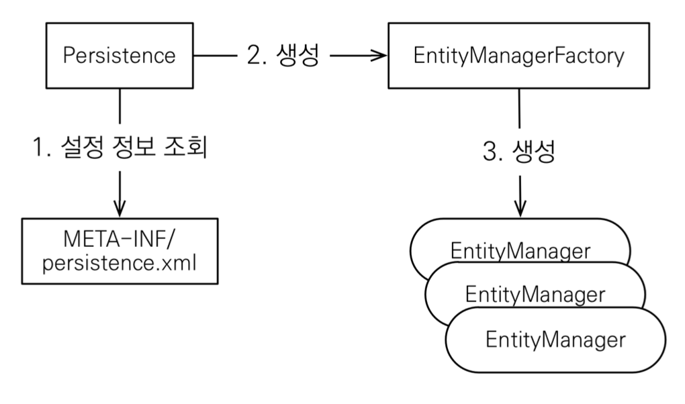
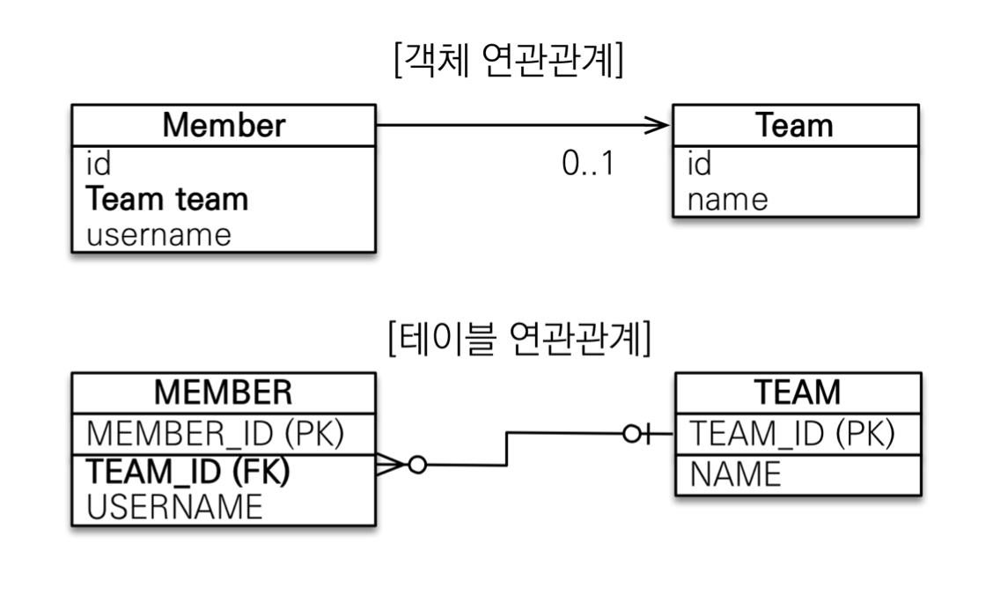
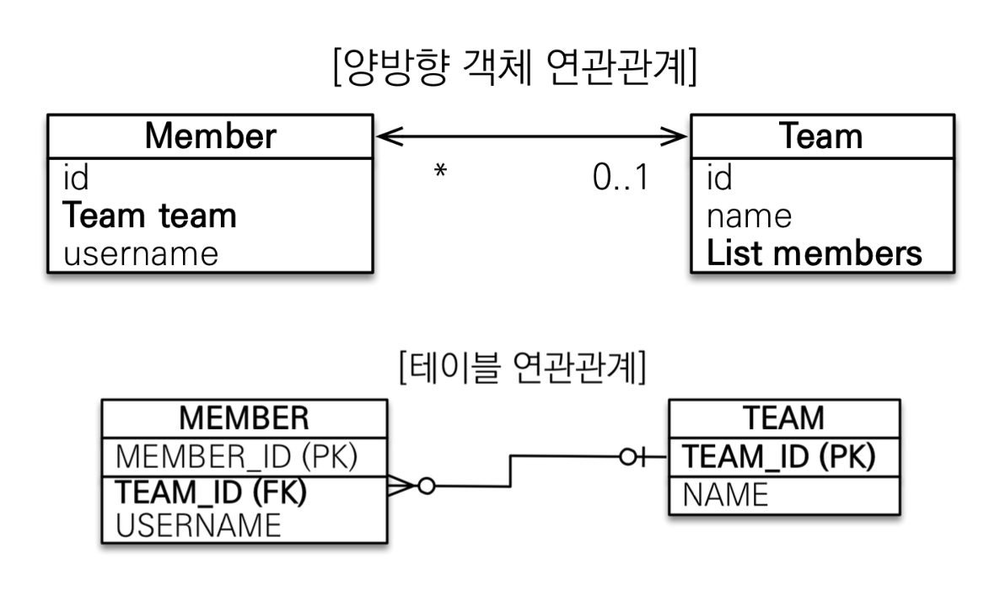
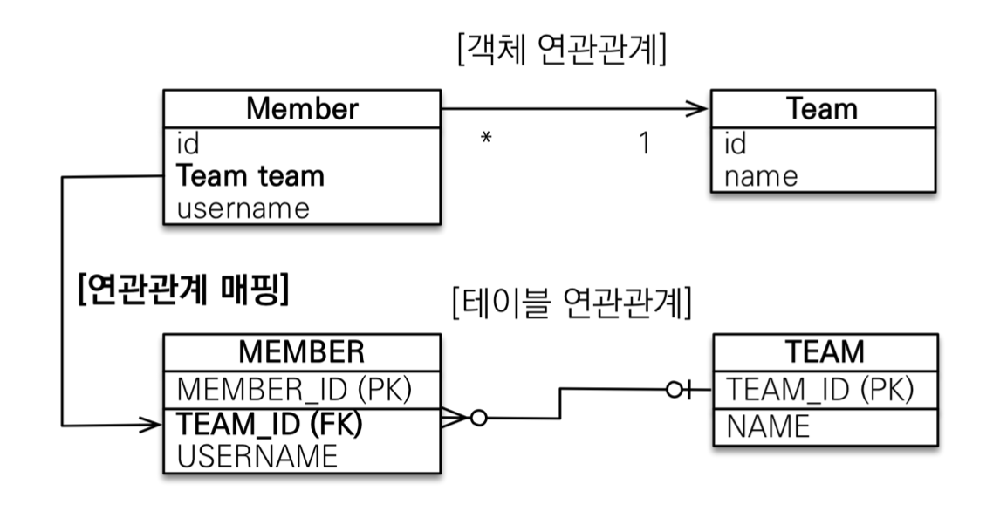
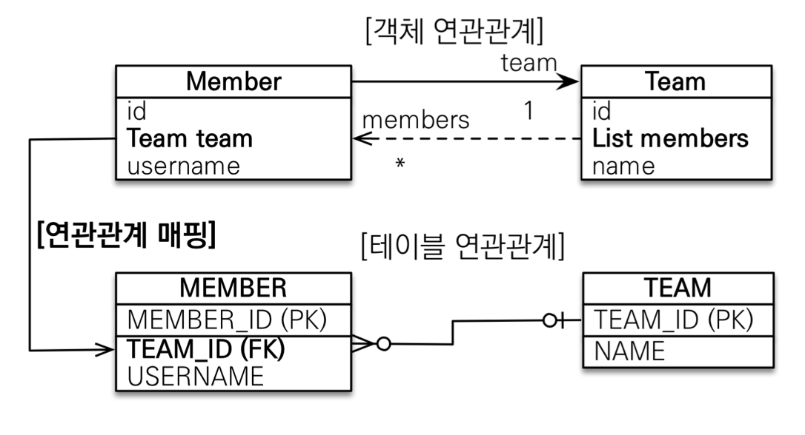
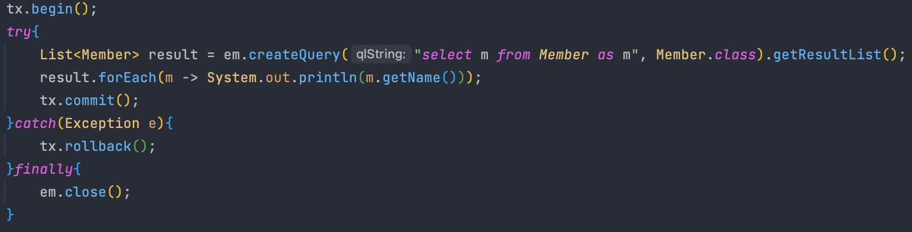
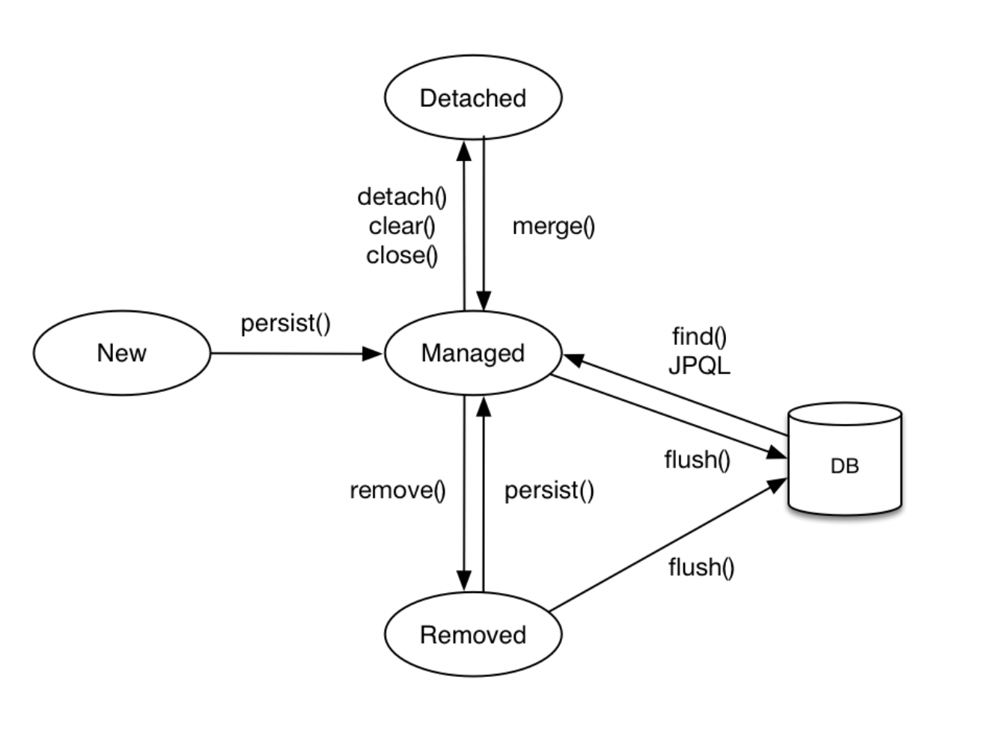
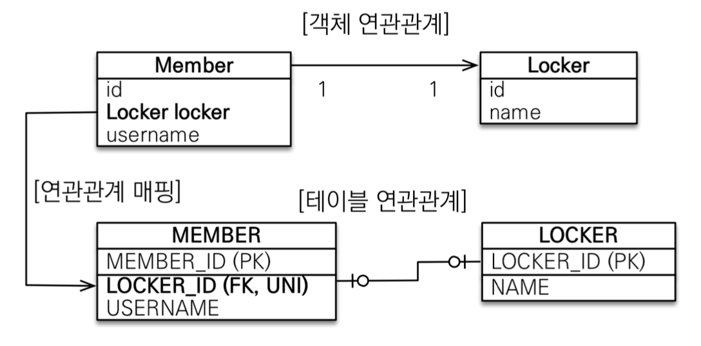
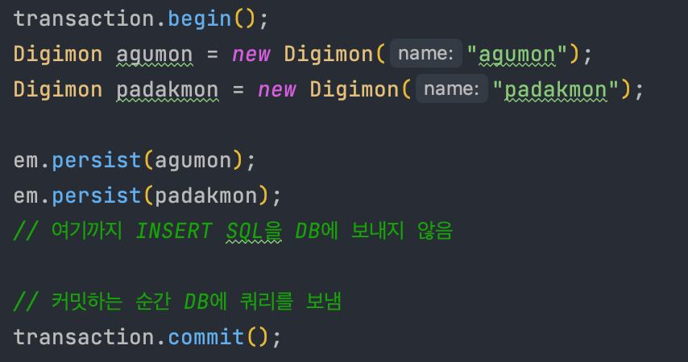
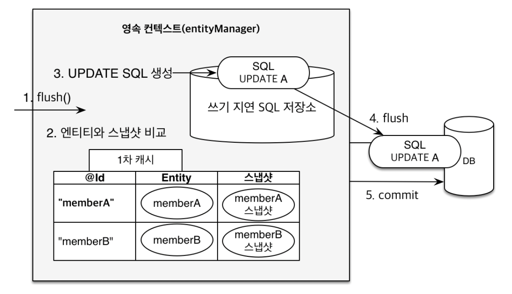

## 들어가면서
인프런에 있는 김영한님의 [자바 ORM 표준 JPA 프로그래밍 - 기본편](https://www.inflearn.com/course/ORM-JPA-Basic/dashboard) 강의를 정리한 글입니다. 세부사항이나 설정 등은 포스팅하지 않으니, 자세한 내용은 강의를 통해 확인해주시길 바랍니다.

## 목차
- JPA 시작
- 영속성 관리

### **JPA 시작**
#### Hello JPA - 애플리케이션 개발

#### 객체와 테이블을 생성하고 매핑하기

#### 회원 등록 

#### 회원수정

`Collection`에서 데이터를 꺼내서 수정한 뒤 다시 컬렉션에 저장하지 않는 것처럼, `JPA`로 꺼내 온 데이터도 수정한 뒤에 다시 저장하지 않는다. 

#### 회원 삭제

#### 회원 모두 조회 - JPQL

### **영속성 관리**

JPA에서 가장 중요한 두 가지는 아래와 같다.
- 객체와 관계형 데이터베이스 매핑하기 (Object Relational Mapping)
- 영속성 컨텍스트

#### 영속성 컨텍스트란?
영속성 컨텍스트는 눈에 보이지 않는 논리적인 개념인데, **엔티티를 영구 저장하는 환경**이라는 뜻이다. 엔티티 매니저를 통해서 영속성 컨텍스트에 접근할 수 있게 된다. 

예를 들어, `EntityManager.persist(entity)`는 사실 DB에 데이터를 저장하는 것이 아니고 엔티티를 영속성 컨텍스트에 저장하는 메소드이다.

#### 엔티티의 생명주기

- 비영속 (new/transient)  
    영속성 컨텍스트와 전혀 관계가 없는 새로운 상태

- 영속 (managed)  
    영속성 컨텍스트에 의해 관리되고 있는 상태 

- 준영속 (detached)  
    영속 상태의 엔티티가 영속성 컨텍스트에서 분리(detached)된 상태, 영속성 컨텍스트가 제공하는 기능을 사용하지 못한다. 

- 삭제 (removed)  
    삭제된 상태

#### 영속성 컨텍스트의 이점
- 1차 캐시  
    DB에서 데이터를 조회하기 위해 `em.find()`를 호출하면 바로 DB에서 데이터를 찾는 것이 아니고 영속성 컨텍스트 내의 1차 캐시에서 먼저 데이터를 찾아본다.

    만약 1차 캐시에 없는 데이터를 읽으려고 하면 DB에서 해당 데이터를 조회한 후 1차캐시에 저장 후 데이터를 반환해준다. 
    > 1차 캐시는 한 트랜잭션 안에서만 유효하기 때문에 성능적 이점이 매우 크지는 않다.
    
- 동일성(identity) 보장  
    
    

    마치 컬렉션에서 데이터를 꺼내서 비교하는 것처럼 JPA에서 같은 PK를 통해 꺼내온 데이터는 동일성이 보장된다.

- 트랜잭션을 지원하는 쓰기 지연 (transactional write-behind)  

    

    JPA 관련 메소드 실행 시, 바로 DB에 쿼리를 보내지 않고 우선 영속성 컨텍스트 내 `쓰기 지연 SQL 저장소`에 저장해둔다. 그리고 `commit()`이 호출되거나 `flush()`를 호출될 때 쓰기 지연 SQL 저장소에 보관하고 있던 쿼리들을 DB에 반영하는 `쓰기 지연` 방식을 사용한다. 

- 변경감지(Dirty Checking)  

    

    앞서 언급한 것처럼, JPA로 꺼내온 엔티티의 데이터를 수정한 뒤에 다시 DB에 해당 엔티티를 저장하는 코드를 작성하지 않아도 된다. 

    영속성 컨텍스트 내 1차 캐시에서는 해당 엔티티들의 스냅샷을 가지고 있기때문에 엔티티의 데이터 변경이 발생하면 자동으로 `UPDATE` 쿼리를 보낸다. 

- 지연 로딩(Lazy Loading)  
    만약 `Member`라는 엔티티와 `Team` 엔티티가 다대일 관계로 매핑되어 있을 때, `Member` 엔티티를 조회할 시 `Team` 엔티티의 값을 바로 읽어오지 않고 프록시 값으로 채워진다. 이후 `Team` 엔티티의 값을 사용해야 할 때가 되어서야 `Team` 엔티티를 조회하는데, 이러한 방식을 지연 로딩이라 한다. 
    
    `@ManyToOne(fetch = FetchType.EAGER)`를 사용해서 fatch 타입을 LAZY에서 EAGER로 변환하면 즉시 로딩을 사용할 수도 았는데, 관련 내용은 이후에 엔티티 매핑 파트에서 더 자세히 다루겠다. 

#### 플러시
`flush()`는 영속성 컨텍스트의 변경 내용을 데이터베이스에 반영하는 것을 말한다. `flush()`를 호출한다고 1차 캐시에 있는 내용이 영향을 받는 것은 아니고, 단지 쓰기 지연 저장소에 있던 SQL이 DB에 반영된다.  

영속성 컨텍스트를 플러시하기 위해서는 다음과 같은 방법이 있다. 
- em.flush() - 직접호출
- 트랜잭션 커밋 - 플러시 자동 호출
- JPQL 쿼리 실행 - 플러시 자동 호출