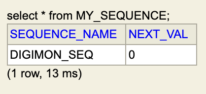

## 들어가면서
인프런에 있는 김영한님의 [자바 ORM 표준 JPA 프로그래밍 - 기본편](https://www.inflearn.com/course/ORM-JPA-Basic/dashboard) 강의를 정리한 글입니다. 세부사항이나 설정 등은 포스팅하지 않으니, 자세한 내용은 강의를 통해 확인해주시길 바랍니다.

## 목차
- JPA 시작
- 영속성 관리
- 엔티티 매핑

### **JPA 시작**
#### Hello JPA - 애플리케이션 개발


#### 객체와 테이블을 생성하고 매핑하기

```java
@Entity
@Getter @Setter
public class Member{
    @Id
    private long id;
    private String name;
}
```

```sql
create table Member(
    id bigint not null,
    name varchar(255),
    primary key (id)
);
```

#### 회원 등록 

```java
public static void main(String[] args) {
    EntityManagerFactory emf = Persistence.createEntityManagerFactory("hello");
    EntityManager em = emf.createEntityManager();
    EntityTransaction transaction = em.getTransaction();
    transaction.begin();
    try{
        Member member = new Member();
        member.setId(1L);
        member.setUsername("memberA");
        em.persist(member);
        transaction.commit();
    }catch(Exception e){
        transaction.rollback();
    }finally {
        em.close();
    }
    emf.close();
}
```

#### 회원수정

```java
Member findMember = em.find(Member.class, 1L);
findMember.setUsername("HelloJPA");
transaction.commit();
```

`Collection`에서 데이터를 꺼내서 수정한 뒤 다시 컬렉션에 저장하지 않는 것처럼, `JPA`로 꺼내 온 데이터도 수정한 뒤에 다시 저장하지 않는다. 

#### 회원 삭제

```java
Member findMember = em.find(Member.class, 1L);
em.remove(findMember);
transaction.commit();
```

#### 회원 모두 조회 - JPQL

```java
List<Member> result = em.createQuery("select m from Member as m", Member.class)
                                                                .getResultList();
result.forEach(m -> System.out.println(m.getUsername()));
```

### **영속성 관리**

JPA에서 가장 중요한 두 가지는 아래와 같다.
- 객체와 관계형 데이터베이스 매핑하기 (Object Relational Mapping)
- 영속성 컨텍스트

#### 영속성 컨텍스트란?
영속성 컨텍스트는 눈에 보이지 않는 논리적인 개념인데, **엔티티를 영구 저장하는 환경**이라는 뜻이다. 엔티티 매니저를 통해서 영속성 컨텍스트에 접근할 수 있게 된다. 

예를 들어, `EntityManager.persist(entity)`는 사실 DB에 데이터를 저장하는 것이 아니고 엔티티를 영속성 컨텍스트에 저장하는 메소드이다.

#### 엔티티의 생명주기


- 비영속 (new/transient)  
    영속성 컨텍스트와 전혀 관계가 없는 새로운 상태

- 영속 (managed)  
    영속성 컨텍스트에 의해 관리되고 있는 상태 

- 준영속 (detached)  
    영속 상태의 엔티티가 영속성 컨텍스트에서 분리(detached)된 상태, 영속성 컨텍스트가 제공하는 기능을 사용하지 못한다. 

- 삭제 (removed)  
    삭제된 상태

#### 영속성 컨텍스트의 이점
- 1차 캐시  
    DB에서 데이터를 조회하기 위해 `em.find()`를 호출하면 바로 DB에서 데이터를 찾는 것이 아니고 영속성 컨텍스트 내의 1차 캐시에서 먼저 데이터를 찾아본다.

    만약 1차 캐시에 없는 데이터를 읽으려고 하면 DB에서 해당 데이터를 조회한 후 1차캐시에 저장 후 데이터를 반환해준다. 
    > 1차 캐시는 한 트랜잭션 안에서만 유효하기 때문에 성능적 이점이 매우 크지는 않다.
    
- 동일성(identity) 보장  
    
    ```java
    Member memberOne = em.find(Member.class, 1L);
    Member memberTwo = em.find(Member.class, 1L);
    System.out.println(memberOne == memberTwo);     //true
    ```

    마치 컬렉션에서 데이터를 꺼내서 비교하는 것처럼 JPA에서 같은 PK를 통해 꺼내온 데이터는 동일성이 보장된다.

- 트랜잭션을 지원하는 쓰기 지연 (transactional write-behind)  

    ```java
    transaction.begin();
    Member memberA = new Member("memberA");
    Member memberB = new Member("memberB");

    em.persist(memberA);
    em.persist(memberB);
    //여기까지 INSERT QUERY를 DB에 보내지 않고
    
    //커밋하는 순간 DB에 쿼리를 전송
    transaction.commit();
    ```

    JPA 관련 메소드 실행 시, 바로 DB에 쿼리를 보내지 않고 우선 영속성 컨텍스트 내 `쓰기 지연 SQL 저장소`에 저장해둔다. 그리고 `commit()`이 호출되거나 `flush()`를 호출될 때 쓰기 지연 SQL 저장소에 보관하고 있던 쿼리들을 DB에 반영하는 `쓰기 지연` 방식을 사용한다. 

- 변경감지(Dirty Checking)  

    

    앞서 언급한 것처럼, JPA로 꺼내온 엔티티의 데이터를 수정한 뒤에 다시 DB에 해당 엔티티를 저장하는 코드를 작성하지 않아도 된다. 

    영속성 컨텍스트 내 1차 캐시에서는 해당 엔티티들의 스냅샷을 가지고 있기때문에 엔티티의 데이터 변경이 발생하면 자동으로 `UPDATE` 쿼리를 보낸다. 


- 지연 로딩(Lazy Loading)  
    만약 `Member`라는 엔티티와 `Team` 엔티티가 다대일 관계로 매핑되어 있을 때, `Member` 엔티티를 조회할 시 `Team` 엔티티의 값을 바로 읽어오지 않고 프록시 값으로 채워진다. 이후 `Team` 엔티티의 값을 사용해야 할 때가 되어서야 `Team` 엔티티를 조회하는데, 이러한 방식을 지연 로딩이라 한다. 
    
    `@ManyToOne(fetch = FetchType.EAGER)`를 사용해서 fatch 타입을 LAZY에서 EAGER로 변환하면 즉시 로딩을 사용할 수도 았는데, 관련 내용은 이후에 엔티티 매핑 파트에서 더 자세히 다루겠다. 

#### 플러시
`flush()`는 영속성 컨텍스트의 변경 내용을 데이터베이스에 반영하는 것을 말한다. `flush()`를 호출한다고 1차 캐시에 있는 내용이 영향을 받는 것은 아니고, 단지 쓰기 지연 저장소에 있던 SQL이 DB에 반영된다.  

영속성 컨텍스트를 플러시하기 위해서는 다음과 같은 방법이 있다. 
- em.flush() - 직접호출
- 트랜잭션 커밋 - 플러시 자동 호출
- JPQL 쿼리 실행 - 플러시 자동 호출

### **엔티티 매핑**

#### 엔티티 매핑 어노테이션
- 객체와 테이블 매핑 : `@Entity`, `@Table`
- 필드와 컬럼 매핑 : `@Column`
- 기본 키 매핑 : `@Id`
- 연관관계 매핑 : `@ManyToOne`, `@JoinColumn`

#### 1. 객체와 테이블 매핑

`@Entity`가 붙은 클래스는 JPA가 관리하고, 이것을 엔티티라고 한다. JPA를 사용해서 테이블과 매핑할 클래스는 @Entity가 필수이다. 해당 클래스에는 **기본 생성자**가 필수이고 `final` 클래스나 `enum`, `interface`, `inner` 클래스는 엔티티가 될 수 없다. 

`@Table`은 엔티티와 매핑할 테이블을 지정한다. 

|속성|기능|
|--:|--:|
|name|매핑할 테이블 이름|
|catalog|데이터베이스 catalog 매핑|
|schema|데이터베이스 schema 매핑|
|uniqueConstraints(DDL)|DDL 생성 시에 유니크 제약 조건 생성|

#### 2. 필드와 컬럼 매핑

매핑 어노테이션 정리

|어노테이션|설명|
|@Column|컬럼 매핑|
|@Temporal|날짜 타입 매핑|
|@Enumerated|enum 타입 매핑|
|@Lob| BLOB, CLOB 매핑|
|@Transient|특정 필드를 컬럼에 매핑하지 않음|

위 어노테이션들을 하나씩 자세히 알아보자

**@Column**

|속성|설명|기본값|
|--:|--:|--:|
|name|필드와 매핑할 테이블의 컬럼명|객체의 필드이름|
|insertable,<br> updatable|등록, 변경 가능 여부|TRUE|
|nullable(DDL)|null값 허용 여부. false로 설정하면 DDL 생성 시에 <br> not null 제약 조건이 붙는다.|
|unique(DDL)|@Table의 uniqueConstraints와 같은 역할||
|columnDefinition(DDL)|데이터베이스 컬럼 정보를 직접 입력<br> ex) varchar(100) default 'EMPTY'|필드의 자바 타입과 방언 정보|
|length(DDL)|문자 길이 제약 조건, String타입에만 사용|255|
|precision, <br> scale(DDL)|BigDecimal이나 BigInteger처럼 아주 큰 숫자나 <br>정밀한 소수를 다룰 때 사용|precision = 19,<br>scale=2|

**@Enumerated**  
\: 자바 enum 타입을 매핑할 때 사용

|속성|설명|기본값|
|--:|--:|--:|
|value|EnumType.ORDINAL : enum 순서를 저장 <br> EnumType.STRING : enum 이름을 저장 | EnumType.ORDINAL|

**@Temporal**  
\: 날짜 타입(java.util.Date, java.util.Calendar)을 매핑할 때 사용한다. Java8 이후 버전은 `LocalDate`, `LocalDateTime`을 사용하면 @Temporal을 사용하지 않아도 자동 매핑된다. 

|속성|설명|
|--|:--|
|value|TemporalType.DATE : 날짜를 데이터베이스 date 타입과 매핑<br>(ex. 2021-09-15)<br>TemporalType.TIME : 시간과 데이터베이스 time 타입을 매핑 <br> (ex. 18:01:42)<br> TemporalType.TIMESTAMP : 날짜와 시간을 데이터베이스 timestamp 타입과 매핑 <br> (ex. 2021-09-15 18:01:42)|

**@Lob**  
\: 데이터베이스 BLOB, CLOB 타입과 매핑

여기서 LOB이란 Text, 그래픽, 이미지, 비디오, 사운드 등 구조화되지 않은 대형 데이터를 저장하는 타입을 말한다. `BLOB`은 이진 대형 객체를 저장하고, `CLOB`은 문자 대형 객체를 저장한다. 

`@Lob`은 따로 지정할 수 있는 속성이 없다. 매핑하는 필드 타입이 문자면 CLOB에 매핑되고, 나머지는 모두 BLOB으로 매핑된다.

**@Transient**  
\: 해당 필드를 데이터베이스에 매핑하지 않도록 한다. 주로 메모리 상에서만 임시로 어떤 값을 보관하고 싶을 때 사용한다. 

```java
@Transient
private Integer temp;
```

#### 3. 기본 키 매핑
기본 키 매핑에 사용하는 어노테이션은 `@Id`와 `@GeneratedValue`가 있다. 
```java
@Id @GeneratedValue(strategy = GenerationType.AUTO)
private Long id;
```

**기본 키 매핑 방법**
- 직접 할당 : @Id만 사용
- 자동 생성 : @GeneratedValue  
    - IDENTITY : 데이터베이스에 위임, MYSQL
    - SEQUENCE : 데이터베이스 시퀀스 오브젝트 사용, ORACLE (@SequenceGenerator 필요)
    - TABLE : 키 생성용 테이블 사용, 모든 DB에서 사용가능 (@TableGenerator 필요)
    - AUTO : 방언에 따라 자동 지정, AUTO가 defualt임 


**IDENTITY 전략 - 특징**  
- 기본 키 생성을 데이터베이스에 위임한다. 
- 주로 MySQL, PostgreSQL, SQL Server, DB2에서 사용 (MySQL의 `AUTO_INCREMENT`)
- JPA는 영속성 컨텍스트 내에서 기본값을 기준으로 1차 캐시에 엔티티들을 저장하고 있다가 트랜잭션 커밋 시점에 `INSERT SQL`을 실행하는데, IDENTITY를 사용하면 DB에 INSERT SQL을 사용한 후에 기본값을 알 수 있다.  
    때문에 IDENTITY 전략을 사용할 때는 `em.persist()`호출 시점에 즉시 INSERT SQL을 실행하고 DB에서 기본값을 조회한다.
    
```java
@Id @GeneratedValue(strategy = GenerationType.IDENTITY)
private Long id;
```

**SEQUENCE 전략 - 특징**  
- 데이터베이스 시퀀스는 유일한 값을 순서대로 생성하는 특별한 데이터베이스 오브젝트이다. (Oracle의 시퀀스)
- Oracle, PostgreSQL, DB2, H2 데이터베이스에서 사용한다.

```java
@Entity
@SequenceGenerator(
        name = "DIGIMON_SEQ_GENERATOR",
        sequenceName = "DIGIMON_SEQ", //매핑할 데이터베이스 시퀀스 이름
        initialValue = 1, allocationSize = 1)
public class Digimon{
    @Id
    @GeneratedValue(strategy = GenerationType.SEQUENCE, 
            generator = "DIGIMON_SEQ_GENERATOR")
    private long id;
}
```

**SEQUENCE - @SequenceGenerator**

|속성|설명|기본값|
|--:|--:|--:|
|name|식별자 생성기 이름|필수|
|sequenceName|데이터베이스에 등록한 시퀀스 이름|hibernate_sequence|
|initialValue|DDL생성 시에만 사용되는데, 시퀀스 DDL 생성 시 <br>처음 시작하는 수를 지정한다.|1|
|allocationSize|시퀀스 한 번 호출에 증가하는 수 (성능최적화) <br> 데이터베이스 시퀀스 값이 하나씩 증가하도록 설정되어있으면 <br>이 값을 반드시 1로 설정해야 한다.|50|
|catalog, schema|데이터베이스 catalog, schema 이름||

**TABLE 전략**  
- 키 생성 전용 테이블을 하나 만들어서 데이터베이스 시퀀스를 흉내내는 전략
- 모든 데이터베이스에 적용 가능하다는 장점을 가지지만 성능 이슈가 있다.

```java
@Entity
@TableGenerator(
        name="DIGIMON_SEQ_GENERATOR",
        table="MY_SEQUENCE",
        pkColumnValue = "DIGIMON_SEQ", allocationSize = 1)
public class Digimon{
    @Id
    @GeneratedValue(strategy = GenerationType.TABLE,
            generator = "DIGIMON_SEQ_GENERATOR")
    private long id;
}
```

생성된 키 생성 전용 테이블은 아래와 같다. 



**@TableGenerator - 속성**  

|속성|설명|기본값|
|--:|--:|--:|
|name|식별자 생성기 이름|필수|
|table|키 생성 테이블명|hibernate_sequence|
|pkColumnName|시퀀스 컬럼명|sequence_name|
|valueColumnName|시퀀스 값 컬럼명|next_val|
|pkColumnValue|키로 사용할 이름|엔티티 이름|
|initialValue|초기값, 마지막으로 생성된 값이 기준이다.|0|
|allocationSize|시퀀스 한 번 호출에 증가하는 수 (성능최적화)|50|
|catalog, schema|데이터베이스 catalog, schema 이름||
|uniqueConstraints(DDL)|유니크 제약 조건||