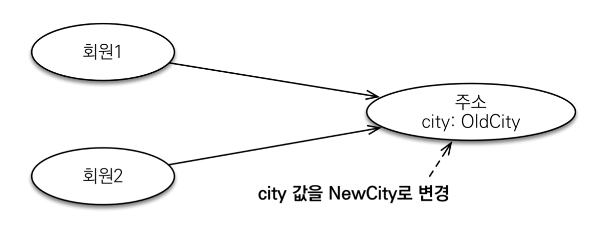
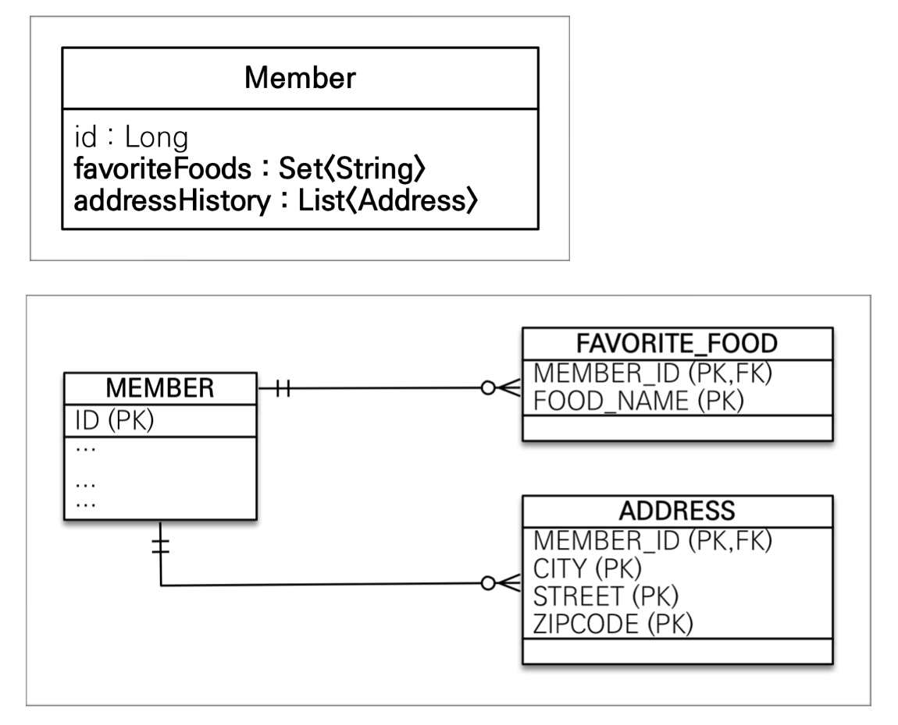
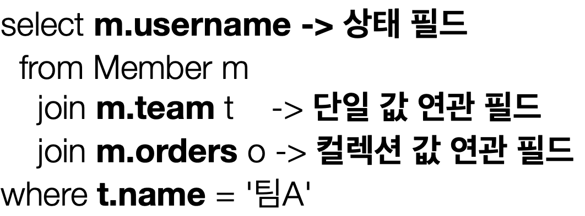
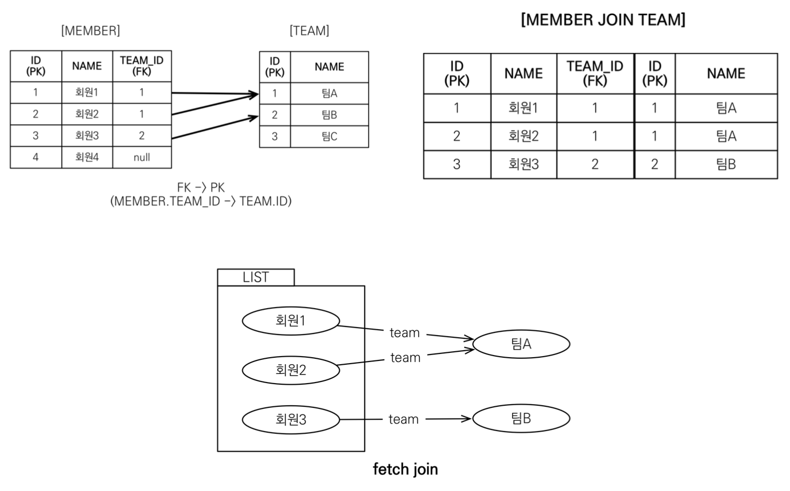
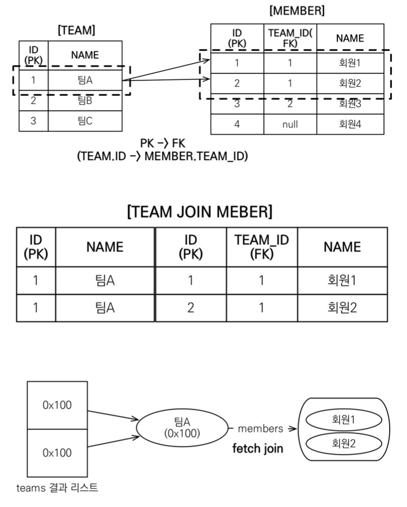

## 들어가면서
인프런에 있는 김영한님의 [자바 ORM 표준 JPA 프로그래밍 - 기본편](https://www.inflearn.com/course/ORM-JPA-Basic/dashboard) 강의를 정리한 글입니다. 세부사항이나 설정 등은 포스팅하지 않으니, 자세한 내용은 강의를 통해 확인해주시길 바랍니다.

## 목차
- 값 타입
- 객체지향 쿼리 언어 (JPQL)


### **값 타입**

JPA의 데이터 타입은 크게 두 가지로 분류할 수 있다. 
- 엔티티 타입  
    - `@Entity`로 정의하는 객체
    - 데이터가 변해도 식별자(PK)로 지속해서 추적 가능

- 값 타입  
    - `int`, `Integer`, `String`처럼 단순히 값으로 사용하는 자바 기본 타입이나 객체
    - 식별자가 없고 값만 있으므로 데이터 변경 시 추적 불가

여기서 값 타입은 또 세 가지 유형으로 나뉜다. 
- 기본값 타입
- 임베디드 타입 (embedded type, 복합 값 타입)
- 컬렉션 값 타입 (collection value type)

이 값 타입의 세 가지 유형에 대해 자세히 알아보자.

#### 기본값 타입
ex) `String name`, `Integer age`, `double height`
기본값 타입은 생명주기를 엔티티에 의존한다. 예를 들어, 회원을 삭제하면 기본값 타입인 이름과 나이 등의 필드는 함께 삭제된다. 이는 기본값 타입만 해당되는 것이 아니고, 엔티티 타입이 아닌 모든 값 타입에 적용된다.

또한, 값 타입은 공유되도록 사용하면 안되는데, 만약 회원 이름 변경 시 다른 회원의 이름도 함께 변경된다면 큰 문제가 발생할 것이다. `int`, `double` 같은 `primitive type`은 절대 공유되지 않는다. 또한, `Integer`같은 래퍼 클래스나 `String`같은 특수한 클래스는 공유 가능한 객체이지만, 값을 변경할 수 없기때문에 (Integer setInteger()같은건 없음) 사이드 이펙트가 발생하지 않는다. 
 
#### 임베디드 타입
임베디드 타입은 새로운 값 타입을 직접 정의해서 사용할 수 있도록 한다. 주로 기본값 타입을 모아서 만들기 때문에 복합 값 타입이라고도 한다. 

임베디드 타입을 사용하기 위해서는 값 타이블 정의하는 클래스에 `@Embeddable`, 값 타입을 사용하는 곳에 `@Embedded`를 사용하면 된다. 이 때 기본 생성자가 필수이고, 두 개의 어노테이션 중에 하나만 명시해도 컴파일에 문제는 없으나 명확성을 위해 둘 다 명시하는 것이 좋다.

```java
@Entity
public class Member {
    ...
    @Embedded
    private Period workPeriod;
    @Embedded
    private Address homeAddress;
}
```
```java
@Embeddable
@Getter @Setter
public class Period {
    private LocalDateTime startDate;
    private LocalDateTime endDate;
}
```
```java
@Embeddable
@Getter @Setter
public class Address {
    private String city;
    private String street;
    private String zipcode;

    @Override
    public boolean equals(Object o) {
        if (this == o) return true;
        if (o == null || getClass() != o.getClass()) return false;
        Address address = (Address) o;
        return Objects.equals(city, address.city) 
        && Objects.equals(street, address.street) 
        && Objects.equals(zipcode, address.zipcode);
    }

    @Override
    public int hashCode() {
        return Objects.hash(city, street, zipcode);
    }
}
```

임베디드 타입 사용 전후의 테이블은 똑같지만 객체를 임베디드 타입으로 묶음으로써 코드에서 좀 더 객체지향적으로 설계하는 것이다. 또한 임베디드 타입은 재사용이 가능하고, `Period.isWork()`처럼 해당 값 타입에만 사용하는 의미있는 메소드를 만들 수 있다는 장점을 가진다. 

만약 한 엔티티에서 같은 값 타입을 두 번 이상 사용하려면 어떻게 해야할까? 그냥 `@Embedded`를 두 번 사용하면 컬럼명이 중복되어 오류가 발생할 것이다. 따라서 `@AttributeOverrides`, `@AttributeOverride`를 사용해서 컬럼명을 다르게 지정해야 한다.

```java
@Entity
public class Member{
    ....
    @Embeded
    private Address homeAddress;

    @Embeded
    @AttributeOverrides({
        @AttributeOverrid(name="city", column=@Column(name = "work_city")),
        @AttributeOverrid(name="street", column=@Column(name = "work_street")),
        @AttributeOverrid(name="zipcode", column=@Column(name = "work_zipcode"))
    })
    private Address workAddress;
}
```

#### 값 타입과 불변 객체

임베디드 타입같은 값 타입을 여러 엔티티에서 공유하면 예기치 못한 부작용(side effect)이 발생할 수 있다.



위 그림에서 회원1과 회원2가 같은 `Address`의 참조를 가지고있다. 이것을 코드로 표현하면 아래와 같다.

```java
Address address = new Address("city", "street", "10000");
Member member = new Member();
member.setUsername("member1");
member.setHomeAddress(address);
em.persist(member);

Member member2 = new Member();
member2.setUsername("member2");
member2.setHomeAddress(address);
em.persist(member2);

member.getHomeAddress().setCity("newCity");
```

이렇게 되면, `UPDATE` 쿼리가 두 방 나가고, `member1`과 `member2` 모두 `city`가 `newCity`로 변경된다. 
이것은 명백한 사이드 이펙트이고, 이런 오류는 발견하기 굉장히 어렵다. 만약 개발자가 이런 동작을 의도했다하더라도 이런 방식을 원하면 임베디드 타입이 아니라 엔티티로 공유했어야 한다. 

임베디드 타입은 객체로 만들어지기 때문에 참조 값을 직접 대입하는 것을 막을 방법이 없다. 따라서 참조를 공유하더라도 객체의 타입을 수정할 수 없게 만들어서 부작용을 원천 차단해야 하기 때문에 값 타입은 `불변 객체(immutable object)`로 설계해야 한다. 이를 위해 생성자로만 값을 설정하도록 하고 `Setter`를 만들지 않으면 된다.
> Integer, String은 자바가 제공하는 대표적인 불변 객체이다.

#### 값 타입의 비교
값 타입에서는 인스턴스가 달라도 그 안의 값이 같으면 같은 것으로 봐야하기 때문에 `equals()`와 `hashCode()`를 적절히 오버라이딩해야 한다. 인텔리제이의 자동생성을 사용하면 편리한데, 이 때 `Getter` 사용 옵션을 켜야 엔티티가 프록시일 때도 접근이 가능하므로 꼭 켜주도록 하자.

#### 값 타입 컬렉션



값을 하나 이상 저장하는 컬렉션을 사용할 때, 데이터베이스는 컬렉션을 같은 테이블에 저장할 수 없기때문에 이것을 저장하기 위해 `@ElementCollection`과 `@CollectionTable`을 사용해서 별도의 테이블을 따로 만들어야 한다.(개념적으로 보면 일대다 매핑)

```java
@Entity
public class Member {
    ...
    @ElementCollection
    @CollectionTable(name="favorite_food", joinColumns = @JoinColumn(name="member_id"))
    @Column(name="food_name")
    private Set<String> favoriteFoods = new HashSet<>();

    @ElementCollection
    @CollectionTable(name="address", joinColumns = @JoinColumn(name="member_id"))
    private List<Address> addressHistory = new ArrayList<>();
}
```
값타입 컬렉션도 결국 값타입이다. 값타입은 스스로의 생명주기를 가지지않고 엔티티에 종속적이기 때문에 컬렉션 내의 데이터들은 다른 테이블에 저장됨에도 불구하고 

엔티티만 `persist`해도 컬렉션 내의 데이터들은 자동으로 테이블에 저장된다. 따라서 컬렉션들은 기본이 지연로딩 전략이 사용되고, 영속성 전이(Cascade)와 고아 객체 제거기능을 필수로 가진다고 볼 수 있다.

하지만 값 타입 컬렉션은 여러 가지 한계점을 가진다.
- 값 타입은 엔티티와 다르게 식별자 개념이 없다.  
    - 값타입 컬렉션 내의 값을 변경하고 싶을 때도 `Setter`를 사용해서는 안되고, `remove()`를 통해서 해당 값을 지우고 `add()`를 통해서 새로운 값을 넣어야 한다. 

    ```java
    member.getAddressHistory().remove(new Address("old1","street","10000"));
    member.getAddressHistory().add(new Address("newCity1","street","10000"));
    ```
    > 기본적으로 컬렉션들은 remove 시에 equals()를 통해 해당 데이터를 찾기 떄문에, 값타입의 equals를 항상 구현해두어야 함
    
- 값을 변경하면 추적이 어렵다.  

- 값 타입 컬렉션에 변경 사항이 발생하면, 주인 엔티티와 연관된 모든 데이터를 삭제하고, 값 타입 컬렉션에 있는 현재 값을 모두 다시 저장한다.  
    - 위의 `remove()` 후 `add()` 코드의 쿼리를 살펴보면, `ADDRESS` 테이블에서 해당 `member_id`를 가진 데이터를 모두 `delete` 해버리고 새로 갈아끼운다.(데이터의 개수만큼 insert 쿼리가 나감)

- 값 타입 컬렉션을 매핑하는 테이블은 모든 컬럼을 묶어서 PK를 구성해야 한다. 따라서 `null` 입력이 불가하고, 중복 저장이 허용되지 않는다.

따라서 실무에서 사용할 때는 **값 타입 컬렉션 대신에 일대다 매핑을 고려해야 한다.**

일대다 관계를 위한 엔티티를 만들고 여기에서 값 타입을 사용한다. 이 때 영속성 전이와 고아 객체 제거를 사용해서 값 타입 컬렉션처럼 동작하도록 사용하면 된다.

```java
@Entity
@Getter @Setter
@Table(name="ADDRESS")
public class AddressEntity{
    @Id @GeneratedValue
    private Long id;
    private Address address;
}
```
이렇게 `Address`를 엔티티로 한 번 감싸주고

```java
@ElementCollection
@CollectionTable(name="address", joinColumns = @JoinColumn(name="member_id"))
private List<Address> addressHistory = new ArrayList<>();
```
이렇게 값 타입 컬렉션으로 사용하던 부분을 

```java
@OneToMany(cascade = CascadeType.ALL, orphanRemoval = true)
@JoinColumn(name="member_id")
private List<AddressEntity> addressHistory = new ArrayList<>();
```
이렇게 일대다 연관관계 매핑으로 바꾸면 된다.

### **객체지향 쿼리 언어 (JPQL)**

#### JPQL이란?
JPA를 사용하면 엔티티 객체를 중심으로 개발을 하게되기 때문에 검색을 할 때도 실제 데이터베이스 테이블이 아닌 엔티티 객체를 대상으로 검색할 수 있어야 한다. 따라서 이러한 엔티티 중심적인 쿼리를 지원하기 위해서 JPA는 **SQL을 추상화한 JPQL이라는 객체지향 쿼리 언어**를 제공한다.

기본 SQL과 가장 큰 차이점은 **JPQL은 데이터베이스 테이블이 아닌 엔티티 객체를 대상으로 쿼리**한다는 점이다. 이 때 SQL을 추상화하기 때문에 특정 SQL 문법에 의존하지 않는다. 따라서 JQPL을 한 마디로 정의하자면 객체지향 SQL이라고 볼 수 있다.

```java
String query = "select m from Member m where m.age > 18";
List<Member> result = em.createQuery(query, Member.class).getResultList();
```

```database
Hibernate: 
    /* select
        m 
    from
        Member m 
    where
        m.age > 18 */ select
            member0_.id as id1_0_,
            member0_.age as age2_0_,
            member0_.team_id as team_id4_0_,
            member0_.username as username3_0_ 
        from
            Member member0_ 
        where
            member0_.age>18
```

#### JPQL 문법
```java
String query = "select m from Member m where m.username like '%kim%'"
List<Member> result = em.createQuery(query, Member.class).getResultList();
```

여기서 `Member`는 테이블 이름이 아니고 엔티티 이름이며, `Member`, `username`처럼 엔티티와 속성은 대소문자를 구분해야 하고, `select`, `from`, `where`같은 JPQL 키워드는 대소문자를 구분하지 않는다. 

이 때 엔티티 이름에 대한 별칭(alias)이 필수이며, as는 생략 가능하다. 

- TypeQuery, Query  
    -  TypeQuery : 반환 타입이 명확할 때 사용
```java
TypeQuery<Member> query = em.createQuery("select m from Member m"
                                                        , Member.class);
```
    - Query : 반환 타입이 명확하지 않을 때 사용
```java
Qeury query = em.createQuery("select m.username, m.age from Member m");
```

- 결과 조회 API  
    - `query.getResultList()` : 결과가 하나 이상일 때 `List`를 반환, 결과가 없으면 빈 리스트를 반환

    - `query.getSingleResult()` : 결과가 정확히 하나일 때 단일 객체 반환,   
    결과가 없으면 javax.persistence.NoResultException,  
    둘 이상이면 javax.persistence.NonUniqueResultException


- 파라미터 바인딩 - 이름 기준  
    ```java
    String query = "select m from Member m where m.username=:username"
    Member member = em.createQuery(query, Member.class)
                      .setParameter("username","member1").getSingleResult();
    ```
    순서(위치)기준으로 파라미터 바인딩하는 방법도 있으나, 순서가 바뀔 수 있으므로 사용하지 않아야 한다.

- 페이징 API  
    JPA는 페이징을 다음 두 가지 API로 추상화하였다. 
    - `setFirstResult(int startPosition)` : 조회 시작 위치 (0부터 시작)
    - `setMaxResults(int maxResult)` : 조회할 데이터 수   

    ```java
    String jpql = "select m from Member m order by m.name desc";
    List<Member> result = em.createQuery(jpql, Member.class)
                            .setFirstResult(10)
                            .setMaxResults(20)
                            .getResultList();
    ```

#### 프로젝션
프로젝션이란, `SELECT`절에서 조회할 대상을 지정하는 것을 말한다.   
프로젝션 대상 : 엔티티, 임베디드 타입, 스칼라 타입(숫자,문자 등 기본 데이터 타입)

- select `m` from Member m -> 엔티티 프로젝션
- select `m.team` from Member m -> 엔티티 프로젝션
- select `m.address` from Member m -> 임베디드 타입 프로젝션
- select `m.username, m.age` from Member m -> 스칼라 타입 프로젝션


엔티티 프로젝션하면 `List`로 반환된 것들이 모두 영속성 컨텍스트 내에서 엔티티로 관리된다.
```java
List<Member> result = em.createQuery("select m from Member m", Member.class)
                        .getResultList();
Member findMember = result.get(0);
findMember.setAge(20);
```
이 상황에서 `findMember`에 대한 `UPDATE` 쿼리가 나가는 것을 확인할 수 있기때문에 영속성 컨텍스트에 의해 관리된다는 것을 알 수 있다.

스칼라 타입 프로젝션에서 여러 값을 조회할 때 데이터의 자료형이 다르다면 어떻게 받아와야 할까?
```java
String query = "select m.usernmae, m.age from Member m";
```
이에 대한 세 가지 방법이 있다. 
1. `Query` 타입으로 조회
2. `Object[]` 타입으로 조회  
    ```java
    String query = "select m.username, m.age from Member m"
    List<Object[]> resultList = em.createQuery(query).getResultList();
    Object[] result = resultList.get(0);
    System.out.println("username = " + result[0]);
    System.out.println("age = " + result[1]);
    ```
3. `new` 명령어로 조회  
    조회할 데이터들을 담은 `DTO`를 만들어 바로 조회한다. 
    ```java
    package jpql;

    @AllArgsConstructor
    @Getter @Setter
    public class MemberDTO{
        private String username;
        private int age;
    }
    ```

    ```java
    String query = "select new jpql.MemberDTO(m.username, m.name) from Member m"
    List<MemberDTO> result = em.createQuery(query, MemberDTO.class).getResultList();
    MemberDTO memberDTO = result.get(0);
    System.out.println("username = " + memberDTO.getUsername());
    System.out.println("age = " + memberDTO.getAge());
    ```

    이 때 DTO의 패키지명을 포함한 클래스명을 적어줘야 한다는 번거로움이 있고, 순서와 타입이 일치하는 생성자를 만들어 두어야 한다.

#### 조인
- 내부 조인  
    ```java
    select m from Member m [inner] join m.team t
    ```
- 외부 조인  
    ```java
    select m from Member m left [outer] join m.team t
    ```
- 세타 조인  
    ```java
    select count(m) from Member m, Team t where m.username = t.name
    ```

#### on을 이용한 join  
조인 대상을 필터링하거나 연관관계가 없는 엔티티와 외부 조인할 때 `on`을 사용한다. 

1. 조인 대상 필터링  
    ex) 회원과 팀을 조인하면서 팀 이름이 A인 팀만 조인
    ```java
    select m, t from Member m left join m.team t on t.name='A'
    ```
    ```sql
    select m.*, t.* from Member m left join Team t 
                                        on m.team_id=t.id and t.name='A'
    ```
2. 연관관계가 없는 엔티티와 외부 조인  
    ex) 회원의 이름과 팀의 이름이 같은 대상 외부 조인
    ```java
    select m, t from Member m left join Team t on m.username = t.name
    ```
    ```sql
    select m.*, t.* from Member m left join Team t on m.usernmae = t.name
    ```

#### 서브쿼리
- 나이가 평균보다 많은 회원
```java
select m from Member m where m.age > (select avg(m2.age) from Member m2)
```
메인쿼리와 서브쿼리는 서로 연관관계가 없기 때문에 m과 m2는 서로 다르다. 서브쿼리에서 m을 사용하면 성능이 저하된다.

- 한 건이라도 주문한 고객
```java
select m from Member m where (select count(o) from Order o where m = o.member) > 0
```

- 팀 A 소속인 회원  
```java
select m from Member m where exists(select t from m.team t where t.name="팀A")
```

- 어떤 팀이든 팀에 소속된 회원  
```java
select m from Member m where m.team = any(select t from Team t)
```

- JPA 서브쿼리의 한계  
    - JPA는 `where`, `having`절에서만 서브쿼리를 사용할 수 있다.   
    (하이버네이트는 `select`절에서도 서브쿼리를 사용할 수 있도록 지원)

    - `from`절의 서브쿼리는 현재 JPQL에서는 불가능  
    조인으로 풀 수 있으면 풀어서 해결해야 함

#### 조건식 - CASE 식
기본 CASE 식
```java
String query =  "select 
                    case
                        when m.age <= 20 then '학생'
                        else '성인'
                    end
                from Member m";
List<String> resultList = em.createQuery(query, String.class).getResultList();
```


단순 CASE 식
```java
select
    case t.name
        when "팀A" then "인센티브110%"
        when "팀B" then "인센티브120%"
        else "인센티브105%"
    end
from Team t
```

`COALESCE` : 하나씩 조회해서 null인 경우 값을 대체
```java
select coalesce(m.username, "이름없는 회원") from Member m
```

`NULLIF` : 두 값이 같으면 null반환, 다르면 첫 번째 인자의 값 반환
```java
select nullif(m.username, "관리자") from Member m
```

#### JPQL 타입 표현
- 문자 : 'HELLO' , 'She''s'
- 숫자 : 10L (Long), 10D (Double), 10F (Float)
- Boolean : TRUE, FALSE
- ENUM : jpabook.MemberType.Admin (패키지명 포함)  
    ```java
    String query = "select m.username, 'HELLO', true from Member m " 
                                    + "where m.type=:userType";
    List<Object[]> result = em.createQuery(query)
                            .setParameter("userType", MemberType.ADMIN)
                            .getResultList();
    ```
이렇게 파라미터 바인딩을 사용하면 enum의 전체 패키지명을 명시하지 않고 import해서 사용할 수 있다.

- 엔티티 타입 : TYPE(m) = Member (상속 관계에서 사용)  
    ```java
    String query = "select i from Item i where type(i) = Book"
    List<Item> result = em.creaeteQuery(query, Item.class).getResultList();
    ```

#### 경로 표현식

경로 표현식이란 `.`(점)을 찍어 객체 그래프를 탐색하는 것을 말한다.



- 상태 필드(state field) : 단순히 값을 저장하기 위한 필드. 경로 탐색의 끝이므로 추가 탐색 x
- 연관 필드(association field) : 연관관계를 위한 필드  
    - 단일 값 연관 필드 : @ManyToOne, @OneToOne -> 대상이 엔티티   
     묵시적 내부 조인 발생, 탐색 o
    - 컬렉션 값 연관 필드 : @OneToMany, @ManyToMany -> 대상이 컬렉션   
     묵시적 내부 조인 발생, 탐색 x

JPQL에서 단일 값 연관 경로를 사용하면 내부적으로 `inner join`을 사용하는 쿼리가 나가는데, `join` 같은 쿼리가 묵시적으로 나가면 직관적이지도 않고 운영/튜닝이 너무 힘들어지기 때문에 좋지않다. 가장 좋은 방법은 묵시적 조인을 사용하지않고 명시적 조인을 사용하는 것이다.

위가 `JPQL` 쿼리이고, 아래가 해당 `JPQL`로 인해 만들어지는 `SQL` 쿼리이다. 묵시적으로 `inner join`을 사용하는 것을 알 수 있다.
```sql
select o.member from Order o
```
```sql
select m.* from Order o inner join Member m on o.member_id = m.id
```

컬렉션 값 연관 경로도 묵시적인 내부 조인이 발생하는데, 탐색은 되지 않는다. 탐색이 안된다는 말은 즉, 해당 컬렉션의 멤버변수에 접근할 수 없다는 것을 의미한다. 대신 `.size`로 컬렉션의 크기를 구할 수는 있다.
컬렉션의 탐색을 위해서는 `from`절에서 명시적 조인을 통해 별칭을 얻으면 별칭을 통해서 탐색할 수 있다. 


#### JPQL - 패치 조인 (fetch join)

`[LEFT [OUTER] | INNNER ] JOIN FETCH 조인경로`

패치 조인은 SQL이 제공하는 join의 종류가 아니고 JPQL에서 성능을 최적화하기 위해 제공하는 기능이다. 마치 즉시로딩을 사용하는 것처럼, 연관된 엔티티나 컬렉션을 SQL 하나로 한번에 조회한다.

다음 예제를 살펴보자. 

```java
Team teamA = new Team();
teamA.setName("A팀");
em.persist(teamA);

Team teamB = new Team();
teamB.setName("B팀");
em.persist(teamB);

Member member1 = new Member();
member1.setUsername("회원1");
member1.setTeam(teamA);
em.persist(member1);

Member member2 = new Member();
member2.setUsername("회원2");
member2.setTeam(teamA);
em.persist(member2);

Member member3 = new Member();
member3.setUsername("회원3");
member3.setTeam(teamB);
em.persist(member3);

em.flush();
em.clear();

String query = "select m from Member m";
List<Member> result = em.createQuery(query, Member.class).getResultList();
result.forEach(m -> System.out.println("member = " + m.getUsername() 
                        + " : " + m.getTeam().getName()));
transaction.commit();
```

```console
Hibernate: 
    /* insert ch10.Team
        */ insert 
        into
            Team
            (name, team_id) 
        values
            (?, ?)
Hibernate: 
    /* insert ch10.Team
        */ insert 
        into
            Team
            (name, team_id) 
        values
            (?, ?)
Hibernate: 
    /* insert ch10.Member
        */ insert 
        into
            Member
            (age, team_id, username, id) 
        values
            (?, ?, ?, ?)
Hibernate: 
    /* insert ch10.Member
        */ insert 
        into
            Member
            (age, team_id, username, id) 
        values
            (?, ?, ?, ?)
Hibernate: 
    /* insert ch10.Member
        */ insert 
        into
            Member
            (age, team_id, username, id) 
        values
            (?, ?, ?, ?)
Hibernate: 
    /* select
        m 
    from
        Member m */ select
            member0_.id as id1_0_,
            member0_.age as age2_0_,
            member0_.team_id as team_id4_0_,
            member0_.username as username3_0_ 
        from
            Member member0_
Hibernate: 
    select
        team0_.team_id as team_id1_1_0_,
        team0_.name as name2_1_0_ 
    from
        Team team0_ 
    where
        team0_.team_id=?
member = 회원1 : A팀
member = 회원2 : A팀
Hibernate: 
    select
        team0_.team_id as team_id1_1_0_,
        team0_.name as name2_1_0_ 
    from
        Team team0_ 
    where
        team0_.team_id=?
member = 회원3 : B팀
```

`select m from Member m`로 `JPQL`을 작성하니, `Team`은 프록시 값이 들어가있어서 사용할 때마다 따로 쿼리가 나가는 것을 확인할 수 있다. 만약 회원이 100명있다면 쿼리가 100번이 나간다. 이런 현상을 `N+1 문제`라고 한다. 이것을 해결하는 방법이 패치 조인이다. 

패치 조인을 사용하는 방법은 간단한데, 
```sql
select m from Member m join fetch m.team
```
이렇게 `m.team`과의 `join fetch`를 명시하면 `Member` 뿐 아니라 `Team`도 함께 조회한다.




```console
Hibernate: 
    /* select
        m 
    from
        Member m 
    join
        fetch m.team */ select
            member0_.id as id1_0_0_,
            team1_.team_id as team_id1_1_1_,
            member0_.age as age2_0_0_,
            member0_.team_id as team_id4_0_0_,
            member0_.username as username3_0_0_,
            team1_.name as name2_1_1_ 
        from
            Member member0_ 
        inner join
            Team team1_ 
                on member0_.team_id=team1_.team_id
member = 회원1 : A팀
member = 회원2 : A팀
member = 회원3 : B팀
```
이전 결과와 달리 쿼리 한 번으로 원하는 결과를 얻어왔다.

그런데 만약 `Member`에서 `team`을 `@ManyToOne`으로 매핑할 때 `LAZY` 옵션을 주지 않고 `select m from Member m`로 쿼리를 날리면 어떻게 될까? 

```console
Hibernate: 
    /* select
        m 
    from
        Member m */ select
            member0_.id as id1_0_,
            member0_.age as age2_0_,
            member0_.team_id as team_id4_0_,
            member0_.username as username3_0_ 
        from
            Member member0_
Hibernate: 
    select
        team0_.team_id as team_id1_1_0_,
        team0_.name as name2_1_0_ 
    from
        Team team0_ 
    where
        team0_.team_id=?
Hibernate: 
    select
        team0_.team_id as team_id1_1_0_,
        team0_.name as name2_1_0_ 
    from
        Team team0_ 
    where
        team0_.team_id=?
member = 회원1 : A팀
member = 회원2 : A팀
member = 회원3 : B팀
```
`select` 쿼리가 `N+1번` 발생하는 것을 알 수 있다. 따라서 **즉시 로딩이든 지연 로딩이든 상관없이 발생하는 N+1 문제**를 `fetch join`이 해결해준다. 


아래는 컬렉션 패치 조인의 간단한 예제이다.
```java
String query = "select t from Team t join fetch t.members";
List<Team> result = em.createQuery(query, Team.class).getResultList();
result.forEach(t -> {
    System.out.print("team = "+ t.getName() +" : ");
    t.getMembers().forEach(m -> System.out.print(m.getUsername()+" "));
    System.out.println();
});
```
```console
team = A팀 : 회원1 회원2 
team = A팀 : 회원1 회원2 
team = B팀 : 회원3 
```

그런데 결과를 보면 A팀에 대한 결과가 중복해서 나타나는 것을 확인할 수 있는데, 일대다 매핑에서 `join`하면 데이터가 뻥튀기되기 때문이다. 현재 `Team` 테이블에는 2개의 데이터가 있지만 조인하면서 3개로 합쳐지기 때문에 A팀의 내용이 두 번 나온 것이다.



`SQL의 DISTINCT`만으로는 우리가 없애려는 중복을 모두 없앨 수 없어서 `JPQL의 DISTINCT`를 사용해야 한다. 
JPQL의 DISTINCT는 SQL에 DISTINCT를 추가하고, 애플리케이션에서 같은 식별자(PK)를 가진 엔티티를 중복으로 판단하고 제거한다.

`select distinct t from Team t join fetch t.members` 사용
```console
team = A팀 : 회원1 회원2 
team = B팀 : 회원3 
```
우리가 원하던 결과를 확인할 수 있다.

**패치 조인의 특징과 한계**  
- 패치 조인 대상에는 별칭을 줄 수 없다. 하이버네이트는 가능하나, 사용하지 않는 것이 좋다.
- 둘 이상의 컬렉션은 패치 조인할 수 없다.
- 컬렉션을 패치 조인하면 페이징 API를 사용할 수 없다.  
    - 일대일, 다대일 같은 단일 값 연관 필드들은 패치 조인해도 페이징 가능
    - 하이버네이트의 경우, 컴파일러가 경고 로그를 남기고 메모리에서 페이징하는데 이 때 테이블의 데이터를 모두 메모리로 가져와서 페이징하기 때문에 문제가 생길 여지가 매우 큼
    - 따라서 이런 경우, 다대일로 쿼리 방향을 뒤집어서 페이징 API를 사용할 수는 있는데 이러면 N+1 문제가 발생
    - 이 때 `BatchSize`를 적용하면 쿼리가 N번 수행되지 않고, where 조건절이 in 절로 바뀌어 수행되기 때문에 성능이 향상된다.  
    ```java
    @Entity
    public class Team{
        ...
        @BatchSize(size=100)
        @OneToMany(mappedBy="team")
        private List<Member> members = new ArrayList<>();
    }
    ```
    이렇게 하면 팀 테이블과 연관된 멤버를 최대 100개까지 한 번에 가져온다
    > \<property name="hibernate.default_batch_fetch_size" value="100"/>   
    > BatchSize는 persistence.xml에서 위 처럼 전역설정을 할 수도 있다. (값은 1,000 이하로 줄 것)

- 연관된 엔티티들을 SQL 한 번으로 조회하기 떄문에 성능 최적화에 유리하다.
- 엔티티에 직접 적용하는 지연 로딩 전략보다 우선순위가 높다.
- 패치 조인은 객체 그래프를 유지할 때 사용하면 효과적이다.
- 여러 테이블을 조인해서 엔티티가 가진 모양이 아닌 전혀 다른 결과를 내야 하면, 패치 조인 보다는 일반 조인을 사용하고 필요한 데이터들만 조회해서 DTO로 반환하는 것이 효과적이다.


#### JPQL - 다형성 쿼리

- TYPE : 조회 대상을 특정 자식으로 한정  
ex) Item 중에 Book, Movie를 조회
```sql 
select i from Item i where type(i) in (Book, Movie)
```
- TREAT : 상속 구조에서 부모 타입을 특정 자식 타입으로 다룰 때 사용  
FROM, WEHRE, SELECT(하이버네이트 지원)에서 사용  
ex) 부모인 Item과 자식 Book
```sql
select i from Item i where treat(i as Book).author = 'kim'
```

#### JPQL - 엔티티 직접 사용
JPQL에서 엔티티를 직접 사용하면 SQL에서는 해당 엔티티의 PK를 사용한다.
```sql
select count(m.id) from Member m
select count(m) from Member m
```
위의 두 가지 JPQL은 내부적으로 같은 SQL을 생성한다.

엔티티를 파라미터로 전달
```java
String jpql = "select m from Member m where m =: member";
List result = em.createQeury(jpql).setParameter("member",member)
                .getResultList();
```

식별자를 직접 전달
```java
String jpql = "select m from Member m where m.id =: memberId";
List result = em.createQeury(jpql).setParameter("memberId",memberId)
                .getResultList();
```

실행된 SQL
```sql
select m.* from Member m where m.id=?
```

#### JPQL - Named 쿼리
Named 쿼리란 이름 그대로 미리 정의해서 이름을 부여해두고 사용하는 JPQL을 말한다.
애플리케이션이 시작되어 로딩될 때 Named 쿼리를 파싱해서 가지고 있다가 사용될 때마다 재사용하기 때문에 쿼리로 변환할 때 필요한 코스트를 줄일 수 있다는 장점을 가지고, 애플리케이션 로딩 시점에 쿼리를 검사할 수 있다는 장점을 가진다. 

```java
@Entity
@NamedQuery(
    name = "Member.findByUsername",
    query = "select m from Member m where m.username =:username"
)
public class Member{
    ...
}
```
이 때 만약 query에 오타가 나거나 잘못적은게 있다면 컴파일 시점에 예외가 발생해서 잘못된 쿼리임을 검사할 수 있다는 엄청난 장점을 가진다.

```java
List<Member> result = em.createNamedQuery("Member.findByUsername", Member.class)
                        .setParameter("username","회원1").getResultList();
```

이후에 `Spring Data JPA`를 사용하면, `@Query` 어노테이션을 사용해서 메소드 위에 Named Query를 만들 수 있어서 편리하게 사용 가능하다.


#### JPQL - 벌크 연산
벌크연산은 흔히 알고있는 `UPDATE`나 `DELETE`문이라고 보면 되는데, JPA의 변경 감지만으로만 실행하려면 매번 하나씩 UPDATE문이 발생되어 너무 많은 SQL문이 실행되어야 하므로 벌크 연산을 사용한다.  

쿼리 한 번으로 테이블의 여러 로우를 변경한다.
```java
int resultCount = em.createQuery("update Member m set m.age = 20", Member.class)
                    .executeUpdate();
```

벌크연산은 영속성 컨텍스트를 무시하고 데이터베이스에 직접 쿼리하기 때문에 벌크연산 후 영속성 컨텍스트를 초기화해주어야만 데이터가 꼬이지 않는다.

JPQL 실행 시 자동으로 `flush()`는 되지만 영속성 컨텍스트를 초기화하기 위해서는 `clear()`로 영속성 컨텍스트를 비워줘야 한다.
`Spring Data JPA`에서는 `@Modifying`을 통해 벌크연산을 실행하면서 옵션을 통해 `clear()`까지 자동화할 수 있다. 