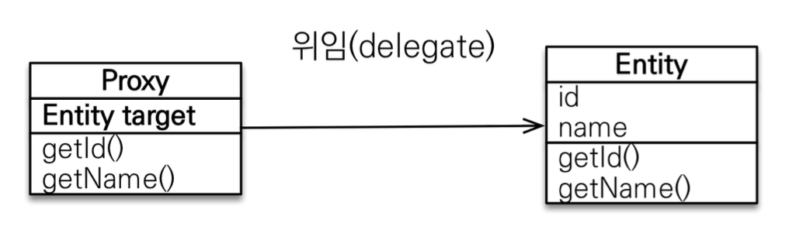

## 들어가면서
인프런에 있는 김영한님의 [자바 ORM 표준 JPA 프로그래밍 - 기본편](https://www.inflearn.com/course/ORM-JPA-Basic/dashboard) 강의를 정리한 글입니다. 세부사항이나 설정 등은 포스팅하지 않으니, 자세한 내용은 강의를 통해 확인해주시길 바랍니다.

## 목차
- 프록시와 연관관계 관리


### **프록시와 연관관계 관리**

#### 프록시
`em.getReference()`는 데이터베이스 조회를 미루는 프록시를 조회한다. 가짜(프록시)엔티티를 가지고 있다가 이 값이 실제 사용되는 시점에 쿼리를 보내는 방식이다. 

프록시는 실제 클래스를 상속받아서 만들어지기 때문에 실제 클래스와 겉모양이 같다. 따라서 사용하는 입장에서는 진짜 객체인지 프록시 객체인지 구분하지 않고 사용하면 된다. 



프록시 객체는 실제 객체의 참조(target)를 보관하고 있다가, 프록시 객체가 호출되는 시점에 실제 객체의 메소드를 호출하는데, 이것을 `프록시 객체의 초기화`라고 한다.

```java
Member member = em.getReference(Member.class, "id1");
member.getName();
```


프록시 객체는 처음 사용할 때 한 번만 초기화되는데, 이 때 프록시 객체를 통해서 실제 엔티티에 접근이 가능해지는 것이지 프록시 객체가 실제 엔티티로 바뀌는 것은 아니다.

```java
Book reference = em.getReference(Book.class, 1L);
String name = reference.getName();
System.out.println(reference.getClass().toString());
```
```console
class domain.Book$HibernateProxy$si3rb9q3
```
또한 프록시 객체는 내부적으로 원본 엔티티를 상속받아서 만들어지기 때문에 타입 체크 시 주의가 필요하다. 따라서 `==`가 아닌 `instanceof`를 사용해서 타입을 체크해야 한다.

만약 영속성 컨텍스트에 찾는 엔티티가 있다면, `em.getReference()`를 호출해도 실제 엔티티가 반환된다. 

위 그림을 보면 알 수 있듯이 프록시 객체는 영속성 컨텍스트의 도움을 받는데, 만약 영속성 컨텍스트가 종료되었거나 프록시가 준영속 상태일 때 프록시를 초기화하려하면 예외가 발생한다.
> 하이버네이트는 org.hibernate.LazyInitializationException 예외를 발생시킨다.

만약 해당 프록시 인스턴스의 초기화 여부를 확인하고 싶다면 `PersistenceUnitUtil.isLoaded(Object entity)`를 사용한다.

```java
boolean check = emf.getPersistenceUnitUtil().isLoaded(member);
```

#### 즉시 로딩과 지연 로딩

지연로딩 구현
```java
@Entity
public class Member{
    @ManyToOne(fetch=FetchType.LAZY)
    @JoinColumn(name="team_id")
    private Team team;
}
```
`Member` 객체 조회 시 `Team`은 실제 엔티티가 아닌 프록시 값이 들어간다. 

즉시로딩 구현
```java
@Entity
public class Member{
    @ManyToOne(fetch=FetchType.EAGER)
    @JoinColumn(name="team_id")
    private Team team;
}
```
`Member` 조회 시 `Join`을 사용해서 항상 `Team`도 함께 조회한다. 

즉시로딩은 편리해보이지만, 즉시 로딩을 사용하면 예상치못한 SQL이 발생하거나, JPQL에서 N+1 문제를 일으키기 때문에 실무에서는 **가급적 지연로딩만 사용해야 한다.** 지연 로딩을 사용하더라도 JPQL의 `fetch join`이나 엔티티 그래프 기능을 사용해서 필요할 때 엔티티를 조회할 수 있다. 

`@ManyToOne`이나 `@OneToOne`은 기본 설정이 즉시 로딩이기때문에 직접 지연 로딩으로 설정해주어야 한다.
> @OneToMany와 @ManyToMany는 기본 설정이 지연로딩이다. 

#### 영속성 전이 : CASCADE

특정 엔티티를 영속 상태로 만들 때 연관된 엔티티도 함께 영속 상태로 만들고 싶을 때 사용하는 설정이다. 예를 들어, 부모 엔티티를 저장할 때 자식 엔티티도 함께 저장되도록 할 수 있다. 

```java
@Entity
public class Parent{
    ...
    @OneToMany(mappedBy="parent", cascade=CascadeType.PERSIST)
    List<Child> children = new ArrayList<>();
}
```

```java
@Entity
public class Child{
    ...
    @ManyToOne
    @JoinColumn(name="parent_id)
    private Parent parent;
}
```

```java
Child child1 = new Child();
Child child2 = new Child();

Parent parent = new Parent();
parent.addChild(child1);
parent.addChild(child2);

em.persist(parent)
```
`CascadeType.PERSIST`를 설정하면 위 코드에서 `parent`만 `persist()`해도 `child1`과 `child2`까지 `Child` 테이블에 insert 쿼리가 나간다. 만약 `Child`가 다른 엔티티와도 연관성이 있다면 CASCADE를 사용하지 않는 것이 좋다. (단일소유자)

CASCADE의 종류는 다음과 같다. 
- ALL : 모두 적용
- PERSIST : 영속
- REMOVE : 삭제
- MERGE : 병합
- REFERESH : REFERESH
- DERACH : DETACH

#### 고아 객체
고아 객체는 부모 엔티티와 연관관계가 끊어진 자식 엔티티를 말하는데 `orphanRemoval` 설정은 `@OneToOne` 이나 `@OneToMany` 사용 시, 이러한 고아 엔티티를 자동으로 삭제하도록 한다. 

```java
@Entity
public class Parent{
    ...
    @OneToMany(mappedBy="parent", orphanRemoval=true)
    private List<Child> children = new ArrayList<>();
}
```

```java
Parent parent = em.find(Parent.class, id);
parent.getChildren().remove(0);
```
위 코드에서 0번째 자식 엔티티는 컬렉션에서 제거되고 `Child` 테이블에 해당 데이터에 대한 `DELETE` 쿼리가 나간다.

이 기능또한 참조하는 곳이 하나일 때만 사용해야 한다. 만약 `Child` 엔티티를 여러 엔티티에서 참조하고 있다면 의도하지 않은 다른 테이블의 데이터까지 삭제될 수 있다.

#### 영속성 전이 + 고아객체
`CascadeType.ALL + orphanRemoval=true`로 두 가지 설정을 모두 활성화하면, 부모 엔티티를 통해서 자식 엔티티의 생명 주기를 관리할 수 있게 된다. 이 것은 `도메인 주도 설계(DDD)`의 `Aggregate Root` 개념을 구현할 때 유용하다. 