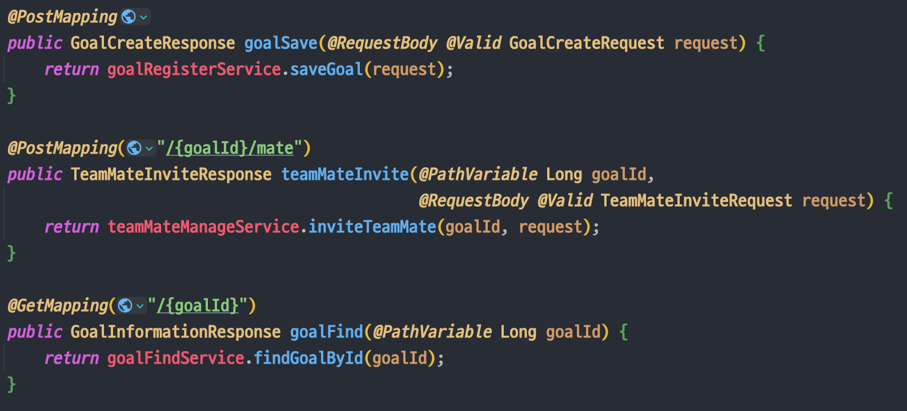
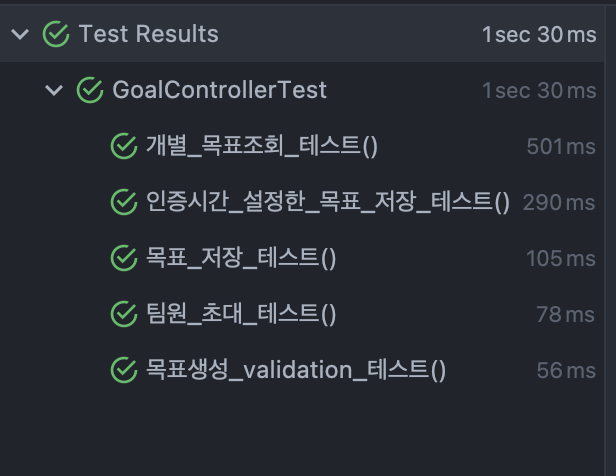
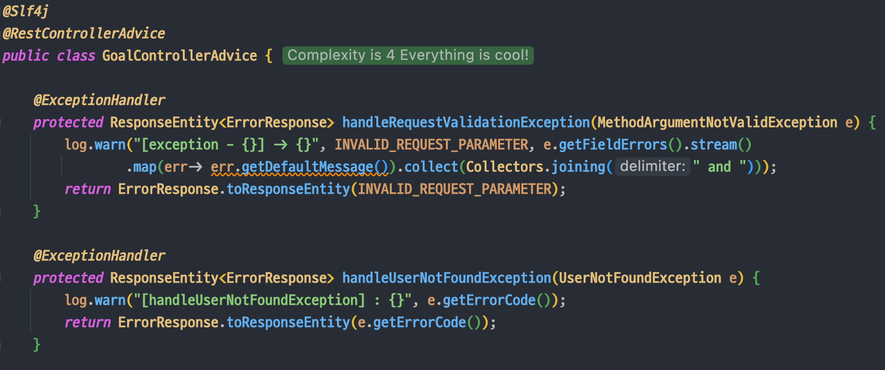
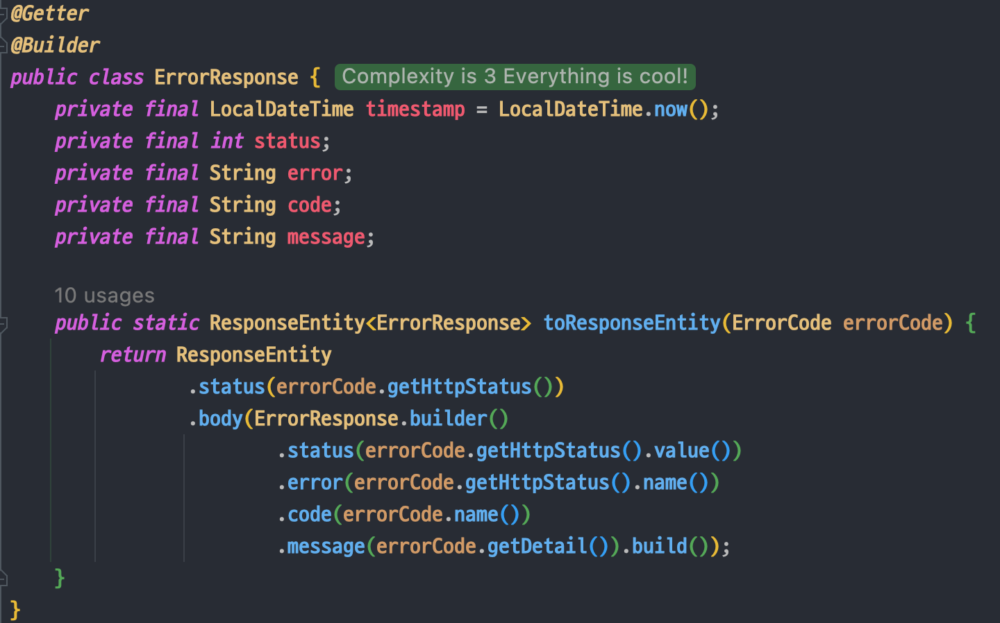

[개발바닥](https://www.youtube.com/channel/UCSEOUzkGNCT_29EU_vnBYjg/featured) 단톡방에서 한 분이 질문을 올리셨다. 간략히 하면 컨트롤러의 반환타입으로 ResponseEntity<>를 사용하는 1번 방식과 Dto를 반환하는 2번 방식 중에 어떤 방식을 선호하는가에 대한 질문이었다. 

```java
// 1번
public ResponseEntity<Dto> methodName(){}

//2번
public Dto methodName(){}
```


많은 분들이 의견을 공유해주셨는데, 응답 헤더를 다채롭게 구성할 수 있어 1번을 선호한다는 의견도 있었고 ResponseEntity를 컨트롤러마다 매번 리턴하는게 의미없다고 하시는 분도 있었다. 

오고가는 대화를 보고 나는 컨트롤러에서 어떤 방식을 사용하고 있나 생각해보니 아무생각 없이 매번 ResponseEntity로 Dto를 감싸서 리턴하고 있었다.

  

> ResponseEntity가 덕지덕지 발린 컨트롤러 

물론 ResponseEntity를 반환하는 것 자체가 잘 못되었다는 것은 아니다. 문제는 내가 왜 ResponseEntity를 사용하는가에 대한 근거없이 습관적으로 사용하고 있다는 점이다. 

응답 헤더를 다채롭게 구성하기 위한 목적도 아니고 그저 HttpStatus를 OK나 CREATED로 설정하고 있으며, CREATED 응답이 유의미한 API라면 모르겠는데 API를 호출하는 클라이언트단에서는 응답이 성공이라면, 응답 상태로 OK가 오던, CREATED가 오던 로직 상의 차이가 없다.

불필요하게 DTO를 한 겹 더 감싸서 사용하고 있던 것이다. 그래서 컨트롤러에서 무의미하게 사용되고있던 ResponseEntity를 제거했다. 

  

Dto를 ResponseEntity로 감싸는 부분을 제거하니, service단으로 요청을 넘기는 컨트롤러의 역할이 더 명확하게 드러나고 코드가 간결해졌다.

컨트롤러 테스트 코드에서 response의 status를 isCreated()로 받는 부분만 isOk()로 변경해주니 테스트 코드도 모두 통과했다. 

  

대부분의 경우에서 API 호출에서 문제가 발생하지 않은 경우에는 응답 헤더나 응답 상태를 복잡하게 구성할 필요가 없으니 바로 DTO를 반환하도록 하고

예외 발생 시에 `@ExceptionHandler`에서 ResponseEntity를 사용해서 상태 코드나, 헤더, 바디를 상황에 맞게 정의하도록 했다.

  

  

이렇게 함으로써, 일반적인 응답 성공 상황에서는 DTO를 반환하여 번거로움을 줄이고, 예외 처리 시에는 ResponseEntity를 사용해 응답 상태와 바디를 적절히 구성할 수 있게되었다. 

<br>

위에 나온 1번 방식과 2번 방식 모두 사용할 수 있다는 것을 알면서도 어떤 이유에서인지는 모르겠으나 여타 블로그 예제나 강의 등에서 ResponseEntity로 반환하던 것을 그동안 아무 생각없이 그대로 따라했었던 것 같다. 로직상에서 크리티컬한 변화를 주는 것은 아니지만 이런 사소한 것에서부터 그 개발자의 실력이 드러나는 것 같다.  

나는 그동안 의식하지 않고 사용하던 컨트롤러 반환 타입에 대해 고민하고 질문해주신 분이 새삼 대단하다는 생각이 들었고, 답변해주시는 모두가 각자의 이유를 가지고 리턴 방식을 사용하는 것을 보고 느낀 점이 많았다.  

한 줄 한 줄에 의도와 근거를 가져야겠다고 다짐하면서, 해당 프로젝트 내 다른 컨트롤러들에 있는 불필요한 ResponseEntity를 제거하러 가야겠다.

