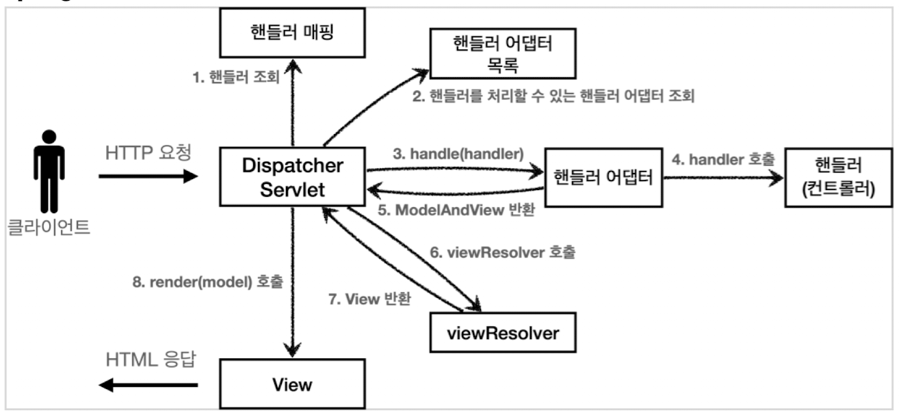
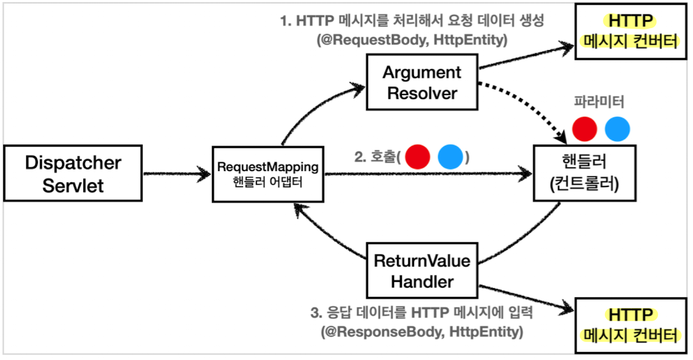

## 들어가면서
인프런에 있는 김영한님의 [스프링 MVC 1편 - 백엔드 웹 개발 핵심 기술](https://inf.run/PRGs) 강의를 정리한 글입니다. 세부사항이나 설정 등은 포스팅하지 않으니, 자세한 내용은 강의를 통해 확인해주시길 바랍니다.


## 목차
- HTTP 요청 - 기본, 헤더 조회
- HTTP 요청 파라미터 - 쿼리 파라미터, HTML Form
- HTTP 요청 파라미터 - @ModelAttribute
- HTTP 요청 메시지 - 단순 텍스트
- HTTP 요청 메시지 - JSON
- HTTP 메시지 컨버터


### **HTTP 요청 - 기본, 헤더 조회**

```java
@RequestMapping("/headers")
public String headers(HttpServletRequest request,
                        HttpServletResponse response,
                        HttpMethod httpMethod,
                        Locale locale,
                        @RequestHeader MultiValueMap<String, String> headerMap,
                        @RequestHeader("host") String host,
                        @CookieValue(value="myCookie", required=false) 
                                                            String cookie){
    log.info("request = {}", request);
    log.info("response = {}", response);
    log.info("httpMethod = {}", httpMethod);
    log.info("locale = {}", locale);
    log.info("headerMap = {}", headerMap);
    log.info("host = {}", host);
    log.info("cookie = {}", cookie);
            
    return "ok";
}
```

`MultiValueMap`은 `Map`과 유사한데, 하나의 키에 여러 값을 받을 수 있는 자료구조이다. HTTP header나 HTTP 쿼리 파라미터와 같이 하나의 키에 여러 값을 받을 때 사용한다.  

```java
MultiValueMap<String, String> map = new LinkedMultiValueMap<>();
map.add("keyA", "value1");
map.add("keyA", "value2");

List<String> values = map.get("keyA");
```

### **HTTP 요청 파라미터 - 쿼리 파라미터, HTML Form**
클라이언트에서 서버로 요청 데이터를 전달할 때는 주로 다음 3가지 방법을 사용한다.
1. `GET` - 쿼리 파라미터
2. `POST` - HTML Form
3. `HTTP message body`

여기서 GET 쿼리 파라미터 전송 방식이든, POST HTML Form 전송 방식이든 둘 다 형식이 같으므로 구분 없이 조회할 수 있다. 이것을 `요청 파라미터(request parameter) 조회`라고 한다.

스프링으로 요청 파라미터를 조회하는 방법을 단계적으로 알아보자. 

```java
@RequestMapping("/request-param-1")
public void requestParamV1(HttpServletRequest request, 
                           HttpServletResponse response) throws IOException {
    String username = request.getParameter("username");
    int age = Integer.parseInt(request.getParameter("age"));
    log.info("username = {}, age = {}", username, age);
    response.getWriter().write("ok");
}
```
여기서는 단순히 `HttpServletRequest`가 제공하는 `request.getParameter()`로 요청 파라미터를 조회했다.


```java
@ResponseBody
@RequestMapping("/request-param-2")
public String requestParamV2(@RequestParam("username") String memberName,
                             @RequestParam("age") int memberAge) {
    log.info("username = {}, age = {}", memberName, memberAge);
    return "ok";
}
```

`@RequestParam`의 `name`속성이 파라미터 이름으로 사용된다. 만약 HTTP 파라미터 이름이 변수 이름과 같으면 `name` 속성을 생략 가능하다.
```java
@ResponseBody
@RequestMapping("/request-param-3")
public String requestParamV2(@RequestParam String username,
                             @RequestParam int age) {
    log.info("username = {}, age = {}", username, age);
    return "ok";
}
```

**파라미터 필수 여부 - requestParamRequired**  
`@RequestParam`의 `required` 속성의 기본값은 `true`이다.

```java
@ResponseBody
@RequestMapping("/request-param-required")
public String requestParamV2(@RequestParam(required=true) String username,
                             @RequestParam(required=false) int age) {
    log.info("username = {}, age = {}", username, age);
    return "ok";
}
```

위 컨트롤러에 `/request-param-required`로 요청하면 `username`이 없으므로 `400`예외가 발생한다. 

이 때 `username`을 전달하더라도, `기본형(primitive type)`에 `null`이 입력되는 것을 주의해야 하는데, 기본형에 `null`이 입력되면 `500` 예외가 발생한다. 따라서 `null`을 받을 수 있는 `Integer`로 변경하거나, `defaultValue`를 사용해야 한다.

```java
@ResponseBody
@RequestMapping("/request-param-default")
public String requestParamV2(@RequestParam(required=true) String username,
                        @RequestParam(required=false, defaultValue=-1) int age){
    log.info("username = {}, age = {}", username, age);
    return "ok";
}
```

**파라미터를 Map으로 조회하기 - requestParamMap**
```java
@ResponseBody
@RequestMapping("/request-param-map")
public String requestParamMap(@RequestParam Map<String, Object> map) {
    log.info("username = {}, age = {}", map.get("username"), map.get("age"));
    return "ok";
}
```
이 때 위에서 배운 `MultiValueMap`을 사용할 수도 있다.


### **HTTP 요청 파라미터 - @ModelAttribute**  

실제 개발을 하면, 요청 파라미터를 받아서 필요한 객체에 값을 넣어주는 작업을 주로 한다. 스프링은 이 과정을 완전히 자동화해주는 `@ModelAttribute` 어노테이션을 제공한다. 

요청 파라미터를 바인딩 받을 객체는 아래와 같다. 
```java
@Data
public class HelloData{
    private String username;
    private int age;
}
```

```java
@ResponseBody
@RequestMapping("/model-attr-v1")
public String modelAttrV1(@ModelAttribute HelloData data) {
    log.info("username = {}, age = {}", data.getUsername(), data.getAge());
    return "ok";
}
```
이렇게 하면, 자동으로 `HelloData`의 객체가 생성되고, 요청 파라미터의 값도 모두 들어가 있다. 

스프링 MVC는 `@ModelAttribute`가 있으면 해당 클래스의 객체를 생성한 뒤, 요청 파라미터의 이름으로 해당 객체의 프로퍼티를 찾는다. 그리고 해당 프로퍼티의 `setter`를 호출해서 파라미터의 값을 입력(바인딩)한다.

### **HTTP 요청 메시지 - 단순 텍스트**

요청 파라미터와 다르게 HTTP 메시지 바디를 통해 데이터가 직접 넘어오는 경우는 `@RequestParam`이나 `@ModelAttribute`를 사용할 수 없다.

```java
@PostMapping("/request-body-string")
public HttpEntity<String> requestBodyString(HttpEntity<String> httpEntity) {
    String messageBody = httpEntity.getBody();
    log.info("messageBody = {}", messageBody);
    return new HttpEntity<>("ok");
}
```

`HttpEntity`는 HTTP의 header나 body 정보를 편리하게 조회할 수 있게 한다. `HttpEntity`는 위 코드처럼 응답에도 사용가능하며, 이 때는 메시지 바디 정보를 직접 반환하는데 헤더 정보도 포함가능하다. 

> 스프링 MVC는 HttpEntity를 상속받은 RequestEntity와 ResponseEntity 기능도 제공한다. 

스프링 MVC 내부에서 HTTP 메시지 바디를 읽어서 문자나 객체로 변환해서 전달해주는데, 이 때 `HTTP 메시지 컨버터`라는 기능을 사용한다. 

```java
@ResponseBody
@PostMapping("/request-body")
public String requestBody(@RequestBody String messageBody) {
    log.info("messageBody = {}", messageBody);
    return "ok";
}
```

`@RequestBody`를 이용하면 HTTP 메시지 바디 정보를 편리하게 조회할 수 있다. 참고로 헤더 정보가 필요하다면 `HttpEntity`를 사용하거나 `@RequestHeader`를 사용하면 된다. 


### **HTTP 요청 메시지 - JSON**

이번에는 HTTP API에서 주로 사용하는 `JSON` 데이터 형식을 조회해보자.

```java
@ResponseBody
@PostMapping("/request-body-json-v1")
public String requestBodyJsonV1(@RequestBody String messageBody) 
                                            throws JsonProcessingException {
    HelloData data = objectMapper.readValue(messageBody, HelloData.class);
    log.info("username = {}, age = {}", data.getUsername(), data.getAge());
    return "ok";
}
```
`@RequestBody`를 사용해서 HTTP 메시지에서 데이터를 꺼내고 `messageBody`에 저장한 뒤, 문자로 된 JSON 데이터인 `messageBody`를 `objectMapper`를 통해서 자바 객체로 변환한다.

그런데 JSON도 `@ModelAttribute`처럼 한 번에 객체로 변환할 수는 없을까?

```java
@ResponseBody
@PostMapping("/request-body-json-v2")
public String requestBodyJsonV2(@RequestBody HelloData data) {
    log.info("username = {}, age = {}", data.getUsername(), data.getAge());
    return "ok";
}
```
`@RequestBody`에 직접 만든 객체를 지정할 수 있다. 

`HttpEntity`나 `@RequestBody`를 사용하면 HTTP 메시지 컨버터가 HTTP 메시지 바디의 내용을 우리가 원하는 문자나 객체 등으로 변환해주는데, 자세한 내용은 뒤에 HTTP 메시지 컨버터에서 다룬다.  

> HTTP 요청 시에 content-type이 application/json인지 꼭 확인해야 한다. 그래야 JSON을 처리할 수 있는 HTTP 메시지 컨버터가 실행된다.

```java
@ResponseBody
@PostMapping("/request-body-json-v3")
public String requestBodyJsonV3(HttpEntity<HelloData> httpEntity) {
    HelloData data = httpEntity.getBody();
    log.info("username = {}, age = {}", data.getUsername(), data.getAge());
    return "ok";
}
```
이렇게 `HttpEntity`를 사용할 수도 있다. 


```java
@ResponseBody
@PostMapping("/request-body-json-v4")
public HelloData requestBodyJsonV4(@RequestBody HelloData data) {
    log.info("username = {}, age = {}", data.getUsername(), data.getAge());
    return data;
}
```
응답의 경우에도 `@RequestBody`를 사용하면 해당 객체를 HTTP 메시지 바디에 직접 넣어줄 수 있다. 물론 이 경우에도 `HttpEntity`를 사용해도 된다.


- @RequestBody 요청  
    - JSON 요청 -> HTTP 메시지 컨버터 -> 객체
 
- @RequestBody 응답  
    - 객체 -> HTTP 메시지 컨버터 -> JSON 응답

### **HTTP 메시지 컨버터**
뷰 템플릿으로 HTML을 생성해서 응답하는 것이 아니라, HTTP API처럼 JSON 데이터를 HTTP 메시지 바디에서 직접 읽거나 쓰는 경우, HTTP 메시지 컨버터를 사용하면 편리하다.

**@ResponseBody 사용 원리**  


`@ResponseBody`를 사용하면 HTTP의 body에 문자 내용을 직접 반환한다. 이 때 `viewResolver` 대신에 `HttpMessageConverter`가 동작한다.

스프링 MVC는 다음의 경우에 HTTP 메시지 컨버터를 적용한다.
- HTTP 요청 : `@RequestBody`, `HttpEntity(RequestEntity)`
- HTTP 응답 : `@ResponseBody`, `HttpEntity(ResponseEntity)`


**HTTP 메시지 컨버터 인터페이스**  
```java
public interface HttpMessageConverter<T> {
	boolean canRead(Class<?> clazz, @Nullable MediaType mediaType);

	boolean canWrite(Class<?> clazz, @Nullable MediaType mediaType);

	List<MediaType> getSupportedMediaTypes();

	default List<MediaType> getSupportedMediaTypes(Class<?> clazz) {
		return (canRead(clazz, null) || canWrite(clazz, null) ?
		getSupportedMediaTypes() : Collections.emptyList());
	}

	T read(Class<? extends T> clazz, HttpInputMessage inputMessage)
			throws IOException, HttpMessageNotReadableException;
	
	void write(T t, @Nullable MediaType contentType, 
                              HttpOutputMessage outputMessage)
			throws IOException, HttpMessageNotWritableException;
}
```
- `canRead()`, `canWrite()` : 메시지 컨버터가 해당 클래스, 미디어 타입을 지원하는지 체크   
- `read()`, `write()` : 메시지 컨버터를 통해서 메시지를 읽고 쓰는 기능


**스프링 부트 기본 메시지 컨버터**  
```
0 = ByteArrayHttpMessageConverter
1 = StringHttpMessageConverter
2 = MappingJackson2HttpMessageConverter
```
스프링 부트는 다양한 메시지 컨버터를 제공하는데, 대상 `클래스 타입`과 `미디어 타입`을 체크해서 사용여부를 결정한다. 만약 만족하지 않으면 다음 메시지 컨버터로 우선순위가 넘어간다.

몇 가지 주요 메시지 컨버터를 알아보자.

- `ByteArrayHttpMessageConverter` : `byte[]` 데이터를 처리  
    - 클래스 타입 : byte[] 
    - 미디어 타입: \*/\*
- `StringHttpMessageConverter` : `String` 문자로 데이터를 처리
    - 클래스 타입 : String
    - 미디어 타입 : \*/\*
- `MappingJackson2HttpMessageConverter` : application/json
    - 클래스 타입 : 객체 또는 HashMap
    - 미디어 타입 : application/json 관련


**HTTP 요청 데이터 읽기**  
- HTTP 요청이 오고, 컨트롤러에서 `@RequestBody`, `HttpEntity` 파라미터를 사용한다.
- 메시지 컨버터가 메시지를 읽을 수 있는지 확인하기 위해 `canRead()`를 호출한다. 이 때 대상 클래스 타입과 Http 요청의 Content-Type 미디어 타입을 확인한다.
- `canRead()` 조건을 만족하면 `read()`를 호출해서 객체를 생성하고 반환한다.

**HTTP 응답 데이터 생성**  
- 컨트롤러에서 `@ResponseBody`, `HttpEntity`로 값이 반환된다.
- 메시지 컨버터가 메시지를 쓸 수 있는지 확인하기 위해 `canWrite()`를 호출한다. 이 때 대상 클래스 타입과 HTTP 요청의 Accept 미디어 타입을 지원하는지 확인한다.
- `canWrite()` 조건을 만족하면 `write()`를 호출해서 HTTP 응답 메시지 바디에 데이터를 생성한다.


#### 요청 매핑 핸들러 어뎁터 구조
그렇다면 HTTP 메시지 컨버터는 스프링 MVC의 어디쯤에서 사용되는 것일까? 아래 스프링 MVC 구조에서는 보이지 않는다. 



이것을 이해하기 위해서는 먼저, `@RequestMapping`을 처리하는 핸들러 어뎁터인 `RequestMappingHandlerAdapter`의 동작을 이해해야 한다.


**RequestMappingHandlerAdapter 동작 방식**  


생각해보면, 어노테이션 기반의 컨트롤러는 매우 다양한 파라미터를 사용할 수 있었다. `HttpServletRequest`, `Model`뿐만 아니라 `@RequestParam`, `@ModelAttribute`같은 어노테이션과 `@RequestBody`, `HttpEntity`같은 HTTP 메시지를 처리하는 부분까지 매우 큰 유연함을 가진다.

이렇게 파라미터를 유연하게 처리할 수 있는 이유가 바로 `ArgumentResolver`덕분이다. 

어노테이션 기반 컨트롤러를 처리하는 `RequestMappingHandlerAdapter`는 바로 이 `ArgumentResolver`를 호출해서 컨트롤러(핸들러)가 필요로 하는 다양하 파라미터의 값(객체)을 생성한다. 이렇게 파라미터의 값이 모두 준비되면 컨트롤러를 호출하면서 값을 넘겨준다.


**ReturnValueHandler**  
`HandlerMethodReturnValueHandler`를 줄여서 `ReturnValueHandler`라고 부른다. `ArgumentResolver`와 비슷한데, 이것은 응답 값을 변환하고 처리한다.

컨트롤러에서 `String`으로 뷰 이름을 반환해도 동작하는 이유가 바로 `ReturnValueHandler`덕분이다.

<br>

이쯤하고 다시 HTTP 메시지 컨버터로 돌아가자. 



HTTP 메시지 컨버터를 사용하는 `@RequestBody`도 컨트롤러가 필요로 하는 파라미터의 값에 사용되고, `@ResponseBody`의 경우도 컨트롤러의 반환값을 이용한다.

**요청의 경우**, `@RequestBody`를 처리하는 `ArgumentResolver`가 있고, `HttpEntity`를 처리하는 `ArgumentResolver`가 있다. 이 `ArgumentResolver`들이 HTTP 메시지 컨버터를 사용해서 필요한 객체를 생성하는 것이다. 

**응답의 경우**에도, `@ResponseBody`와 `HttpEntity`를 처리하는 `ReturnValueHandler`가 있다. 그리고 여기에서 HTTP 메시지 컨버터를 호출해서 응답 결과를 만든다.


