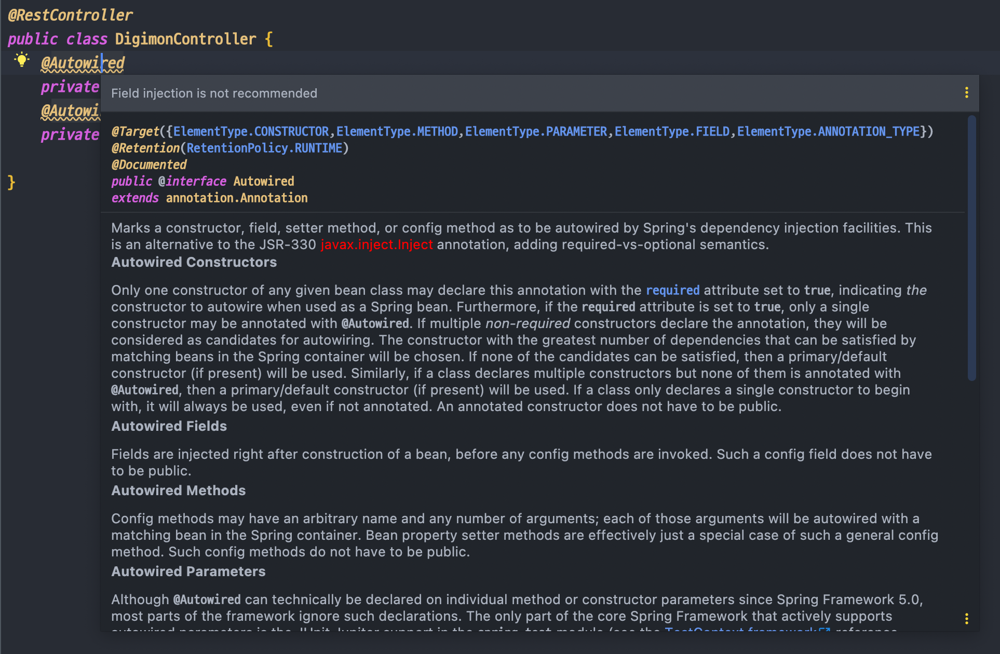

## 의존성 주입이란?

의존성 주입이란, 설계 시점에는 알지 못했던 두 오브젝트가 서로 관계를 맺도록 도와주는 것을 말한다. 

이때 DI 컨테이너에 의해 런타임 시에 의존 오브젝트를 사용할 수 있도록 그 레퍼런스를 전달받는 과정이 마치 메소드를 통해 DI 컨테이너가 오브젝트에게 레퍼런스를 주입해주는 것과 같다고 해서 이를 의존성 주입이라고 부른다.

DI가 적용되면, 런타임 시에는 클래스에 대한 의존관계가 나타나지 않고 결합도가 낮은 코드가 만들어지기 때문에 서로 다른 책임을 가진 의존성이 변경되더라도 자신은 영향을 받지 않으며, 변경을 통한 다양한 확장에는 자유로워진다.

스프링은 DI를 편하게 사용할 수 있도록 도와주는 도구이면서 그 자체로 DI를 적극적으로 활용한 프레임워크이기 때문에 스프링을 공부하는 건 DI를 어떻게 활용해야 할지를 공부하는 것이기도 하다.


## 의존성 주입 방법 세 가지

스프링에서 등록된 빈을 DI하기 위한 방법은 크게 세 가지가 있다. 

### 1. 필드 주입
- 필드 주입은 `@Autowired` 어노테이션을 이용해 객체를 주입한다. 사용법이 매우 간단하고 코드가 간결하다는 장점이 있다.

```java
@RestController
public class DigimonController {
    @Autowired
    private AttackService attackService;

    @Autowired
    private EvolutionService evolutionService;
}
```

### 2. 수정자 주입 (메소드 주입)
- 수정자(setter) 혹은 사용자 정의 메소드를 통해 의존성을 주입하는 방법이다. 

```java
@RestController
public class DigimonController {
    private AttackService attackService;
    private EvolutionService evolutionService;

    @Autowired
    public void setAttackService(AttackService attackService) {
        this.attackService = attackService;
    }

    @Autowired
    public void setEvolutionService(EvolutionService evolutionService) {
        this.evolutionService = evolutionService;
    }
}
```

### 3. 생성자 주입
- 생성자를 통해 의종 객체를 주입받는 방식이다. 만약 생성자가 하나만 있는 경우, `@Autowired` 어노테이션을 생략할 수 있다. 

```java
@RestController
public class DigimonController {
    private AttackService attackService;
    private EvolutionService evolutionService;

    @Autowired
    public DigimonController(AttackService attackService, EvolutionService evolutionService) {
        this.attackService = attackService;
        this.evolutionService = evolutionService;
    }
}
```

이렇게 세 가지 방법을 간단히 살펴보았는데, 가장 간결하고 사용하기 쉬워보이는 것은 필드 주입 방식이다. `@Autowired` 어노테이션 하나만 붙여서 사용할 수 있으니 필드 주입만 잘 사용하면 될 것 같지만, 필드 주입을 사용하면 다음과 같은 경고가 발생한다.



필드 주입 방식을 추천하지 않고 생성자 주입 사용을 권장하고 있다. 필드 주입을 사용할 때 어떤 단점이 있고, 생성자 주입을 통해 이를 얼마나 해소할 수 있는지 알아보도록 하자. 


## 생성자 주입을 사용해야 하는 이유

### 1. 순환 참조 방지

순환 참조는 A 객체가 B 객체를 참조하고 있으면서, B 객체 또한 A 객체를 참조하고 있을 때 발생한다. 이 경우, 애플리케이션을 실행하면 한 객체가 다른 객체의 메소드를 호출하면, 서로의 메소드를 반복적으로 호출하다가 `StackOverflowError`가 발생하면서 애플리케이션이 종료된다.

여기서 문제점은 아무런 경고나 오류 없이 애플리케이션이 실행되고, `StackOverflowError`가 애플리케이션 실행 중에 발생한다는 것이다.  
필드 주입이나 생성자 주입을 사용하는데 순환 참조가 존재한다고 가정해보자. 이때 다행인지 불행인지 순환 참조를 유발하는 메소드가 실행되지 않는다면 에러는 발생하지 않고, 개발자는 이 문제를 눈치채지 못한다. 하지만 이 문제는 언젠가 터질 폭탄과도 같다. 

그렇다면 이같은 문제가 생성자 주입방식에서 발생한다면 어떻게 될까? 

이때는 `BeanCurrentlyInCreationException`이 발생하여 순환 참조가 발생함을 알리며 애플리케이션이 실행되지 않는다. 
즉, 생성자 주입 방식을 사용하면 순환 참조 문제를 애플리케이션 실행 시점에 알려주기 때문에 사전에 문제를 해결할 수 있도록 돕는다. 

주입 방식만 변경했을 뿐인데, 실행 결과에 이런 차이가 발생하는 이유는 빈을 주입하는 순서가 다르기 때문이다.

수정자 주입이나 필드 주입같은 경우, 먼저 의존성 주입을 받으려는 빈의 생성자를 호출하여 빈을 찾거나 빈 팩토리에 등록한 뒤, 주입하려는 빈 객체를 주입해준다. 다시말해, 먼저 빈을 생성한 후에 의존성을 주입해주는 방식이다. 

그에 반해 생성자 주입은 생성자로 객체를 생성하는 그 시점에 필요한 의존성을 주입한다. 그렇기 때문에 생성자 주입 사용 시에는 순환 참조가 문제가 된다. 객체 생성 시점에 빈을 주입하기 때문에 서로 참조하는 객체가 생성되지 않은 상태에서 서로 참조하고 있기 때문이다. 


### 2. 테스트 코드 작성의 편리함
필드 주입으로 작성된 코드는 스프링의 IoC 컨테이너가 의존성을 주입해주는 방식이기 때문에 순수 자바 코드 (POJO)로 단위 테스트를 실행할 수 없다. 
테스트 코드에서는 이런 의존성 주입이 정상적으로 작동하지 않기 때문에 `NullPointException`이 발생한다. 

생성자 주입으로 작성된 코드에서는 원하는 의존 객체를 생성자를 통해서 넘겨줄 수 있고, 의존 객체를 넘겨주지 않으면 객체 생성 자체가 불가능하기 때문에 테스트 하기가 용이하다. 물론 필드 주입을 사용한 경우에도 Mockito와 같은 라이브러리를 사용해서 테스트가 동작하도록 할 수는 있지만, 생성자를 통한 주입 방식이 테스트 하기에 훨씬 편리하다는 것을 알 수 있다.


### 3. 객체의 불변성 확보
객체의 생성자는 객체 생성 시 한 번만 호출되기 때문에, 주입받은 객체가 불변 객체여야 하거나, 반드시 주입이 필요한 경우에 해당 필드를 `final`로 선언한다면 불변성을 보장할 수 있다. 

필드 주입과 생성자 주입은 의존성 필드를 `final`로 선언할 수 없기 때문에 객체 생성 후 의존성 객체가 변경될 여지가 있지만, 생성자 주입 방식을 사용한다면 이를 사전에 방지할 수 있다.

생성자 주입 방식에서 필드를 final로 선언할 경우 코드를 간결하게 만들 수 있는 팁이 있는데,  
롬복의 `@RequiredArgsConstructor`를 사용하면 final이 포함된 생성자를 만들어준다. 위에서 언급했듯이 생성자 주입 방식에서 생성자가 하나라면 `@Autowired` 어노테이션을 생략할 수 있기 때문에 아래 코드를 보면, 필드 주입 못지않게 간략한 코드를 작성할 수 있다. 

```java
@RequiredArgsConstructor
@RestController
public class DigimonController {
    private final AttackService attackService;
    private final EvolutionService evolutionService;
}
```

## 정리
인터넷 상에 스프링 관련 예제들을 살펴보면, 필드 주입을 사용한 방식을 많이 사용하기 때문에 무의식적으로 간편한 생성자 주입을 사용하는 경우가 더러 있다. 하지만 간편한 사용법 뒤에는 여러 단점이 존재하고 있었고, 위에서 알아본 여러 이유로 스프링에서도 필드 주입보다 생성자 주입을 사용할 것을 강력히 추천하고 있다. 

나 같은 경우, 생성자 주입을 사용하는 것이 좋다는 것만 알고 있어 항상 생성자 주입을 사용하고 있었는데, 그 이유에 대해서 정확히 파악하지는 못한 채로 사용하고 있었다. 이번 포스팅을 통해서 생성자 주입을 사용하되, 이 방식이 왜 좋은지 왜 사용하는지에 대한 이유를 알 수 있었다.

앞으로도 어떤 기술이나 방법을 사용함에 있어서 남들이 좋다고 해서 쓰는 것이 아니라, 그 방식을 사용하는 이유에 대해 충분히 학습한 뒤, 타당성을 가지고 사용해야겠다. 

## 참조
[토비의 스프링](http://www.yes24.com/Product/Goods/7516721)  
<https://madplay.github.io/post/why-constructor-injection-is-better-than-field-injection>  
<https://programforlife.tistory.com/111>